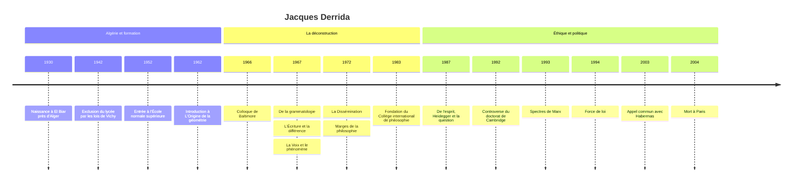

# Jacques Derrida (1930-2004)

Jacques Derrida est le philosophe de la **déconstruction**, mot qu'il a rendu célèbre et qui a fini par circuler bien au-delà de la philosophie, jusque dans la critique littéraire, l'architecture, le droit et le langage courant. Sa démarche consiste à lire de très près les grands textes de la tradition pour y repérer les oppositions hiérarchiques qui les structurent (parole et écriture, présence et absence, nature et culture) et montrer que ces hiérarchies ne tiennent pas aussi bien que leurs auteurs le voudraient. Figure majeure de ce que l'on a appelé le post-structuralisme, admiré et détesté avec une égale intensité, il a été le philosophe français le plus lu dans les universités américaines de la fin du XXe siècle.

## Biographie et contexte

Jackie Derrida naît le 15 juillet 1930 à El Biar, sur les hauteurs d'Alger, dans une famille juive de l'Algérie alors française (voir [[05 - Colonisation de l'Algérie]]). En 1942, les lois antijuives du régime de Vichy, appliquées en Algérie avec zèle, entraînent son exclusion du lycée ; les Juifs d'Algérie perdent en outre la nationalité française que leur avait conférée le décret Crémieux (voir [[08 - Vichy, Occupation et Résistance]]). Il dira plus tard que cette exclusion, prononcée par une France qui était sa seule culture, l'a rendu durablement méfiant envers toute appartenance communautaire, y compris juive.

Arrivé à Paris en 1949, il prépare l'École normale supérieure, où il entre en 1952 après deux échecs au concours. Il y lit de près [[Husserl]] et [[Heidegger]], les deux maîtres de la [[Phénoménologie]], et obtient l'agrégation en 1956. Après un séjour à Harvard, il fait son service militaire en Algérie, pendant la guerre (voir [[10 - Guerre d'Algérie]]), comme enseignant dans une école pour enfants de militaires. Il enseigne ensuite à la Sorbonne, puis à l'École normale supérieure de 1964 à 1984, avant d'être élu à l'École des hautes études en sciences sociales.

Sa première publication importante est une longue introduction à sa traduction de *L'Origine de la géométrie* de Husserl (1962). La reconnaissance vient en 1966, lors d'un colloque à l'université Johns Hopkins de Baltimore, censé présenter le [[Structuralisme]] français au public américain : sa conférence, « La structure, le signe et le jeu dans le discours des sciences humaines », qui critique [[Claude Lévi-Strauss]], annonce déjà l'après-structuralisme. L'année suivante, en 1967, il publie coup sur coup trois livres qui le rendent célèbre.

Les décennies suivantes sont celles d'une production considérable (plus de quatre-vingts livres) et d'une notoriété internationale, surtout aux États-Unis, où il enseigne régulièrement, notamment à Yale puis à l'université de Californie à Irvine. Il s'engage pour l'enseignement de la philosophie en France (fondation du Collège international de philosophie en 1983 avec d'autres), soutient les dissidents tchécoslovaques (ce qui lui vaut d'être arrêté à Prague en 1981 sous un faux prétexte de trafic de drogue), milite contre l'apartheid et pour les sans-papiers. À partir des années 1990, son œuvre prend un tour plus explicitement éthique et politique. Il meurt à Paris le 9 octobre 2004.

## Œuvres majeures

| Œuvre | Année | Thème principal |
|---|---|---|
| **Introduction à L'Origine de la géométrie de Husserl** | 1962 | Phénoménologie, historicité, écriture |
| **De la grammatologie** | 1967 | Logocentrisme, écriture, lecture de Saussure, Lévi-Strauss et Rousseau |
| **L'Écriture et la différence** | 1967 | Recueil d'essais sur Lévi-Strauss, Foucault, Levinas, Freud, Artaud |
| **La Voix et le phénomène** | 1967 | Critique de la présence chez Husserl |
| **La Dissémination** | 1972 | Contient « La pharmacie de Platon » |
| **Marges de la philosophie** | 1972 | Contient la conférence « La différance » |
| **Spectres de Marx** | 1993 | Héritage de Marx après la chute du communisme |
| **Force de loi** | 1994 | Droit, violence et justice |

## Concepts clés

### Le logocentrisme

Derrida soutient que la métaphysique occidentale, de [[Platon]] à Husserl, est dominée par un privilège de la **présence** : ce qui compte, ce qui est vrai, c'est ce qui est immédiatement présent à la conscience. Ce privilège s'exprime dans le **logocentrisme** (primat du *logos*, raison et parole) et plus précisément dans le **phonocentrisme** : la parole vive est jugée plus proche de la pensée, donc plus authentique, et l'écriture n'en serait qu'une copie dérivée, extérieure et dangereuse, un signe de signe.

Il retrouve cette hiérarchie chez Platon (le *Phèdre* condamne l'écriture), chez [[Rousseau]] (qui voit dans l'écriture un supplément dangereux de la parole), chez Saussure (qui exclut l'écriture de l'objet de la linguistique) et chez Lévi-Strauss. Or ces mêmes auteurs, en décrivant la parole, lui prêtent sans le vouloir les traits qu'ils reprochent à l'écriture : différence, absence, répétition, dépendance à l'égard d'un système. Derrida appelle **archi-écriture** cette structure commune à toute signification, parlée ou écrite.

### La déconstruction

Déconstruire une opposition hiérarchique, c'est procéder en deux temps : d'abord **renverser** la hiérarchie (montrer que le terme dévalué, l'écriture, est en réalité la condition de possibilité du terme valorisé, la parole), puis **déplacer** l'opposition elle-même, en forgeant un concept qui ne se laisse ranger d'aucun côté. Le mot, Derrida l'a expliqué, traduit et transforme la *Destruktion* heideggérienne de l'histoire de la métaphysique.

| Couple hiérarchique | Terme privilégié par la tradition | Ce que montre la lecture déconstructrice |
|---|---|---|
| Parole et écriture | Parole | La parole suppose déjà les traits de l'écriture |
| Présence et absence | Présence | Le présent n'est jamais pur, il est tissé de traces du passé et de l'avenir |
| Nature et culture | Nature | L'origine naturelle est toujours déjà supplémentée |
| Sens propre et sens figuré | Sens propre | Le concept vit de métaphores oubliées |
| Intérieur et extérieur | Intérieur | Le dehors est la condition du dedans |

> [!warning] Piège
> Déconstruire ne veut pas dire détruire, ni démontrer que tout se vaut. Derrida a répété que la déconstruction n'est ni une méthode, ni une critique, ni une analyse au sens technique : c'est un travail de lecture patient qui suit un texte dans sa propre logique jusqu'au point où elle se retourne contre elle-même. Elle suppose une connaissance intime et même une fidélité aux textes qu'elle déconstruit ; les livres de Derrida sont d'abord des commentaires minutieux.

### La différance

Dans une conférence de 1968, Derrida forge le néologisme **différance**, avec un *a*. La différence d'orthographe ne s'entend pas à l'oral, elle ne se voit qu'à l'écrit, ce qui est déjà un argument contre le primat de la parole. Le mot joue sur les deux sens du verbe « différer » :

- **différer** au sens de ne pas être identique : chez Saussure, un signe n'a de valeur que par sa différence avec les autres signes du système ;
- **différer** au sens de remettre à plus tard : le sens n'est jamais pleinement présent, il est toujours renvoyé à d'autres signes, dans une chaîne sans terme.

La différance n'est ni un mot ni un concept au sens classique, mais le mouvement qui produit les différences. Elle est liée à la notion de **trace** : chaque élément porte la marque de ce qu'il n'est pas.

### Il n'y a pas de hors-texte

La formule de *De la grammatologie*, « il n'y a pas de hors-texte », est la plus citée et la plus mal comprise de Derrida.

> [!important] Idée clé
> La phrase ne dit pas que seuls les livres existent, ni que le monde réel est une illusion. Elle dit qu'on n'accède jamais à un sens ou à une réalité qui serait purement présent, hors de tout système de renvois, de différences et d'interprétation. « Texte » désigne chez Derrida toute structure de traces, bien au-delà du livre. Derrida l'a précisé plus tard : cela revient à dire qu'il n'y a pas de hors-contexte.

### Le pharmakon et les indécidables

Dans « La pharmacie de Platon », Derrida lit le mythe de Theuth dans le *Phèdre*, où l'écriture est présentée au roi égyptien comme un *pharmakon*. Le mot grec signifie à la fois **remède** et **poison**, et les traducteurs choisissent l'un ou l'autre selon le contexte, masquant l'ambivalence que le texte exploite. Derrida appelle **indécidables** ces termes (pharmakon, supplément, hymen) qui oscillent entre deux valeurs opposées sans pouvoir être fixés dans l'une ou l'autre, et qui font vaciller l'opposition elle-même.

### Le tournant éthique et politique

À partir de *Force de loi* (conférence de 1989, livre en 1994), la déconstruction s'applique explicitement au droit et à la politique. Derrida distingue le **droit**, toujours déconstructible parce qu'il est construit et historique, et la **justice**, qui ne l'est pas : c'est au nom de la justice, jamais pleinement réalisée, qu'on déconstruit le droit. Il pense une **hospitalité inconditionnelle**, qui accueillerait l'autre sans lui demander son nom, distincte des lois de l'hospitalité toujours conditionnelles, et une **démocratie à venir**, promesse jamais accomplie. *Spectres de Marx* (1993), publié au moment où l'on proclame la fin de l'histoire, affirme que l'on ne peut se débarrasser de l'héritage de [[Karl Marx]], dont l'esprit critique continue de hanter le présent (voir [[Marxisme]]). Ces textes l'inscrivent dans la [[Philosophie Politique]] contemporaine.

## Influence et postérité

L'influence de Derrida a été plus forte aux États-Unis qu'en France. Dans les départements de littérature, autour de Paul de Man et de l'école de Yale dans les années 1970, la déconstruction devient une méthode de critique littéraire, parfois éloignée de ses enjeux philosophiques. Elle nourrit ensuite les études de genre (Judith Butler), les études postcoloniales (Gayatri Chakravorty Spivak, qui traduit *De la grammatologie* en anglais), la théorie du droit et l'architecture dite déconstructiviste. Avec [[Foucault]] et Deleuze, Derrida incarne la « French Theory » et reste associé, parfois contre son gré, au [[Postmodernisme]]. Son héritage le plus durable est peut-être une exigence de lecture : l'attention aux marges, aux notes, aux métaphores et aux contradictions d'un texte, qui a transformé la [[Philosophie du Langage]] continentale et l'analyse des discours (voir [[Sémiologie et Analyse de Discours]]).

## Critiques

**L'obscurité.** Le reproche le plus constant porte sur son style, jugé volontairement obscur, et sur l'impossibilité de réfuter une pensée qui se dérobe à toute thèse. En 1992, l'attribution d'un doctorat honoris causa par l'université de Cambridge suscite une lettre de protestation signée par une vingtaine de philosophes, dont Quine ; le doctorat est finalement accordé après un vote (336 voix contre 204).

**Le débat avec Searle.** Dans « Signature événement contexte », Derrida discute la théorie des actes de langage d'Austin. John Searle lui répond en 1977 en l'accusant de contresens ; la réplique de Derrida, *Limited Inc*, ironique et très longue, fait de cette querelle le symbole du dialogue de sourds entre [[Philosophie Analytique]] et philosophie continentale.

**Habermas et le relativisme.** [[Habermas]], dans *Le Discours philosophique de la modernité* (1985), lui reproche d'effacer la distinction entre philosophie et littérature, et de priver la critique de tout critère rationnel. Les deux hommes se réconcilient pourtant et signent ensemble, en 2003, un appel pour une politique étrangère européenne commune après l'invasion de l'Irak.

> [!note] Débat
> Les affaires de 1987 (la découverte des articles collaborationnistes du jeune Paul de Man, ami de Derrida) et les controverses sur le nazisme de [[Heidegger]] ont conduit certains critiques à accuser la déconstruction d'indifférence morale ou de complaisance. Derrida a répondu en défendant une lecture qui ne condamne ni n'excuse sans avoir lu, et en consacrant *De l'esprit* (1987) à Heidegger. La question de savoir si la déconstruction fonde une éthique ou la rend impossible reste l'un des grands débats autour de son œuvre.

## Chronologie

## Ressources

- Jacques Derrida, *Positions*, entretiens, Minuit, 1972. La meilleure porte d'entrée par l'auteur lui-même.
- Geoffrey Bennington et Jacques Derrida, *Jacques Derrida*, Seuil, coll. Les Contemporains, 1991.
- Benoît Peeters, *Derrida*, Flammarion, 2010.
- Jonathan Culler, *On Deconstruction. Theory and Criticism after Structuralism*, Cornell University Press, 1982.
