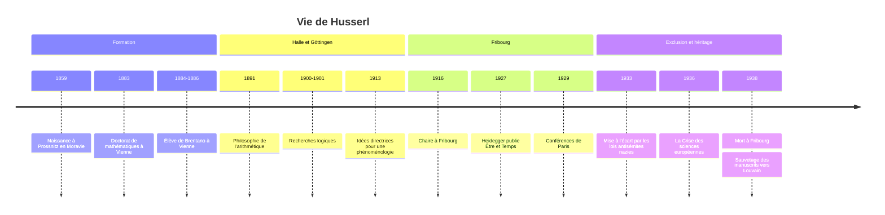

# Edmund Husserl (1859-1938)

## Biographie et contexte

**Edmund Husserl** naît le 8 avril 1859 à Prossnitz (aujourd'hui Prostějov, en République tchèque), en Moravie, dans une famille juive de marchands de l'Empire autrichien. Il meurt le 27 avril 1938 à Fribourg-en-Brisgau. Il est le fondateur de la **[[Phénoménologie]]**, l'un des deux grands courants de la philosophie du XXe siècle avec la [[Philosophie Analytique]].

### Du mathématicien au philosophe

Husserl commence par les mathématiques. Il étudie à Leipzig, à Berlin auprès de Karl Weierstrass, puis soutient à Vienne en 1883 une thèse sur le calcul des variations. C'est à Vienne, entre 1884 et 1886, qu'il suit les cours de **Franz Brentano**, qui le convainc que la philosophie peut être une science rigoureuse et lui transmet la notion d'intentionnalité. En 1886, il se convertit au luthéranisme.

Il enseigne ensuite comme *Privatdozent* à Halle (1887-1901), où il publie une *Philosophie de l'arithmétique* (1891) qui cherche à fonder le nombre sur des actes psychologiques. La critique sévère de Gottlob Frege (1894) contribue à le détourner de cette voie.

### Göttingen, Fribourg

Les *Recherches logiques* (1900-1901) lui ouvrent un poste à Göttingen (1901-1916), où se forme autour de lui un premier cercle de phénoménologues (Adolf Reinach, Edith Stein, Roman Ingarden). Avec les *Idées directrices pour une phénoménologie* (1913), il opère un « tournant transcendantal » qui déconcerte une partie de ses élèves. En 1916, il succède à Heinrich Rickert à Fribourg ; son fils Wolfgang est tué la même année à Verdun. À Fribourg, il prend comme assistant un jeune philosophe, Martin [[Heidegger]], qu'il considère comme son héritier et qui lui succède à sa retraite en 1928.

### Les années sombres

L'arrivée au pouvoir des nazis en 1933 (voir [[Montée du nazisme]]) frappe Husserl, d'origine juive : il est mis en congé forcé dès avril 1933, puis, après les lois de Nuremberg, perd son droit d'enseigner ; il est privé de toute possibilité de publier en Allemagne. Heidegger, devenu recteur, adhère au parti nazi ; les relations entre les deux hommes, déjà dégradées par leurs désaccords philosophiques, sont rompues. Isolé, Husserl continue à écrire et prononce en 1935 à Vienne et à Prague les conférences d'où sortira *La Crise des sciences européennes*.

Après sa mort, le franciscain belge **Herman Leo Van Breda** fait passer clandestinement en Belgique, en 1938, ses manuscrits (environ 40 000 pages en sténographie Gabelsberger) et sa bibliothèque. Les **Archives Husserl de Louvain** les conservent et publient depuis 1950 l'édition critique des *Husserliana*, qui compte aujourd'hui plusieurs dizaines de volumes.

## Œuvres majeures

| Œuvre | Année | Thème principal |
|---|---|---|
| **Philosophie de l'arithmétique** | 1891 | Origine psychologique des concepts de nombre |
| **Recherches logiques** | 1900-1901 | Critique du psychologisme, signification, intentionnalité |
| **La Philosophie comme science rigoureuse** | 1911 | Manifeste contre le naturalisme et l'historicisme |
| **Idées directrices pour une phénoménologie** (*Ideen I*) | 1913 | Réduction phénoménologique, noèse et noème |
| **Leçons sur la conscience intime du temps** | 1928 (éd. par Heidegger) | Rétention, protention, flux de la conscience |
| **Logique formelle et logique transcendantale** | 1929 | Fondement de la logique dans la subjectivité |
| **Méditations cartésiennes** | 1931 (en français) | Ego transcendantal, intersubjectivité |
| **La Crise des sciences européennes et la phénoménologie transcendantale** | 1936 (partiel) | Monde de la vie, crise du rationalisme |

Les *Méditations cartésiennes* sont issues de conférences données à la Sorbonne en 1929 ; elles paraissent d'abord en français, dans une traduction de Gabrielle Peiffer et Emmanuel Levinas.

## Concepts clés

### Le retour aux choses mêmes

La devise de la phénoménologie est de revenir « aux choses mêmes » (*zu den Sachen selbst*), c'est-à-dire de décrire ce qui se donne à la conscience tel qu'il se donne, avant toute théorie, toute construction ou tout préjugé scientifique. La phénoménologie n'est pas une doctrine mais une **méthode** de description.

Le « principe des principes » posé dans les *Idées I* le résume : toute intuition donatrice originaire est une source légitime de connaissance, dans les limites où elle se donne.

### La critique du psychologisme

Les *Prolégomènes à la logique pure*, premier volume des *Recherches logiques*, s'attaquent au **psychologisme**, la thèse selon laquelle les lois logiques seraient des lois psychologiques décrivant comment nous pensons de fait. Husserl montre que cette position conduit au relativisme : si le principe de non-contradiction n'était qu'une habitude de l'espèce humaine, une autre espèce pourrait avoir une autre logique, et la vérité dépendrait de notre constitution. La vérité d'une proposition logique est idéale et vaut indépendamment de ceux qui la pensent (voir [[Logique]]).

### L'intentionnalité

Reprise de Brentano et profondément remaniée, l'**intentionnalité** est la propriété fondamentale de la conscience : **toute conscience est conscience de quelque chose**. Percevoir, c'est percevoir un objet ; se souvenir, c'est se souvenir de quelque chose ; aimer, c'est aimer quelqu'un. La conscience n'est pas une boîte fermée qui contiendrait des images du monde ; elle est d'emblée tournée vers ce qui n'est pas elle.

Husserl distingue dans tout vécu intentionnel deux faces :

| Pôle | Nom | Exemple de la perception d'un arbre |
|---|---|---|
| L'acte de conscience | **Noèse** | Le fait de percevoir, avec sa manière propre (percevoir, imaginer, se souvenir) |
| L'objet tel qu'il est visé | **Noème** | « Cet arbre en fleurs », tel qu'il m'apparaît sous tel angle |

Un objet ne se donne jamais d'un seul coup : je vois une face de l'arbre, les autres sont co-visées, anticipées, et se découvriront si je tourne autour. Toute perception est ainsi une synthèse d'**esquisses** (*Abschattungen*).

### L'épochè et la réduction

Dans la vie ordinaire, nous vivons dans l'**attitude naturelle** : nous croyons spontanément à l'existence du monde. Pour étudier la manière dont le monde se donne, Husserl propose de **suspendre** cette croyance, de la « mettre entre parenthèses » : c'est l'**épochè**, terme repris des sceptiques grecs.

> [!warning] Piège
> L'épochè n'est pas un doute sur l'existence du monde, ni une négation de celui-ci. Contrairement au doute de [[Descartes]], elle ne cherche pas une première certitude pour rebâtir le savoir ; elle neutralise une thèse sans la nier, pour déplacer le regard de l'objet vers la manière dont il se donne. Le monde reste là, avec tout son contenu, mais il devient « phénomène ».

La réduction se décline en deux gestes :

- la **réduction phénoménologique** ou transcendantale ramène le monde à la conscience pour laquelle il a sens, jusqu'à l'**ego transcendantal**, source de toute donation de sens ;
- la **réduction eidétique** dégage les essences (*eidos*) en faisant varier un exemple en imagination : on cherche ce qui ne peut être modifié sans que l'objet cesse d'être ce qu'il est. C'est la **variation eidétique**. On découvre ainsi, par exemple, qu'un son a nécessairement une durée, ou qu'un objet perçu se donne nécessairement par esquisses.

### Le temps, autrui et le monde de la vie

**Le temps vécu.** Le présent n'est pas un point : il retient ce qui vient de passer (**rétention**) et anticipe ce qui va venir (**protention**). C'est ainsi que nous entendons une mélodie et non une succession de notes isolées.

**L'intersubjectivité.** La cinquième des *Méditations cartésiennes* affronte le risque du solipsisme : si tout sens se constitue dans mon ego, comment l'autre peut-il être autre chose qu'un objet de ma conscience ? Husserl répond que je perçois autrui par une **apprésentation** analogique à partir de son corps vivant (*Leib*), comme un autre moi dont je n'aurai jamais l'expérience directe. Le monde objectif est un monde constitué en commun.

**Le monde de la vie.** Dans *La Crise*, Husserl diagnostique une crise des sciences européennes : depuis Galilée, la science a substitué au monde vécu un monde mathématisé, oubliant que ses idéalisations prennent sens dans le **monde de la vie** (*Lebenswelt*), le monde de l'expérience quotidienne et pré-scientifique. Cet oubli a rendu les sciences incapables de répondre aux questions de sens qui importent le plus à l'humanité.

> [!important] Idée clé
> La phénoménologie de Husserl se présente comme l'accomplissement d'un projet cartésien, une philosophie comme science absolument fondée, mais elle a produit, chez ses héritiers, presque l'inverse. [[Heidegger]] lui reprend la méthode descriptive pour l'appliquer non à la conscience mais à l'existence déjà jetée dans le monde ; Merleau-Ponty conclut que la réduction complète est impossible. Le concept de monde de la vie, tardif chez Husserl, est ce que ses héritiers ont le plus retenu : c'est dans ses derniers textes que le fondateur ouvre lui-même la voie qui l'éloigne de son idéalisme.

## Influence et postérité

- **Allemagne** : [[Heidegger]], avec *Être et Temps* (1927), dédié à Husserl, transforme la phénoménologie en ontologie de l'existence. Max Scheler l'applique aux valeurs et aux sentiments ; Edith Stein à l'empathie.
- **France** : c'est le principal foyer de réception. Levinas publie en 1930 *Théorie de l'intuition dans la phénoménologie de Husserl* ; [[Sartre]], qui étudie Husserl à Berlin en 1933-1934, en tire *La Transcendance de l'ego* et *L'Être et le Néant* ; Merleau-Ponty la réoriente vers le corps et la perception ; Paul Ricœur traduit les *Idées I* (1950) ; [[Derrida|Jacques Derrida]] consacre ses premiers travaux à Husserl. L'[[Existentialisme]] en dépend directement.
- **Sciences humaines** : Alfred Schütz fonde une sociologie phénoménologique, prolongée par Berger et Luckmann ; la psychiatrie phénoménologique (Binswanger, Minkowski) en est issue (voir [[Psychologie]]).
- **Philosophie de l'esprit** : la notion d'intentionnalité est au centre des débats contemporains sur la conscience, et des chercheurs comme Francisco Varela ou Dan Zahavi ont tenté de rapprocher phénoménologie et sciences cognitives (voir [[Philosophie de l'Esprit]]).

## Critiques

- **L'idéalisme transcendantal** : dès 1913, une partie de l'école de Göttingen, restée réaliste, reproche à Husserl de retomber dans un idéalisme où le monde n'existe que pour la conscience.
- **L'impossibilité de la réduction** : pour [[Heidegger]], la conscience pure est une abstraction, car nous sommes toujours déjà au monde ; pour Merleau-Ponty, « le plus grand enseignement de la réduction est l'impossibilité d'une réduction complète » (préface de la *Phénoménologie de la perception*).
- **Le problème d'autrui** : Levinas, puis d'autres, jugent que la cinquième Méditation ramène l'autre au même, en le constituant à partir de l'ego.
- **La philosophie analytique** : le recours à l'intuition des essences paraît invérifiable à beaucoup de philosophes de tradition analytique, même si Husserl et Frege partaient de préoccupations proches sur la logique et la signification.
- **La métaphysique de la présence** : Derrida, dans *La Voix et le Phénomène* (1967), soutient que la phénoménologie privilégie indûment la présence immédiate du sens à la conscience.

## Chronologie

## Ressources

- **Edmund Husserl**, *Idées directrices pour une phénoménologie*, trad. Paul Ricœur, Gallimard, 1950.
- **Emmanuel Levinas**, *Théorie de l'intuition dans la phénoménologie de Husserl*, Alcan, 1930 (rééd. Vrin).
- **Jean-François Lyotard**, *La Phénoménologie*, PUF, coll. « Que sais-je ? », 1954.
- **Paul Ricœur**, *À l'école de la phénoménologie*, Vrin, 1986.
- **Dan Zahavi**, *Husserl's Phenomenology*, Stanford University Press, 2003.
