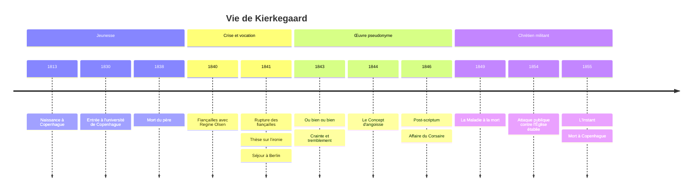

# Søren Kierkegaard (1813-1855)

## Biographie et contexte

**Søren Aabye Kierkegaard** naît le 5 mai 1813 à Copenhague et y meurt le 11 novembre 1855, à 42 ans. Il n'a presque jamais quitté sa ville, sinon pour quelques séjours à Berlin. Sa vie compte peu d'événements extérieurs, mais chacun d'eux est devenu matière philosophique.

### Le père et la « mélancolie »

Il est le dernier des sept enfants de Michael Pedersen Kierkegaard, un ancien berger du Jutland devenu riche négociant, piétiste austère et tourmenté par le sentiment d'une faute. Cinq des sept enfants meurent avant leur père. Søren hérite de lui une piété sombre, une fortune qui le dispense de tout métier, et ce qu'il appelle sa mélancolie. Dans la seconde moitié des années 1830 (la datation est débattue), une découverte sur le passé paternel, dont il ne dit jamais le contenu et qu'il nomme dans son *Journal* le « grand tremblement de terre », le bouleverse durablement.

### Régine Olsen

En 1840, il se fiance avec Regine Olsen, de près de neuf ans sa cadette. Un an plus tard, il rompt, en s'efforçant de passer pour un goujat afin qu'elle puisse l'oublier. Il ne s'en expliquera jamais clairement ; on invoque sa mélancolie, sa vocation religieuse, le secret paternel. Régine épousera un autre homme, mais elle reste présente, sous des figures déguisées, dans presque toute l'œuvre.

### L'écrivain-philosophe

La même année 1841, il soutient une thèse, *Le Concept d'ironie constamment rapporté à Socrate*, puis part à Berlin écouter les leçons de Schelling contre [[Hegel]], dont il revient déçu. S'ouvre alors une production d'une intensité rare : en une dizaine d'années, une trentaine d'ouvrages, dont beaucoup publiés sous **pseudonymes**, et un *Journal* de plusieurs milliers de pages.

Fin 1845, il provoque une polémique avec *Le Corsaire*, journal satirique qui le caricature ensuite pendant des mois de 1846 : son pantalon trop court et sa silhouette voûtée font rire tout Copenhague. Cette expérience de l'humiliation par la foule nourrit sa critique du « public ». Ses dernières années sont consacrées à une attaque frontale contre l'Église d'État danoise, qu'il accuse de trahir le christianisme du Nouveau Testament. À l'automne 1855, il s'effondre dans la rue et meurt quelques semaines plus tard à l'hôpital, après avoir refusé la communion des mains d'un pasteur.

## Œuvres majeures

| Œuvre | Année | Pseudonyme | Thème principal |
|---|---|---|---|
| **Le Concept d'ironie** | 1841 | Aucun (thèse) | Socrate, l'ironie comme négativité |
| **Ou bien... ou bien** | 1843 | Victor Eremita (éditeur) | Opposition entre vie esthétique et vie éthique |
| **Crainte et tremblement** | 1843 | Johannes de Silentio | Abraham, la foi, la suspension de l'éthique |
| **La Répétition** | 1843 | Constantin Constantius | Reprendre ce qu'on a perdu |
| **Miettes philosophiques** | 1844 | Johannes Climacus | La vérité peut-elle s'apprendre ? Le paradoxe |
| **Le Concept d'angoisse** | 1844 | Vigilius Haufniensis | Angoisse, liberté, péché originel |
| **Stades sur le chemin de la vie** | 1845 | Hilarius Bogbinder (éditeur) | Les trois stades de l'existence |
| **Post-scriptum définitif et non scientifique aux Miettes** | 1846 | Johannes Climacus | Subjectivité, vérité, critique de Hegel |
| **Les Œuvres de l'amour** | 1847 | Aucun | L'amour du prochain |
| **La Maladie à la mort** | 1849 | Anti-Climacus | Le désespoir |
| **L'École du christianisme** | 1850 | Anti-Climacus | Imitation du Christ, scandale de la foi |
| **L'Instant** | 1855 | Aucun | Pamphlets contre l'Église établie |

## Concepts clés

### La communication indirecte et les pseudonymes

Kierkegaard ne veut pas enseigner une doctrine, mais amener le lecteur à se choisir lui-même. Or on ne transmet pas une manière d'exister comme on transmet un savoir. D'où la **communication indirecte** : chaque pseudonyme incarne un point de vue sur la vie, que le lecteur doit éprouver et juger. Kierkegaard reprend en cela la maïeutique de [[Socrate]], son modèle constant.

> [!warning] Piège
> Citer *Ou bien... ou bien* ou le *Post-scriptum* comme « ce que pense Kierkegaard » est une erreur fréquente. Il a demandé expressément, dans une déclaration jointe au *Post-scriptum*, qu'on attribue les livres pseudonymes à leurs auteurs fictifs. Le séducteur du *Journal du séducteur* ou le juge Wilhelm ne sont pas ses porte-parole, et Anti-Climacus représente un idéal chrétien qu'il dit lui-même ne pas atteindre. Il faut toujours préciser qui parle.

### Les trois stades de l'existence

L'existence peut prendre trois formes, qui ne se déduisent pas l'une de l'autre : on passe de l'une à l'autre par un **saut**, un choix.

| Stade | Figure | Principe de vie | Échec qui le mine |
|---|---|---|---|
| **Esthétique** | Don Juan, le séducteur | Vivre dans l'instant, fuir l'ennui par la variété des plaisirs | L'ennui et le désespoir d'une vie dispersée |
| **Éthique** | Le juge Wilhelm, l'époux | Se choisir soi-même, s'engager dans le devoir, le mariage, la profession | La culpabilité : on ne peut accomplir l'exigence par ses propres forces |
| **Religieux** | Abraham, le chevalier de la foi | Rapport absolu à l'absolu, foi | Le paradoxe et le scandale, assumés dans la foi |

Le passage d'un stade à l'autre ne se fait pas par un progrès logique, comme chez Hegel, mais par une décision de l'existant, dans l'angoisse.

### Abraham et la suspension téléologique de l'éthique

Dans *Crainte et tremblement*, Johannes de Silentio médite sur Abraham, à qui Dieu ordonne de sacrifier son fils Isaac. D'un point de vue éthique, universel, Abraham est un meurtrier. S'il est pourtant le père de la foi, c'est que l'**individu** peut entrer dans un rapport direct avec Dieu qui le place au-dessus de l'universel : c'est la **suspension téléologique de l'éthique**. Mais ce rapport ne peut se dire, ni se justifier, ni se partager : Abraham se tait. Johannes avoue ne pas comprendre Abraham ; il l'admire, et le livre est d'abord un effroi devant ce que la foi exige.

### L'angoisse et le désespoir

L'**angoisse** n'a pas d'objet précis, à la différence de la peur. Elle naît devant le possible, devant notre propre liberté. Kierkegaard la compare au vertige de celui qui regarde dans l'abîme : l'œil se perd dans le vide, mais la cause est autant dans l'œil que dans l'abîme. Elle est à la fois ce qui nous paralyse et le signe que nous sommes libres.

Le **désespoir**, analysé dans *La Maladie à la mort*, est la maladie de l'esprit. Le moi y est défini comme un rapport qui se rapporte à lui-même, et qui a été posé par un autre, Dieu. Le désespoir est un désaccord dans ce rapport, sous deux formes : **ne pas vouloir être soi**, ou **vouloir désespérément être soi** par ses seules forces. Il est universel et souvent inconscient : le pire désespoir est d'ignorer qu'on désespère. Seule la foi, où le moi se fonde de manière transparente dans la puissance qui l'a posé, le guérit.

### La subjectivité est la vérité

Contre le système hégélien, qui prétend tout comprendre du point de vue de l'Esprit absolu, Climacus affirme dans le *Post-scriptum* que **la subjectivité est la vérité**. Ce n'est pas un relativisme : pour les vérités qui concernent l'existence (comment vivre, que croire), l'important n'est pas le contenu objectif mais la manière passionnée dont on s'y rapporte. Un système de l'existence est impossible, parce que l'existant, pris dans le devenir, n'est jamais à la place de Dieu.

> [!important] Idée clé
> La critique de Hegel ne porte pas d'abord sur un point de doctrine, mais sur la position de celui qui pense. Le philosophe systématique, dit en substance Kierkegaard, construit un palais mais habite une grange à côté : sa pensée ne concerne pas sa propre vie. En déplaçant la question de « qu'est-ce qui est vrai ? » vers « comment celui qui existe se rapporte-t-il au vrai ? », Kierkegaard invente la question de l'existence qui sera au centre de l'[[Existentialisme]].

### L'individu contre la foule

Kierkegaard souhaitait pour épitaphe : « Cet individu ». Face à la presse, au « public » et à l'Église établie, qui dissolvent la responsabilité dans l'anonymat, il défend **l'individu singulier** (*den Enkelte*), seul devant Dieu. Être chrétien n'est pas appartenir à une nation baptisée, mais devenir contemporain du Christ, dans le scandale d'un Dieu fait homme, que la raison ne peut que juger absurde : c'est le **paradoxe absolu** des *Miettes philosophiques*.

## Influence et postérité

Écrite en danois, l'œuvre reste d'abord confinée au Danemark. Elle se diffuse en Europe grâce aux traductions allemandes du début du XXe siècle.

- **Théologie** : Karl Barth et la théologie dialectique des années 1920 reprennent la distance infinie entre Dieu et l'homme ; Paul Tillich et Rudolf Bultmann lui doivent beaucoup.
- **Philosophie de l'existence** : Karl Jaspers le range avec [[Nietzsche]] parmi les deux grands « exceptions » du XIXe siècle. [[Heidegger]] reprend, en les laïcisant, l'angoisse, la répétition et l'instant dans *Être et Temps*, en le citant peu.
- **[[Existentialisme]] français** : [[Sartre]] lui emprunte l'angoisse devant la liberté et le primat de l'existence, en supprimant Dieu ; [[Camus]], dans *Le Mythe de Sisyphe*, lui reproche au contraire le « suicide philosophique » qui consiste à fuir l'absurde dans la foi. [[Beauvoir]] le discute également.
- **[[Wittgenstein]]** le tenait pour le penseur le plus profond du XIXe siècle.
- **Psychologie** : l'analyse de l'angoisse et du désespoir a inspiré la psychologie existentielle et certains courants de la psychothérapie (voir [[Psychologie]]).

## Critiques

- **Irrationalisme** : le primat de la foi et du saut, et la suspension de l'éthique, peuvent sembler justifier n'importe quel fanatisme. Comment distinguer Abraham d'un homme qui croit entendre Dieu ? Le texte laisse délibérément la question ouverte.
- **Individualisme et apolitisme** : Adorno, dans son travail d'habilitation *Kierkegaard. Construction de l'esthétique* (publié en 1933), voit dans son intériorité un repli bourgeois qui ignore la société réelle. Le rejet de la foule s'accompagne d'un mépris de la démocratie naissante.
- **Lecture de Hegel** : les spécialistes de [[Hegel]] soulignent que Kierkegaard combat souvent un hégélianisme danois simplifié, celui de Martensen et de Heiberg, plutôt que Hegel lui-même.
- **Lecture de la religion** : son christianisme de rupture a été jugé excessivement sombre, faisant de la souffrance le signe de l'authenticité (voir [[Philosophie de la Religion]]).

## Chronologie

## Ressources

- **Søren Kierkegaard**, *Œuvres complètes*, trad. Paul-Henri Tisseau et Else-Marie Jacquet-Tisseau, Éditions de l'Orante, 20 volumes, 1966-1986.
- **Joakim Garff**, *Søren Kierkegaard: A Biography*, Princeton University Press, 2005 (original danois 2000).
- **Alastair Hannay**, *Kierkegaard: A Biography*, Cambridge University Press, 2001.
- **Jean Wahl**, *Études kierkegaardiennes*, Aubier, 1938.
