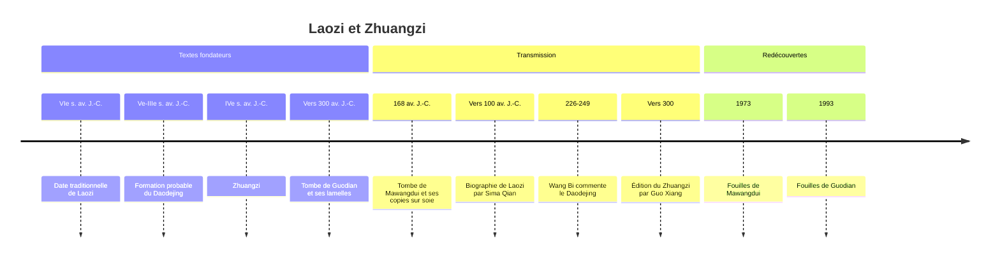

# Laozi

## Un auteur peut-être légendaire

**Laozi** (Lao-tseu dans l'ancienne transcription française) signifie simplement « le Vieux Maître ». Derrière ce nom, on ne sait presque rien de sûr, et il est possible qu'il n'y ait jamais eu d'individu unique.

La seule biographie ancienne est celle de l'historien Sima Qian, vers 100 av. J.-C., soit plusieurs siècles après les faits supposés. Elle fait de Laozi un certain Li Er, archiviste à la cour des Zhou, plus âgé que [[Confucius]] qu'il aurait reçu et sermonné. Voyant la dynastie décliner, il serait parti vers l'ouest ; au poste-frontière, le gardien lui aurait demandé de consigner sa sagesse, et il aurait alors rédigé un livre en deux parties avant de disparaître. Sima Qian lui-même avoue ses doutes : il mentionne deux autres personnages qu'on identifiait à Laozi, et conclut que personne ne sait ce qu'il est advenu de lui.

La tradition place donc Laozi au VIe siècle av. J.-C. La plupart des historiens estiment aujourd'hui que le texte qui porte son nom a pris forme plus tard, par couches successives, entre le Ve et le IIIe siècle av. J.-C., et qu'il rassemble des sentences d'origines diverses. La fourchette reste débattue : la découverte de manuscrits anciens a repoussé vers le haut la date de certains passages sans trancher la question de l'auteur.

> [!warning] Piège
> Parler de « la philosophie de Laozi » est une commodité, pas une thèse historique. On ne peut ni affirmer que Laozi a existé, ni qu'il a écrit le *Daodejing*, ni qu'il a précédé Confucius. L'anecdote de leur rencontre, très populaire, sert surtout, dans les textes taoïstes, à placer Confucius en position d'élève. Mieux vaut lire le *Daodejing* comme un texte collectif dont la voix unifiée est un effet de rédaction.

## Le *Daodejing*

Le **Daodejing** (Tao-tö-king, « Livre de la Voie et de la Vertu ») compte environ cinq mille caractères répartis en quatre-vingt-un courts chapitres, dans la version transmise depuis le commentaire de Wang Bi (226-249). Deux découvertes archéologiques ont renouvelé son étude :

| Découverte | Date | Contenu | Apport |
|---|---|---|---|
| Mawangdui (Hunan) | 1973 | Deux copies sur soie, tombe scellée en 168 av. J.-C. | Texte presque complet, avec la partie sur la Vertu placée avant celle sur la Voie |
| Guodian (Hubei) | 1993 | Lamelles de bambou, tombe de la fin du IVe s. av. J.-C. environ | Une partie seulement des chapitres, dans un autre ordre, sans certaines attaques contre le [[Confucianisme\|confucianisme]] |

La forme est celle d'aphorismes rythmés, souvent paradoxaux, qui s'adressent tantôt au sage, tantôt au souverain. Le texte se prête à des lectures très diverses : mystique, politique, stratégique, et plus tard religieuse.

## La Voie

Le premier chapitre donne le ton : « La Voie qui peut être dite n'est pas la Voie constante ; le nom qui peut être nommé n'est pas le nom constant. » Le *dao*, mot courant qui signifie chemin, puis méthode, devient ici le principe d'où procèdent toutes choses, antérieur au ciel et à la terre. Il ne se laisse pas saisir par le langage, parce que nommer c'est découper, et que la Voie est ce qui précède tout découpage.

Le chapitre 42 en propose une généalogie : « La Voie engendre l'un, l'un engendre deux, deux engendrent trois, trois engendrent les dix mille êtres. » La multiplicité sort d'une source indifférenciée, et y retourne.

### Le vide et le faible

Le *Daodejing* renverse systématiquement les hiérarchies ordinaires. Il valorise le **vide** plutôt que le plein : trente rayons convergent vers le moyeu, mais c'est le vide central qui fait tourner la roue ; c'est le creux du vase qui le rend utile (chapitre 11). Il valorise le **faible** et le **souple** plutôt que le fort : l'eau, la chose la plus molle, vient à bout de la pierre ; la plante vivante est tendre, la morte est raide. « La bonté suprême est comme l'eau » (chapitre 8) : elle profite à tout sans rivaliser, et occupe les lieux bas que tous dédaignent.

## Concepts clés

| Terme | Caractère | Sens | Idée |
|---|---|---|---|
| *Dao* | 道 | la Voie | Source indicible de toutes choses et cours spontané du monde |
| *De* | 德 | vertu, efficace | Puissance propre d'un être quand il suit la Voie |
| *Wuwei* | 無為 | non-agir | Agir sans forcer, sans intention crispée |
| *Ziran* | 自然 | de soi-même ainsi | Spontanéité, ce qui advient sans contrainte extérieure |
| *Pu* | 樸 | bois brut | Simplicité originelle, avant la taille des distinctions |
| *You* / *wu* | 有 / 無 | avoir, il y a / ne pas avoir, il n'y a pas | Couple du plein et du vide, qui s'engendrent l'un l'autre |

### Le non-agir

Le *wuwei* n'est pas la passivité. C'est une manière d'agir qui épouse la pente des choses au lieu de leur imposer un projet : le souverain qui gouverne le mieux est celui dont le peuple sait à peine qu'il existe, et qui, son œuvre accomplie, laisse chacun dire que tout s'est fait de soi-même. « Gouverner un grand État, c'est comme faire frire un petit poisson » (chapitre 60) : à trop le retourner, on le met en miettes.

> [!important] Idée clé
> Le *Daodejing* est aussi, et peut-être d'abord, un texte politique adressé au prince, et sa cible est le confucianisme. « Quand la grande Voie est abandonnée, apparaissent l'humanité et la justice » (chapitre 18) : les vertus que Confucius enseigne sont des symptômes, non des remèdes. On ne prêche la piété filiale que dans des familles désunies. Là où Confucius veut cultiver l'homme par les rites, le *Daodejing* veut le désapprendre, revenir au bois brut. C'est ce dialogue polémique, bien plus qu'une mystique hors du monde, qui donne son relief au texte.

## Zhuangzi

**Zhuangzi** (Zhuang Zhou, IVe s. av. J.-C., dates traditionnelles approximatives vers 369-286) est le second grand nom de cette tradition. Le livre qui porte son nom nous est parvenu dans l'édition de Guo Xiang (mort en 312), en trente-trois chapitres. Seuls les sept premiers, dits « intérieurs », sont généralement attribués à Zhuangzi lui-même ; le reste provient de disciples et de courants apparentés.

Là où le *Daodejing* aphorise, Zhuangzi raconte. Son œuvre est un recueil de fables, de dialogues imaginaires et de personnages fantasques, où l'humour sert l'argument.

- **Le rêve du papillon.** Zhuangzi rêve qu'il est un papillon voletant, heureux, ignorant qu'il est Zhuang Zhou. Il s'éveille, et ne sait plus s'il est Zhuang Zhou qui a rêvé d'être papillon, ou un papillon qui rêve d'être Zhuang Zhou. La leçon n'est pas sceptique au sens de [[Descartes]] : il ne cherche pas une certitude qui résiste au doute, il invite à accueillir la transformation des choses.
- **Le boucher Ding.** Un cuisinier découpe un bœuf avec une aisance de danseur ; son couteau n'a pas besoin d'être aiguisé depuis dix-neuf ans, car il passe par les interstices naturels des articulations. C'est l'image du *wuwei* devenu savoir-faire.
- **La joie des poissons.** Sur un pont, Zhuangzi dit que les poissons sont joyeux. Son ami le logicien Huizi objecte : tu n'es pas un poisson, comment sais-tu ce qu'est leur joie ? Zhuangzi réplique : tu n'es pas moi, comment sais-tu que je ne le sais pas ? L'échange, célèbre, oppose la dispute logique à une connaissance située.
- **L'arbre inutile.** Un arbre tordu, impropre à la charpente, échappe aux bûcherons et vit très vieux. L'inutilité est ici une ruse de la vie.

Le chapitre 2, *Discours sur l'égalisation des choses*, développe un relativisme de la perspective : chaque point de vue découpe le monde en « ceci » et « cela », en vrai et en faux, et le sage se place au pivot de la Voie, d'où ces oppositions apparaissent comme relatives les unes aux autres. À la mort de sa femme, Zhuangzi est surpris par un ami en train de chanter en battant sur une jatte : il explique qu'après un premier chagrin, il a compris que la vie et la mort se succèdent comme les saisons.

| | *Daodejing* | *Zhuangzi* |
|---|---|---|
| Forme | Aphorismes versifiés | Fables, dialogues, humour |
| Destinataire | Souverain et sage | Individu |
| Politique | Art de gouverner par le non-agir | Retrait, indifférence aux charges |
| Ton | Gnomique, grave | Ironique, déroutant |
| Thème dominant | Le faible l'emporte sur le fort | Relativité des points de vue, transformation |

## Chronologie

## Philosophie et religion

Laozi et Zhuangzi ont été lus de deux manières qu'il faut distinguer. D'un côté, une **pensée** philosophique, que les bibliographes chinois des Han classaient déjà parmi les écoles de pensée sous le nom d'« école de la Voie ». De l'autre, une **religion** organisée, apparue à partir du IIe siècle de notre ère, avec clergé, rituels, techniques de longévité, et où Laozi est divinisé. Les deux entretiennent des liens réels, mais ne se confondent pas.

> [!warning] Piège
> Opposer un « [[Taoïsme|taoïsme]] philosophique » pur à un « taoïsme religieux » dégradé est une construction en grande partie occidentale, que les sinologues contemporains critiquent. La distinction reste utile pour s'orienter, à condition de ne pas en faire un jugement de valeur : les communautés religieuses ont lu et commenté le *Daodejing* avec sérieux, et les textes dits philosophiques contiennent déjà des pratiques de souffle et de concentration.

## Réception occidentale

Le *Daodejing* est l'un des textes les plus traduits au monde. Sa réception en Occident a souvent projeté sur lui des préoccupations locales : mysticisme chrétien, romantisme de la nature, contre-culture des années 1960. [[Heidegger]] s'y est intéressé et a entrepris en 1946, avec l'universitaire chinois Paul Shih-yi Hsiao, une traduction partielle restée inachevée ; sa méditation sur le vide de la cruche, dans une conférence de 1950, rappelle de près le chapitre 11. Les rapprochements avec Héraclite (le devenir, l'unité des contraires) sont fréquents, tout comme ceux entre la Voie indicible et la théologie négative ou la chose en soi de [[Kant]]. Pour une mise en perspective, voir [[Philosophies non-occidentales]] et, sur l'autre grande tradition chinoise, [[Confucius]].

## Ressources

- *Philosophes taoïstes* (Lao-tseu, Tchouang-tseu, Lie-tseu), Gallimard, Bibliothèque de la Pléiade, 1980.
- Jean François Billeter, *Leçons sur Tchouang-tseu*, Allia, 2002.
- Anne Cheng, *Histoire de la pensée chinoise*, Seuil, 1997.
- A. C. Graham, *Disputers of the Tao: Philosophical Argument in Ancient China*, Open Court, 1989.
