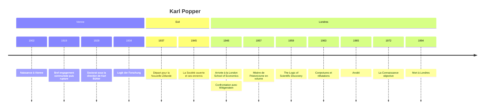

# Karl Popper (1902-1994)

Karl Popper est le philosophe des sciences le plus cité du XXe siècle et l'un de ses grands penseurs politiques libéraux. Sa thèse centrale est d'une simplicité trompeuse : une théorie est scientifique non parce qu'on peut la confirmer, mais parce qu'on peut la **réfuter**. De ce critère de falsifiabilité, il tire une conception de la connaissance comme suite de conjectures audacieuses et de tentatives de réfutation, et une philosophie politique, la **société ouverte**, qui applique la même attitude critique aux institutions. Son nom désigne une doctrine, le rationalisme critique.

## Biographie et contexte

Karl Raimund Popper naît à Vienne le 28 juillet 1902, dans une famille bourgeoise d'origine juive convertie au luthéranisme. Son père, avocat, possède une immense bibliothèque. Adolescent dans la Vienne ruinée de l'après-guerre, il est brièvement attiré par le communisme en 1919, puis s'en détourne après une fusillade où de jeunes manifestants sont tués : il est frappé par la façon dont les militants justifient ces morts au nom des lois de l'histoire. Il travaille aussi auprès d'Alfred Adler, le psychologue, dans des centres d'aide à l'enfance, et fait un apprentissage d'ébéniste.

Il soutient en 1928 une thèse de psychologie sous la direction de Karl Bühler, puis devient instituteur. La Vienne de l'époque est celle du Cercle de Vienne et du [[Positivisme Logique]]. Popper n'en est pas membre ; il en discute les thèses et en critique le principe de vérification. Otto Neurath le surnomme l'« opposition officielle ». Son livre *Logik der Forschung* paraît fin 1934 (daté de 1935).

La [[Montée du nazisme]] le pousse à l'exil. En 1937, il obtient un poste à Christchurch, en Nouvelle-Zélande. C'est là, pendant la guerre, qu'il écrit *La Société ouverte et ses ennemis* (1945), qu'il appelle son effort de guerre. En 1946, il rejoint la London School of Economics grâce notamment à Friedrich Hayek, et y enseigne jusqu'à sa retraite. La même année, lors d'une séance du Moral Sciences Club de Cambridge, a lieu sa célèbre confrontation avec [[Wittgenstein]], qui aurait brandi un tisonnier ; les témoignages divergent sur le déroulement exact de la scène.

Anobli en 1965, il publie jusqu'à la fin de sa vie, notamment sur la théorie de l'esprit avec le neurophysiologiste John Eccles. Il meurt à Londres le 17 septembre 1994.

## Œuvres majeures

| Œuvre | Année | Thème principal |
|---|---|---|
| **Logik der Forschung** (*La Logique de la découverte scientifique*) | 1934, éd. anglaise 1959 | Falsifiabilité, critique de l'induction |
| **La Société ouverte et ses ennemis** | 1945 | Critique de Platon, Hegel et Marx, démocratie libérale |
| **Misère de l'historicisme** | 1944-1945 (articles), 1957 (livre) | Critique des prétendues lois de l'histoire |
| **Conjectures et réfutations** | 1963 | Recueil d'essais, version accessible du falsificationnisme |
| **La Connaissance objective** | 1972 | Épistémologie évolutionniste, théorie des trois mondes |
| **La Quête inachevée** | 1976 | Autobiographie intellectuelle |
| **The Self and Its Brain** (avec John Eccles) | 1977 | Problème corps-esprit, interactionnisme |

## Concepts clés

### Le problème de l'induction

[[Hume]] avait montré qu'aucun nombre d'observations passées ne justifie logiquement une loi universelle : avoir vu mille cygnes blancs ne prouve pas que tous les cygnes sont blancs. Popper prend ce résultat au sérieux et en tire une conséquence radicale : la science ne procède pas par induction. Elle ne part pas d'observations accumulées pour en extraire des lois. Elle part de **problèmes**, propose des **conjectures** hardies, puis cherche à les mettre en défaut.

Il existe une asymétrie logique décisive : aucune observation ne peut vérifier définitivement une loi universelle, mais une seule observation contraire peut la réfuter. Un seul cygne noir suffit.

### La falsifiabilité comme critère de démarcation

Popper cherche à distinguer la science de ce qui n'en est pas. Son critère : une théorie est scientifique si elle **interdit** certains événements observables, c'est-à-dire si l'on peut concevoir une observation qui la contredirait.

| Théorie | Statut chez Popper | Raison |
|---|---|---|
| Relativité générale d'Einstein | Scientifique | Prédiction risquée de la déviation de la lumière, testée lors de l'éclipse de 1919 |
| Astrologie | Non scientifique | Prédictions assez vagues pour s'accommoder de tout |
| Psychanalyse, psychologie d'Adler | Non scientifiques | Tout comportement peut être interprété après coup comme une confirmation |
| Marxisme | D'abord testable, puis rendu irréfutable | Les partisans ont réinterprété la théorie pour sauver ses prédictions démenties |

L'expérience fondatrice, qu'il raconte lui-même, est la comparaison vers 1919 entre Einstein et les théories de Marx, Freud et Adler. Ces dernières semblaient expliquer tout et trouvaient partout des confirmations ; c'était précisément, pour Popper, leur faiblesse. Einstein au contraire prenait le risque d'être démenti par l'observation.

> [!warning] Piège
> La falsifiabilité est un critère de **démarcation**, pas un critère de **sens** ni de valeur. Popper ne dit pas que la métaphysique ou la psychanalyse sont absurdes ou dénuées d'intérêt, contrairement au Cercle de Vienne qui déclarait la métaphysique dépourvue de sens. Il dit qu'elles ne sont pas des sciences empiriques. Une théorie métaphysique peut même inspirer des programmes scientifiques féconds, comme l'atomisme antique.

### Conjectures et réfutations

La connaissance progresse par essais et éliminations d'erreurs, schéma que Popper rapproche de la sélection naturelle (voir [[Évolution]]). Une théorie qui a résisté à des tests sévères est **corroborée**, jamais prouvée : elle reste une conjecture provisoire, la meilleure disponible. La vérité reste un idéal régulateur, et la science peut s'en approcher par des théories de plus en plus riches en contenu, ce qu'il appelle la **vérisimilitude**.

> [!important] Idée clé
> Chez Popper, le caractère scientifique tient à une **attitude** plutôt qu'à une méthode de production des théories. Peu importe d'où vient une hypothèse (un rêve, un mythe, une intuition) : ce qui compte, c'est qu'on l'expose à la critique la plus sévère possible au lieu de la protéger. Le dogmatisme consiste précisément à immuniser une théorie contre la réfutation par des hypothèses ad hoc.

### La société ouverte et ses ennemis

Le versant politique applique le même principe. Une **société ouverte** est une société qui permet de critiquer et de changer ses dirigeants et ses institutions sans violence. Popper redéfinit la démocratie : la bonne question n'est pas « qui doit gouverner ? » (question de [[Platon]], qui répond : les meilleurs) mais « comment organiser les institutions pour que de mauvais gouvernants ne fassent pas trop de dégâts et puissent être renvoyés sans effusion de sang ? ».

Ses « ennemis » sont les penseurs de la **société close**, qui prétendent connaître le sens de l'histoire ou la forme parfaite de la cité : [[Platon]], [[Hegel]] et [[Karl Marx]]. Popper appelle **historicisme** la croyance en des lois du développement historique permettant de prédire l'avenir des sociétés, et il la juge à la fois fausse et dangereuse, car elle justifie le sacrifice des vivants à un avenir prétendument certain. Contre l'ingénierie sociale utopique, il défend une **ingénierie sociale fragmentaire** : des réformes limitées, testables, corrigibles, qui combattent des maux précis plutôt que de réaliser un bien absolu. Ces thèses le placent au cœur de la [[Philosophie Politique]] libérale d'après-guerre.

Dans une note de *La Société ouverte*, il formule aussi le **paradoxe de la tolérance** : une tolérance illimitée envers les intolérants mène à la disparition de la tolérance. Il précise toutefois que la suppression n'est justifiée que lorsque les intolérants refusent l'argumentation rationnelle et recourent à la violence.

### Les trois mondes

Dans *La Connaissance objective*, Popper distingue le monde 1 (les objets physiques), le monde 2 (les états mentaux) et le monde 3 (les produits objectifs de l'esprit : théories, problèmes, arguments, œuvres). Les contenus du monde 3 ont une existence autonome : une théorie a des conséquences que son auteur n'a pas vues. Cette doctrine le rattache à la [[Philosophie de l'Esprit]] interactionniste.

## Influence et postérité

Popper a durablement marqué les scientifiques eux-mêmes, qui ont souvent adopté sa conception de la science : plusieurs prix Nobel de biologie et de médecine s'en sont réclamés. Son critère de démarcation reste la référence spontanée dans les débats sur les pseudosciences et en [[Épistémologie]]. En politique, *La Société ouverte* est devenue un classique du libéralisme ; l'expression a été reprise par George Soros, ancien étudiant de la LSE, pour nommer ses fondations. Son vocabulaire (réfutabilité, société ouverte, historicisme) est passé dans la langue commune, et le [[Biais de confirmation]] décrit exactement l'attitude qu'il recommandait de combattre.

## Critiques

**Kuhn et les révolutions scientifiques.** Dans *La Structure des révolutions scientifiques* (1962), Thomas Kuhn montre que la science réelle ne fonctionne pas ainsi : en période normale, les chercheurs ne cherchent pas à réfuter leur paradigme, ils le défendent et attribuent les anomalies à des erreurs d'expérience. Les paradigmes ne tombent qu'au terme d'une crise, lors de révolutions qui ne se réduisent pas à une réfutation logique.

**La thèse de Duhem-Quine.** Une hypothèse n'est jamais testée seule, mais avec des hypothèses auxiliaires, des instruments, des conditions initiales. Quand une prédiction échoue, la logique ne dit pas quelle pièce incriminer. La réfutation est donc moins décisive que Popper ne le suggère ; il en convenait d'ailleurs en partie.

**Lakatos et Feyerabend.** Imre Lakatos, disciple dissident, propose de juger des **programmes de recherche** progressifs ou dégénérescents plutôt que des théories isolées. Paul Feyerabend va plus loin et conteste l'existence de toute méthode scientifique universelle.

**La vérisimilitude.** En 1974, David Miller et Pavel Tichý démontrent indépendamment que la définition formelle proposée par Popper ne permet pas de comparer deux théories fausses, ce qui oblige à la reprendre.

> [!note] Débat
> Sa lecture de [[Platon]] et de [[Hegel]] est jugée très sévère, voire caricaturale, par nombre de spécialistes ; Walter Kaufmann, par exemple, a contesté son portrait de Hegel en précurseur du totalitarisme. Les défenseurs de Popper répondent que *La Société ouverte* est un livre de combat écrit pendant la guerre, dont l'objet est moins l'exégèse que la généalogie des arguments antidémocratiques.

## Chronologie

## Ressources

- Karl Popper, *La Logique de la découverte scientifique*, trad. française Payot, 1973.
- Karl Popper, *Conjectures et réfutations*, trad. française Payot, 1985.
- Alan Chalmers, *Qu'est-ce que la science ?* (1976), trad. française La Découverte.
- Malachi Haim Hacohen, *Karl Popper. The Formative Years, 1902-1945*, Cambridge University Press, 2000.
- David Edmonds et John Eidinow, *Wittgenstein's Poker*, 2001.
