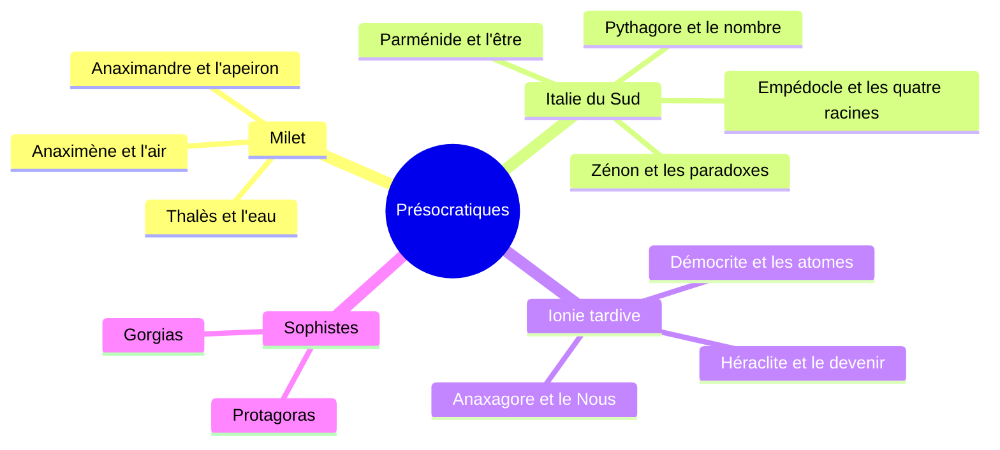
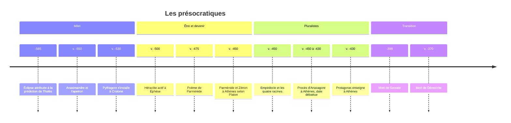

# Les Présocratiques (VIe-Ve siècles av. J.-C.)

## Biographie et contexte

On appelle **présocratiques** les penseurs grecs qui, entre le début du VIe et la fin du Ve siècle av. J.-C., ont cherché à expliquer le monde par des principes naturels plutôt que par les récits de la [[Mythologie Grecque]]. Le mot est une étiquette moderne : il s'est imposé dans l'historiographie allemande et a été consacré par le recueil de Hermann Diels, *Die Fragmente der Vorsokratiker* (1903), dont la numérotation (révisée par Walther Kranz, d'où le sigle « DK ») sert encore de référence pour citer chaque fragment.

### Un monde de cités périphériques

La philosophie ne naît pas à Athènes, mais sur les marges du monde grec :

- en **Ionie**, sur la côte de l'actuelle Turquie (Milet, Éphèse, Clazomènes, Samos), carrefour commercial au contact de la Lydie, de la Perse, de l'Égypte et des savoirs mésopotamiens ;
- en **Grande-Grèce**, dans le sud de l'Italie et en Sicile (Crotone, Élée, Agrigente), où plusieurs penseurs émigrent ou fondent des communautés.

Ces cités marchandes, souvent en conflit et gouvernées par des assemblées où l'on débat publiquement, offrent un terrain où une explication doit se justifier par des arguments plutôt que par l'autorité d'un poète inspiré.

### Un savoir en miettes

Aucun ouvrage présocratique ne nous est parvenu en entier. Nous disposons de deux types de sources :

| Type de source | Nature | Exemples de transmetteurs |
|---|---|---|
| **Fragments** (B dans DK) | Citations textuelles, parfois quelques mots | Simplicius, Sextus Empiricus, Clément d'Alexandrie, Hippolyte |
| **Témoignages** (A dans DK) | Résumés, reformulations, doctrines rapportées | [[Aristote]], Théophraste, Diogène Laërce, Aétius |

> [!warning] Piège
> Nous lisons les présocratiques largement à travers les lunettes d'[[Aristote]]. Au livre A de la *Métaphysique*, il les présente comme des précurseurs cherchant à tâtons ses propres « causes », surtout la cause matérielle. Cette lecture téléologique a durablement façonné l'image de penseurs occupés à désigner « l'élément » primordial. Parler du « principe » (*archè*) de Thalès, c'est déjà employer un vocabulaire aristotélicien qu'il n'utilisait sans doute pas.

## Œuvres majeures

La plupart de ces auteurs auraient écrit un traité en prose, souvent désigné après coup sous le titre générique *Sur la nature* (*Peri phuseôs*), ou un poème. Voici ce qui en subsiste.

| Penseur | Dates approximatives | Cité | Forme de l'œuvre | Ce qui reste |
|---|---|---|---|---|
| **Thalès** | v. 625 - v. 547 | Milet | Probablement aucun écrit | Témoignages seulement |
| **Anaximandre** | v. 610 - v. 546 | Milet | Premier traité en prose connu | Un seul fragment |
| **Anaximène** | v. 585 - v. 525 | Milet | Traité en prose | Quelques lignes |
| **Pythagore** | v. 570 - v. 495 | Samos puis Crotone | Enseignement oral | Rien de sa main |
| **Héraclite** | v. 540 - v. 480 | Éphèse | Livre en aphorismes | Une centaine de fragments |
| **Parménide** | v. 515 - après 450 | Élée | Poème en hexamètres | Environ 160 vers |
| **Zénon** | v. 490 - v. 430 | Élée | Livre d'arguments | Paradoxes rapportés par Aristote |
| **Empédocle** | v. 490 - v. 430 | Agrigente | Deux poèmes, *De la nature* et *Purifications* | Plusieurs centaines de vers, dont le papyrus de Strasbourg publié en 1999 |
| **Anaxagore** | v. 500 - v. 428 | Clazomènes puis Athènes | Traité en prose | Une vingtaine de fragments |
| **Démocrite** | v. 460 - v. 370 | Abdère | Œuvre très abondante | Surtout des sentences morales |

## Concepts clés

### L'école de Milet : chercher ce dont tout est fait

**Thalès** passe pour avoir prédit une éclipse de soleil, que l'on identifie à celle de 585 av. J.-C. (le récit vient d'Hérodote). Aristote lui attribue l'idée que tout vient de l'eau et que la terre flotte sur l'eau. L'intérêt n'est pas la réponse, mais le geste : ramener la diversité des choses à une réalité unique et observable.

**Anaximandre**, son cadet, fait un pas plus audacieux. Le principe ne peut être aucun des éléments visibles, car l'un finirait par dominer les autres : c'est l'**apeiron**, l'illimité ou l'indéterminé. Son unique fragment conservé décrit la naissance et la destruction des choses comme une réparation qu'elles se paient mutuellement « selon l'ordre du temps », en termes quasi juridiques. On lui prête aussi une carte du monde habité et l'idée que la Terre se tient en équilibre au centre sans rien pour la soutenir.

**Anaximène** revient à un élément, l'**air**, mais apporte un mécanisme : par condensation l'air devient vent, nuage, eau, terre, pierre ; par raréfaction il devient feu. Une différence de quantité produit une différence de qualité, schéma qui annonce l'explication physique.

### Pythagore et les pythagoriciens : le monde est nombre

Né à Samos, Pythagore s'installe à Crotone vers 530 et y fonde une communauté à la fois religieuse, morale et politique. Il n'a rien écrit, et la légende a très tôt recouvert l'homme. On associe à son école :

- la **transmigration des âmes** (métempsycose) et des règles de vie (interdits alimentaires, silence) ;
- la découverte que les **intervalles musicaux** consonants correspondent à des rapports simples de longueurs (octave 2/1, quinte 3/2, quarte 4/3), qui fonde la [[Musique Antique]] savante ;
- l'idée que les **nombres** sont la structure des choses, et la notion d'un *kosmos*, ordre harmonieux et beau.

> [!important] Idée clé
> Le fameux « théorème de Pythagore » était connu, dans ses applications, des scribes babyloniens plus d'un millénaire auparavant, et rien ne prouve que Pythagore en ait donné une démonstration. L'apport pythagoricien est ailleurs : l'intuition que la réalité est intelligible parce qu'elle est mathématique. Cette intuition traverse [[Platon]], puis Galilée et toute la physique moderne.

### Héraclite : le devenir et le logos

Surnommé « l'Obscur » dès l'Antiquité, Héraclite d'Éphèse écrit en formules brèves et paradoxales. Trois idées dominent :

- **Tout change** : l'image du fleuve dans lequel on ne peut entrer deux fois dans les mêmes eaux, parce que de nouvelles eaux s'écoulent sans cesse, illustre un monde en flux permanent ;
- **l'unité des contraires** : le chemin qui monte et celui qui descend sont un seul et même chemin ; la guerre (*polemos*) est « père de toutes choses », car la tension des opposés fait tenir l'ensemble ;
- **le logos** : une raison commune, une loi qui gouverne ce changement et que la plupart des hommes ne comprennent pas même quand ils l'entendent. Le **feu**, toujours en transformation, en est le symbole physique.

### Parménide et l'école d'Élée : l'être est

Avec Parménide, la pensée se tourne vers la **logique**. Dans son poème, une déesse montre deux voies : celle de la vérité, selon laquelle **l'être est et le non-être n'est pas**, et celle de l'opinion des mortels, qui mêle être et non-être. Puisqu'on ne peut ni penser ni dire ce qui n'est pas, l'être ne peut ni naître ni périr, ni changer, ni se diviser : il est un, continu, immobile. Le changement que nous percevons est une illusion des sens.

Le contraste avec Héraclite est classique, même si l'on discute pour savoir si Parménide le visait directement.

| | Héraclite | Parménide |
|---|---|---|
| Réalité fondamentale | Le devenir, le flux | L'être immuable |
| Statut du changement | La loi même des choses | Une illusion |
| Rapport aux sens | Témoins à interpréter | Trompeurs |
| Outil privilégié | Le paradoxe, l'unité des contraires | La déduction rigoureuse |
| Postérité | Stoïciens, [[Hegel]], [[Nietzsche]] | [[Platon]], métaphysique de l'être, [[Heidegger]] |

**Zénon d'Élée**, disciple de Parménide, défend son maître par l'absurde : si l'on admet la pluralité et le mouvement, on tombe dans des contradictions. D'où ses **paradoxes**, connus par Aristote :

- **la dichotomie** : pour parcourir une distance il faut d'abord en parcourir la moitié, puis la moitié du reste, et ainsi à l'infini ;
- **Achille et la tortue** : le coureur ne rattrape jamais la tortue partie avant lui, car il doit toujours atteindre le point qu'elle vient de quitter ;
- **la flèche** : à chaque instant la flèche occupe un espace égal à elle-même, donc elle est au repos à chaque instant.

La réponse mathématique (une somme infinie de termes décroissants peut être finie, voir [[Suites et Séries Numériques]]) ne fut formalisée qu'avec l'analyse moderne, et les philosophes discutent encore de savoir si elle épuise le problème.

### Les pluralistes : sauver les phénomènes

Après Parménide, il faut expliquer le changement sans admettre que quelque chose naisse du néant.

- **Empédocle** pose **quatre racines** éternelles (terre, eau, air, feu), que deux forces, **l'Amour** et **la Haine**, unissent et séparent selon un cycle cosmique. C'est l'origine lointaine de la théorie des quatre éléments, qui dominera la science jusqu'à l'époque moderne. La légende le fait mourir en se jetant dans l'Etna.
- **Anaxagore** affirme qu'il y a « une part de tout en tout » et introduit un **Intellect** (*Nous*) qui met en mouvement et ordonne le mélange initial. Installé à Athènes, proche de Périclès, il y est poursuivi pour impiété (à une date débattue, entre 450 et 430 environ), notamment pour avoir soutenu que le soleil est une pierre incandescente, et finit sa vie à Lampsaque.
- **Leucippe** et **Démocrite** proposent la solution la plus radicale : il n'existe que des **atomes**, corps insécables, pleins et éternels, et le **vide** dans lequel ils se meuvent. Les qualités sensibles (couleur, goût) sont de simple convention ; seuls les atomes et le vide existent réellement. Cette physique sera reprise par [[Épicure]].

> [!note] Débat
> Démocrite, né vers 460, est plus jeune que [[Socrate]] et lui survit de près de trente ans. Le qualificatif de « présocratique » est donc chronologiquement faux pour lui, comme pour les sophistes. Il désigne en réalité un type de questionnement, centré sur la nature (*phusis*), par opposition au tournant éthique et anthropologique que la tradition, depuis Cicéron, attribue à Socrate, qui aurait « fait descendre la philosophie du ciel ». Certains historiens, comme André Laks, ont montré que cette catégorie est une construction qui en dit autant sur ceux qui l'ont forgée que sur les penseurs qu'elle regroupe.

### Les sophistes : la transition vers l'homme

Au Ve siècle, dans l'Athènes démocratique, des maîtres itinérants enseignent contre rémunération l'art de parler et de convaincre. **Protagoras** d'Abdère affirme que « l'homme est la mesure de toutes choses », formule relativiste qui fait de la vérité une affaire de point de vue. **Gorgias** de Léontinoi, dans un traité *Sur le non-être*, retourne contre Parménide ses propres armes : rien n'existe, et si quelque chose existait on ne pourrait le connaître, ni le communiquer. Les sophistes déplacent la question de la nature vers la cité, la loi (*nomos*) et le langage. C'est contre eux que [[Socrate]] et [[Platon]] construiront leur idée de la vérité.

## Influence et postérité

- **Platon** construit sa théorie des Idées en tentant de concilier le flux héraclitéen du monde sensible et l'immutabilité parménidienne de l'intelligible ; il consacre un dialogue entier, le *Parménide*, à l'Éléate.
- **Aristote** en fait l'histoire critique et fixe les termes du débat pour deux millénaires.
- L'**atomisme** traverse l'épicurisme, Lucrèce, Gassendi, puis la chimie moderne, qui lui empruntera son nom.
- Les **stoïciens** reprennent le logos et le feu d'Héraclite (voir [[Stoïcisme]]).
- **[[Nietzsche]]**, dans *La Philosophie à l'époque tragique des Grecs* (texte posthume), voit en eux l'âge héroïque de la pensée, avant la « décadence » socratique ; Héraclite est son modèle.
- **[[Heidegger]]** revient à Anaximandre, Héraclite et Parménide pour retrouver une expérience originelle de l'être qu'aurait recouverte la métaphysique.
- En science, les paradoxes de Zénon nourrissent la réflexion sur l'infini et le continu, et l'idée pythagoricienne d'un monde écrit en langage mathématique reste le pari de la physique (voir [[Épistémologie]]).

## Critiques

- **Critique historiographique** : la reconstruction repose sur des citations de seconde ou troisième main, choisies par des auteurs qui avaient leurs propres thèses à défendre. Toute synthèse est hypothétique.
- **Le récit du « miracle grec »** : présenter les Milésiens comme l'invention absolue de la raison, rompant d'un coup avec le mythe, est aujourd'hui nuancé. Jean-Pierre Vernant a montré le lien entre cette pensée et l'organisation politique de la cité, et d'autres ont souligné la dette envers l'astronomie babylonienne et la géométrie égyptienne. Les cosmologies présocratiques gardent d'ailleurs une structure proche des théogonies.
- **Critique aristotélicienne** : pour Aristote, les premiers physiciens n'ont perçu que la cause matérielle et ont négligé la cause finale.
- **Critique platonicienne des sophistes** : le relativisme de Protagoras se réfute lui-même, puisqu'il doit admettre comme vraie l'opinion de ceux qui le jugent faux (argument du *Théétète*).

## Chronologie

## Questions de révision

> [!quiz] Pourquoi Anaximandre refuse-t-il de faire d'un élément visible le principe de toutes choses ?
> Parce qu'un élément illimité finirait par dominer et détruire les autres. Le principe doit donc être l'*apeiron*, l'illimité ou l'indéterminé.

> [!quiz] Quel mécanisme Anaximène propose-t-il pour expliquer la diversité des choses à partir de l'air ?
> La condensation et la raréfaction : condensé, l'air devient vent, nuage, eau, terre, pierre ; raréfié, il devient feu. Une différence de quantité produit une différence de qualité.

> [!quiz] Qu'oppose-t-on classiquement entre Héraclite et Parménide ?
> Pour Héraclite, tout change et le devenir, gouverné par le logos, est la loi des choses. Pour Parménide, l'être est et le non-être n'est pas : l'être est un, immobile, et le changement perçu par les sens est une illusion.

> [!quiz] Quel est le but des paradoxes de Zénon d'Élée ?
> Défendre Parménide par l'absurde : montrer que si l'on admet la pluralité et le mouvement, on tombe dans des contradictions (la dichotomie, Achille et la tortue, la flèche).

> [!quiz] Que proposent Leucippe et Démocrite pour expliquer le changement après Parménide ?
> Il n'existe que des atomes, corps insécables, pleins et éternels, et le vide où ils se meuvent. Les qualités sensibles ne sont que convention ; cette physique sera reprise par Épicure.

> [!quiz] Pourquoi l'étiquette de présocratique est-elle chronologiquement inexacte pour Démocrite ?
> Né vers 460, il est plus jeune que Socrate et lui survit. Le terme désigne en réalité un type de questionnement centré sur la nature (*phusis*), par opposition au tournant éthique attribué à Socrate.

## Ressources

- **Jean-Paul Dumont** (dir.), *Les Présocratiques*, Gallimard, Bibliothèque de la Pléiade, 1988 : l'édition française de référence des fragments et témoignages.
- **G. S. Kirk, J. E. Raven et M. Schofield**, *The Presocratic Philosophers*, Cambridge University Press, 2e éd. 1983.
- **Jonathan Barnes**, *The Presocratic Philosophers*, Routledge, 1979.
- **Jean-Pierre Vernant**, *Les Origines de la pensée grecque*, PUF, 1962.
- **André Laks**, *Introduction à la « philosophie présocratique »*, PUF, 2006.
