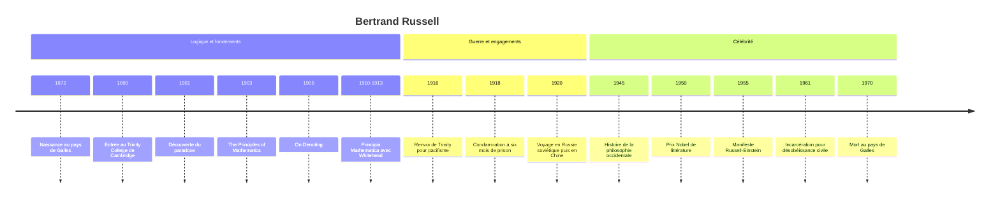

# Bertrand Russell (1872-1970)

Bertrand Russell est l'un des fondateurs de la [[Philosophie Analytique]]. Logicien de premier plan, il a voulu montrer que les mathématiques se ramènent à la logique, découvert au passage le paradoxe qui porte son nom, et proposé avec la **théorie des descriptions** un modèle d'analyse du langage qui a façonné tout un siècle de philosophie. Il fut aussi un intellectuel public infatigable : pacifiste emprisonné pendant la Première Guerre mondiale, vulgarisateur, critique de la religion, prix Nobel de littérature, militant antinucléaire encore arrêté à 89 ans. Sa vie couvre presque un siècle, de la reine Victoria à la guerre du Vietnam.

## Biographie et contexte

Bertrand Arthur William Russell naît le 18 mai 1872 au pays de Galles, dans une grande famille de l'aristocratie libérale : son grand-père, Lord John Russell, a été deux fois Premier ministre. Orphelin très jeune, il est élevé par sa grand-mère dans une atmosphère puritaine et solitaire. Il racontera que la découverte de la géométrie d'Euclide, à onze ans, fut l'un des grands éblouissements de sa vie, mais qu'il fut troublé qu'on lui demande d'admettre les axiomes sans preuve.

Il entre au Trinity College de Cambridge en 1890, où il étudie les mathématiques puis la philosophie. Avec son ami G. E. Moore, il rompt vers 1898 avec l'idéalisme d'inspiration hégélienne alors dominant à Cambridge (voir [[Idéalisme Allemand]] et [[Hegel]]) pour revenir à un réalisme résolu et à l'analyse. La rencontre avec les travaux de Giuseppe Peano en 1900, puis avec ceux de Gottlob Frege, oriente son grand projet : fonder les mathématiques sur la logique.

En 1901, il découvre le paradoxe qui ruine le système de Frege ; il le lui écrit en 1902. Il consacre ensuite près de dix ans, avec Alfred North Whitehead, aux *Principia Mathematica* (trois volumes, 1910-1913). En 1911, un jeune ingénieur autrichien vient suivre ses cours : [[Wittgenstein]], qu'il juge rapidement génial et dont les objections l'ébranlent profondément.

La Première Guerre mondiale fait de lui un homme public. Pacifiste, il milite contre la conscription, ce qui lui vaut d'être privé de son poste à Trinity en 1916 puis condamné en 1918 à six mois de prison, dont il purge environ cinq ; il écrit en prison son *Introduction à la philosophie mathématique*. En 1920, il visite la Russie soviétique, rencontre Lénine et en revient hostile au bolchevisme (voir [[Le Communisme au XXe siècle]]), puis enseigne un an en Chine. Il fonde avec sa deuxième épouse, Dora, une école expérimentale et publie des essais sur le mariage, l'éducation et la religion qui font scandale. En 1940, sa nomination au City College de New York est annulée par un tribunal au motif de son immoralité supposée.

Après 1945, la célébrité vient : *Histoire de la philosophie occidentale* (1945) est un succès mondial, et il reçoit le prix Nobel de littérature en 1950. Il consacre ses dernières décennies à la lutte contre l'arme nucléaire : manifeste Russell-Einstein en 1955, présidence de la Campaign for Nuclear Disarmament en 1958, brève incarcération en 1961 pour désobéissance civile, puis tribunal Russell contre les crimes de guerre au Vietnam en 1966-1967. Il meurt le 2 février 1970 au pays de Galles, à 97 ans.

## Œuvres majeures

| Œuvre | Année | Thème principal |
|---|---|---|
| **The Principles of Mathematics** | 1903 | Programme logiciste, exposé du paradoxe |
| **On Denoting** (article) | 1905 | Théorie des descriptions définies |
| **Principia Mathematica** (avec Whitehead) | 1910-1913 | Dérivation des mathématiques à partir de la logique |
| **Problèmes de philosophie** | 1912 | Introduction à la théorie de la connaissance |
| **La Philosophie de l'atomisme logique** (conférences) | 1918 | Structure logique du monde et du langage |
| **Histoire de la philosophie occidentale** | 1945 | Panorama de Thalès à Dewey |
| **Pourquoi je ne suis pas chrétien** | 1927 (conférence), 1957 (recueil) | Critique de la religion |
| **Autobiographie** | 1967-1969 | Récit de vie en trois volumes |

## Concepts clés

### Le logicisme

Le projet logiciste, que Russell partage avec Frege, consiste à montrer que toutes les vérités de l'arithmétique peuvent être dérivées de principes purement logiques, à l'aide de définitions. Si le projet réussit, les mathématiques ne reposent ni sur l'intuition (contre [[Kant]], pour qui 7 + 5 = 12 est un jugement synthétique a priori) ni sur l'expérience (contre John Stuart Mill). Elles sont de la logique déployée. Les *Principia* consacrent des centaines de pages à établir les fondements ; la proposition qui établit que 1 + 1 = 2 n'arrive qu'au terme d'un long développement, détail devenu légendaire.

### Le paradoxe de Russell

Considérons l'ensemble de tous les ensembles qui ne se contiennent pas eux-mêmes. Se contient-il lui-même ? S'il se contient, il ne remplit pas la condition, donc il ne se contient pas ; s'il ne se contient pas, il la remplit, donc il se contient. Contradiction.

Le paradoxe montre que l'on ne peut pas former librement un ensemble à partir de n'importe quelle propriété, principe que le système de Frege admettait. Frege reçut la lettre de Russell alors que le second volume de ses *Lois fondamentales de l'arithmétique* était sous presse, et y ajouta une postface reconnaissant que l'édifice était ébranlé. La réponse de Russell est la **théorie des types** : les objets sont hiérarchisés en niveaux, et un ensemble ne peut contenir que des éléments d'un niveau inférieur, ce qui interdit l'autoréférence problématique.

> [!important] Idée clé
> Le paradoxe n'est pas une curiosité de logicien. Il déclenche la crise des fondements des mathématiques au début du XXe siècle et oblige à formaliser rigoureusement la théorie des ensembles. Les mathématiques actuelles reposent sur des axiomatiques conçues en grande partie pour l'éviter. Voir la note [[Logique]] pour le contexte plus large.

### La théorie des descriptions

Comment la phrase « l'actuel roi de France est chauve » peut-elle avoir un sens alors qu'il n'existe pas de roi de France ? Si le sens d'une expression est l'objet qu'elle désigne, il faudrait admettre un roi de France qui subsiste d'une manière ou d'une autre, ce que Russell juge absurde.

Sa solution, exposée dans *On Denoting* (1905), consiste à montrer que la **forme grammaticale** trompe sur la **forme logique**. La phrase n'est pas de la forme sujet-prédicat. Elle affirme en réalité trois choses :

| Composante | Contenu |
|---|---|
| Existence | Il existe au moins un individu qui est roi de France |
| Unicité | Il en existe au plus un |
| Prédication | Cet individu est chauve |

Comme la première clause est fausse, la phrase entière est fausse, sans qu'il faille poser d'objet fantôme. Frank Ramsey a qualifié cette analyse de paradigme de la philosophie. Elle inaugure la méthode analytique : dissoudre les problèmes métaphysiques en reformulant les énoncés dans une notation logique rigoureuse, idée qui traverse toute la [[Philosophie du Langage]] du XXe siècle.

### Connaissance directe et connaissance par description

Dans *Problèmes de philosophie*, Russell distingue ce que nous connaissons **directement** (données des sens, universaux, peut-être le moi) et ce que nous ne connaissons que **par description** (les objets physiques, les autres esprits, Bismarck). Cette distinction, héritière de l'[[Empirisme]] britannique et en particulier de [[Hume]], structure sa théorie de la connaissance et son [[Épistémologie]].

### L'atomisme logique

Dans ses conférences de 1918, Russell propose une image du monde comme ensemble de **faits atomiques** indépendants, auxquels correspondraient les propositions élémentaires d'un langage logiquement parfait. Cette doctrine, élaborée en dialogue avec Wittgenstein et proche du *Tractatus*, prépare le [[Positivisme Logique]] du Cercle de Vienne.

### La théière de Russell

Dans un texte de 1952 resté longtemps inédit, Russell imagine qu'il affirme l'existence d'une théière en porcelaine en orbite autour du Soleil, trop petite pour être observée par les télescopes. Personne ne pourrait le réfuter, mais ce ne serait pas une raison de le croire. L'argument vise la charge de la preuve en matière religieuse : c'est à celui qui affirme qu'il revient de prouver. Il s'inscrit dans l'évidentialisme athée présenté dans [[Philosophie de la Religion]].

> [!warning] Piège
> Russell se disait selon les contextes athée ou agnostique, et il a expliqué la nuance : devant un public de philosophes, il se disait agnostique, car il ne pouvait démontrer l'inexistence de Dieu ; devant le grand public, athée, car il jugeait cette existence aussi peu probable que celle des dieux de l'Olympe. La théière n'est pas une preuve que Dieu n'existe pas, mais un argument sur la répartition de la charge de la preuve.

## Influence et postérité

Russell a donné à la philosophie analytique son programme et son style : clarté, usage de la logique formelle, méfiance envers les grandes spéculations. Carnap et le Cercle de Vienne se réclament de lui, [[Wittgenstein]] se construit en dialogue et en opposition avec lui, et Quine prolonge sa démarche. En logique, les *Principia* ont servi de cadre de référence au moment où Gödel démontre ses théorèmes d'incomplétude, dont l'article de 1931 vise explicitement les *Principia*.

Son influence publique fut peut-être aussi grande. Par ses livres de vulgarisation, son engagement pacifiste et antinucléaire, sa défense de la liberté sexuelle et de l'éducation non autoritaire, il est devenu l'une des figures de la libre pensée du XXe siècle. Le manifeste Russell-Einstein a conduit à la création des conférences Pugwash sur la science et les affaires internationales.

## Critiques

**L'échec du logicisme.** Les *Principia* doivent introduire des axiomes (axiome de réductibilité, axiome de l'infini) dont le statut purement logique est contestable. Surtout, les théorèmes d'incomplétude de Gödel (1931) montrent qu'aucun système formel cohérent suffisamment puissant ne peut démontrer toutes les vérités arithmétiques. Le rêve d'un fondement complet des mathématiques par la logique ne peut être réalisé tel quel.

**Strawson contre les descriptions.** Dans « On Referring » (1950), Peter Strawson objecte que la phrase sur le roi de France n'est ni vraie ni fausse : elle présuppose l'existence du roi, et quand la présupposition échoue, la question de la vérité ne se pose pas. Le débat a ouvert la voie à la philosophie du langage ordinaire.

**L'Histoire de la philosophie occidentale.** Le livre, brillant et très lu, est souvent jugé partial : les chapitres sur [[Hegel]], [[Nietzsche]] ou Bergson (voir [[Bergson]]) relèvent davantage de la polémique que de l'exégèse. Russell lui-même le présentait comme une histoire sociale des idées plus que comme un travail d'érudition.

> [!note] Débat
> On oppose souvent un Russell philosophe technique, novateur jusqu'aux années 1920, à un Russell polygraphe qui aurait ensuite dispersé son génie. Ses biographes, Ray Monk en tête, montrent un lien plus étroit : l'exigence de clarté et le refus de croire sans raison suffisante animent aussi bien sa logique que ses combats publics.

## Chronologie

## Ressources

- Bertrand Russell, *Problèmes de philosophie* (1912), trad. française chez Payot.
- Bertrand Russell, *Histoire de mes idées philosophiques* (*My Philosophical Development*, 1959), trad. française Gallimard.
- Ray Monk, *Bertrand Russell. The Spirit of Solitude* (1996) et *The Ghost of Madness* (2000).
- A. C. Grayling, *Russell. A Very Short Introduction*, Oxford University Press, 2002.
- Apostolos Doxiadis et Christos Papadimitriou, *Logicomix*, roman graphique dessiné par Alecos Papadatos et Annie Di Donna, 2008 (éd. grecque), 2009 (éd. anglaise).
