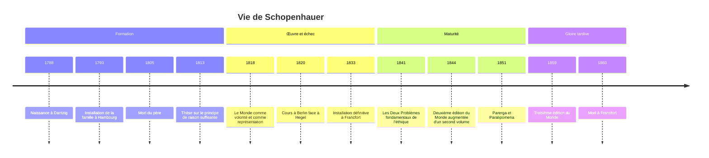

# Arthur Schopenhauer (1788-1860)

## Biographie et contexte

**Arthur Schopenhauer** naît le 22 février 1788 à Dantzig (aujourd'hui Gdańsk, en Pologne) et meurt le 21 septembre 1860 à Francfort-sur-le-Main. Il est le philosophe du pessimisme, et l'un des premiers penseurs occidentaux à prendre au sérieux les philosophies de l'Inde.

### Un fils de marchand

Son père, Heinrich Floris Schopenhauer, riche négociant hanséatique et républicain de cœur, quitte Dantzig en 1793 quand la ville est annexée par la Prusse, pour s'installer à Hambourg. Il destine son fils au commerce et lui fait faire, adolescent, un long voyage à travers l'Europe (Angleterre, France, Suisse, Autriche). Arthur y voit la misère, les galériens de Toulon, et en garde le sentiment précoce que le monde est un lieu de souffrance.

En 1805, le père meurt en tombant dans un canal de Hambourg, très probablement un suicide. Sa mère, **Johanna Schopenhauer**, s'installe à Weimar où elle tient un salon fréquenté par Goethe et devient une romancière à succès. Les relations entre mère et fils, orageuses, s'achèvent en rupture définitive en 1814. Libéré du négoce, Arthur étudie la médecine puis la philosophie à Göttingen et à Berlin, où il découvre [[Platon]] et [[Kant]], ses deux maîtres.

### L'échec, puis la gloire tardive

Sa thèse, *De la quadruple racine du principe de raison suffisante* (1813), lui vaut l'intérêt de Goethe, avec qui il travaille sur la théorie des couleurs. À trente ans, il publie son œuvre maîtresse, *Le Monde comme volonté et comme représentation* (daté de 1819, paru fin 1818). Le livre passe presque inaperçu.

En 1820, devenu *Privatdozent* à Berlin, il fixe son cours à la même heure que celui de [[Hegel]], alors au sommet de sa gloire. Presque personne ne vient ; l'expérience ne sera pas renouvelée. En 1831, il fuit l'épidémie de choléra qui emportera Hegel et s'installe en 1833 à Francfort, où il vit de ses rentes, seul avec ses caniches successifs, dans une routine immuable.

La reconnaissance vient enfin avec les *Parerga et Paralipomena* (1851), recueil d'essais brillants et accessibles, dont les *Aphorismes sur la sagesse dans la vie*. Dans les années 1850, il devient une figure célèbre, visitée et commentée, en partie parce que l'échec des révolutions de 1848 a préparé les esprits à une philosophie désenchantée.

## Œuvres majeures

| Œuvre | Année | Thème principal |
|---|---|---|
| **De la quadruple racine du principe de raison suffisante** | 1813 | Les quatre formes de la nécessité dans la représentation |
| **Sur la vue et les couleurs** | 1816 | Théorie des couleurs, dans le sillage de Goethe |
| **Le Monde comme volonté et comme représentation** | 1818 (2e éd. augmentée d'un second volume 1844, 3e éd. 1859) | Système complet : connaissance, nature, art, morale |
| **De la volonté dans la nature** | 1836 | Confirmations de sa doctrine par les sciences |
| **Les Deux Problèmes fondamentaux de l'éthique** | 1841 | Liberté de la volonté et fondement de la morale |
| **Parerga et Paralipomena** | 1851 | Essais : sagesse de la vie, religion, écrivains, femmes |

Les *Deux Problèmes* réunissent deux mémoires de concours : celui sur la liberté, couronné en 1839 par la Société royale des sciences de Norvège, et celui sur le fondement de la morale, refusé en 1840 par l'Académie danoise, notamment pour son manque de respect envers les « philosophes éminents » de l'époque.

## Concepts clés

### Le monde est ma représentation

Schopenhauer part de [[Kant]] : nous ne connaissons pas les choses en soi mais seulement des **phénomènes**, structurés par les formes de notre esprit. Il simplifie ces formes : l'espace, le temps et la causalité, que résume le **principe de raison suffisante** (rien n'est sans raison). Le monde, tel qu'il m'apparaît, est donc « ma représentation », la première phrase de son grand livre. Espace et temps sont aussi le **principe d'individuation** : ce sont eux qui découpent le réel en individus séparés.

### Le monde est volonté

Mais Kant laissait la chose en soi inconnaissable. Schopenhauer prétend y accéder par une voie unique : notre propre **corps**. Je ne connais pas seulement mon corps de l'extérieur, comme un objet parmi d'autres ; je l'éprouve de l'intérieur comme **volonté**, désir, effort, besoin. Par analogie, il étend cette découverte à toute la nature : la pesanteur, la croissance des plantes, l'instinct animal et le désir humain sont des degrés d'objectivation d'une même force, la **Volonté**, ou « vouloir-vivre ».

Cette Volonté est aveugle, sans but ni raison, une et indivisible sous la multiplicité des phénomènes. L'intellect n'est qu'un instrument à son service.

> [!important] Idée clé
> C'est la rupture la plus profonde de Schopenhauer avec toute la tradition, de [[Platon]] à [[Hegel]]. Pour eux, la raison est au fond du réel et le monde est rationnel. Pour Schopenhauer, l'intellect ressemble à un paralytique voyant juché sur les épaules d'un aveugle robuste, la Volonté, qui seule avance : au fond de tout, il y a un désir sans raison, dont notre conscience n'est que la surface. Ce renversement ouvre la voie à la « volonté de puissance » de [[Nietzsche]] et à l'inconscient pulsionnel de Freud.

### Le pessimisme

Vouloir, c'est manquer de quelque chose, donc souffrir. Le désir satisfait ne procure qu'un soulagement bref, aussitôt remplacé par un nouveau désir, ou par l'**ennui**. La vie oscille ainsi, selon une image célèbre du *Monde*, comme un pendule entre la souffrance et l'ennui. Le bonheur n'est jamais que négatif : la simple cessation d'une douleur.

À l'échelle de la nature, le vouloir-vivre se déchire lui-même : chaque espèce vit de la destruction d'une autre. L'amour sexuel n'est qu'une ruse de l'espèce pour se perpétuer, qui fait croire aux individus qu'ils poursuivent leur propre bonheur. Contre Leibniz et son « meilleur des mondes possibles », Schopenhauer soutient que ce monde est le pire des mondes possibles, au sens où, un peu plus mauvais, il ne pourrait plus subsister.

### Trois voies de délivrance

La souffrance vient de la Volonté ; toute délivrance consiste à s'en affranchir, temporairement ou définitivement.

| Voie | Mécanisme | Durée |
|---|---|---|
| **L'art** | Contemplation désintéressée : le sujet oublie son vouloir et saisit les Idées, au sens platonicien | Moments fugitifs |
| **La morale de la pitié** | Reconnaître dans la souffrance d'autrui sa propre souffrance, au-delà de l'illusion de l'individuation | Durable mais partielle |
| **L'ascèse** | Négation du vouloir-vivre : chasteté, pauvreté, renoncement | Délivrance complète, rare |

**L'art.** Dans la contemplation esthétique, nous cessons un instant d'être des individus qui désirent et devenons de purs sujets connaissants. Les arts sont hiérarchisés selon les degrés d'objectivation de la Volonté qu'ils représentent, de l'architecture à la tragédie. La **musique** a une place à part : elle ne représente pas les Idées, elle est une copie directe de la Volonté elle-même. C'est pourquoi elle nous touche si profondément. Cette thèse fascinera Wagner (voir [[Romantisme]]).

**La pitié.** La morale ne se fonde pas sur la raison, comme chez [[Kant]], mais sur un sentiment : la **compassion** (*Mitleid*). Quand je souffre de la souffrance d'autrui, je perce l'illusion qui me sépare de lui ; je reconnais, selon la formule sanskrite qu'il affectionne, que « tu es cela ». La pitié s'étend aux animaux, ce qui fait de Schopenhauer un précurseur de l'éthique animale.

**L'ascèse.** Le saint ne se contente pas de compatir : il cesse de vouloir. Schopenhauer reconnaît cette figure chez les ascètes chrétiens, hindous et bouddhistes. Il ne s'agit pas du suicide, qu'il juge un échec : le suicidaire veut la vie, mais refuse les conditions qui lui sont faites ; il nie le phénomène, non le vouloir-vivre.

### L'Orient

Schopenhauer découvre en 1813-1814 les **Upanishads**, dans la traduction latine d'Anquetil-Duperron (*Oupnek'hat*), qu'il lira chaque soir et appelle la consolation de sa vie et de sa mort. Il trouve dans l'[[Hindouisme]] (le voile de Maya, illusion de la pluralité) et le [[Bouddhisme]] (la souffrance universelle, l'extinction du désir) une confirmation de ses thèses. Une statuette du Bouddha ornait son appartement.

> [!warning] Piège
> On présente parfois Schopenhauer comme un philosophe bouddhiste ou comme un disciple de la pensée indienne. En réalité, le cœur de son système était constitué avant sa connaissance approfondie de ces textes, qu'il ne lisait qu'en traduction, alors très partielle. Surtout, son « nirvana » reste pensé à partir de catégories occidentales et kantiennes : le néant qui suit la négation de la volonté n'est qu'un néant relatif, défini par rapport à notre monde. Il y a convergence, qu'il a lui-même soulignée, et non filiation.

## Influence et postérité

Schopenhauer est sans doute le philosophe allemand qui a le plus influencé les artistes.

- **[[Nietzsche]]** le découvre en 1865 dans une librairie de Leipzig et en fait son « éducateur », avant de retourner son pessimisme en affirmation de la vie.
- **Wagner** lui envoie le livret de *L'Anneau du Nibelung* ; *Tristan et Isolde* est souvent lu comme une mise en musique de sa métaphysique.
- **Freud** reconnaît que Schopenhauer avait anticipé le primat de l'inconscient et de la sexualité, et Jung le cite comme une lecture décisive de sa jeunesse (voir [[Carl Gustave Jung]] et [[Psychologie]]).
- **Littérature** : Tolstoï, Maupassant, Thomas Mann dans *Les Buddenbrook*, Proust, Borges, Beckett, et en France Houellebecq, se réclament de lui ou en portent la marque.
- **[[Wittgenstein]]** a lu Schopenhauer très jeune, et on en trouve l'écho dans la fin du *Tractatus*.
- **Philosophie** : sa critique de la raison et son attention au corps annoncent la philosophie de la vie ; son pessimisme a nourri les débats sur le [[Nihilisme]].

## Critiques

- **La contradiction de la négation** : si tout est Volonté, qui nie la Volonté ? Comment un intellect qui n'est qu'un instrument du vouloir peut-il se retourner contre lui ? Schopenhauer parle lui-même de mystère.
- **L'accès à la chose en soi** : les lecteurs kantiens objectent qu'en identifiant la chose en soi à la Volonté, il franchit la limite critique qu'il prétendait respecter. Il nuancera plus tard : la Volonté serait la chose en soi telle qu'elle se manifeste à nous.
- **La vie et la doctrine** : le prêcheur de l'ascèse vivait confortablement de ses rentes, soignait sa fortune et fuyait le choléra. Il répondait qu'un philosophe n'a pas à être un saint, pas plus qu'un sculpteur n'a à être beau.
- **Misogynie** : l'essai *Sur les femmes* (dans les *Parerga*) accumule des jugements méprisants, qui reflètent les préjugés de son temps et de sa biographie autant qu'une nécessité de son système.
- **Le pessimisme comme tempérament** : bien des lecteurs y ont vu la généralisation d'une humeur plutôt qu'une démonstration, puisque le bilan des plaisirs et des peines ne peut être établi objectivement ; [[Nietzsche]] y diagnostiquera un symptôme de fatigue vitale.

## Chronologie

## Questions de révision

> [!quiz] Comment Schopenhauer prétend-il accéder à la chose en soi que Kant jugeait inconnaissable ?
> Par notre propre corps : je ne le connais pas seulement de l'extérieur comme un objet, je l'éprouve de l'intérieur comme volonté. Par analogie, il étend cette découverte à toute la nature.

> [!quiz] Quels sont les caractères de la Volonté chez Schopenhauer ?
> Elle est aveugle, sans but ni raison, une et indivisible sous la multiplicité des phénomènes ; l'intellect n'est qu'un instrument à son service.

> [!quiz] Pourquoi la vie oscille-t-elle, selon Schopenhauer, entre souffrance et ennui ?
> Vouloir, c'est manquer, donc souffrir ; le désir satisfait ne procure qu'un soulagement bref, remplacé par un nouveau désir ou par l'ennui. Le bonheur n'est que négatif, la cessation d'une douleur.

> [!quiz] Quelles sont les trois voies de délivrance de la Volonté ?
> L'art (contemplation désintéressée, délivrance fugitive), la morale de la pitié (durable mais partielle) et l'ascèse, négation du vouloir-vivre (délivrance complète mais rare).

> [!quiz] Pourquoi la musique occupe-t-elle une place à part parmi les arts ?
> Les autres arts représentent les Idées ; la musique est une copie directe de la Volonté elle-même, ce qui explique qu'elle nous touche si profondément.

> [!quiz] Sur quoi Schopenhauer fonde-t-il la morale, contrairement à Kant ?
> Non sur la raison mais sur un sentiment, la compassion (*Mitleid*) : en souffrant de la souffrance d'autrui, je perce l'illusion de l'individuation qui me sépare de lui. Cette pitié s'étend aux animaux.

## Ressources

- **Arthur Schopenhauer**, *Le Monde comme volonté et comme représentation*, trad. Auguste Burdeau, revue par Richard Roos, PUF, 1966.
- **Rüdiger Safranski**, *Schopenhauer et les années folles de la philosophie*, PUF, 1990 (original allemand 1987).
- **Clément Rosset**, *Schopenhauer, philosophe de l'absurde*, PUF, 1967.
- **Bryan Magee**, *The Philosophy of Schopenhauer*, Oxford University Press, 1983.
- **Christopher Janaway**, *Schopenhauer: A Very Short Introduction*, Oxford University Press, 2002.
