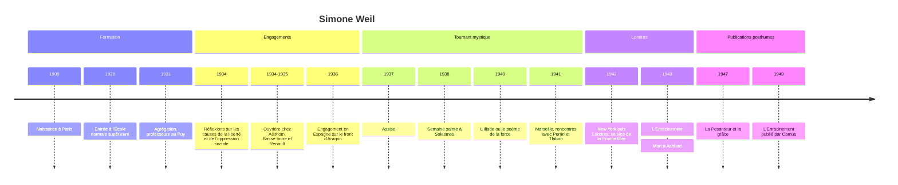

# Simone Weil (1909-1943)

Simone Weil est une philosophe française morte à 34 ans, dont presque toute l'œuvre a été publiée après sa mort. Normalienne et agrégée, elle a voulu penser au plus près de l'expérience : elle a travaillé en usine pour comprendre l'oppression ouvrière, rejoint une colonne anarchiste pendant la guerre d'Espagne, puis connu une série d'expériences mystiques qui l'ont menée au seuil du christianisme sans qu'elle en franchisse la porte. Sa pensée tient ensemble deux pôles qui paraissent inconciliables : une analyse matérialiste et lucide de la **force** et du **travail**, et une métaphysique de la **grâce**, de l'**attention** et du **malheur**. Elle n'appartient à aucune école, et c'est ce qui en fait l'une des voix les plus singulières du XXe siècle.

## Biographie et contexte

Simone Weil naît à Paris le 3 février 1909, dans une famille juive agnostique et aisée ; son père est médecin. Son frère aîné, André Weil, deviendra l'un des plus grands mathématiciens du siècle. Au lycée Henri-IV, elle suit l'enseignement du philosophe Alain, qui la marque profondément par son exigence de pensée concrète et sa méfiance envers les pouvoirs. Elle entre à l'École normale supérieure en 1928, où son intransigeance lui vaut, de la part de ses condisciples, le surnom d'« impératif catégorique en jupons ». [[Beauvoir]], dans ses *Mémoires d'une jeune fille rangée*, raconte leur unique conversation : Weil y affirmait que la seule chose qui compte est une révolution qui donnerait à manger à tout le monde.

Agrégée en 1931, elle enseigne dans plusieurs lycées de province, d'abord au Puy, où elle fait scandale en soutenant des chômeurs en grève. Elle milite dans le syndicalisme révolutionnaire, écrit dans des revues d'extrême gauche, mais se tient à distance du Parti communiste, dont elle voit tôt la dérive bureaucratique (voir [[Le Communisme au XXe siècle]]).

En décembre 1934, elle demande un congé pour travailler comme ouvrière : chez Alsthom à Paris, puis à l'usine des Forges de Basse-Indre à Boulogne-Billancourt, puis chez Renault, jusqu'à l'été 1935. Cette expérience, consignée dans son *Journal d'usine*, la brise physiquement et moralement ; elle y découvre moins la révolte que l'humiliation et la docilité que produit le travail à la chaîne. En août 1936, elle rejoint en Espagne une colonne anarchiste sur le front d'Aragon ; un accident (elle se brûle gravement avec de l'huile bouillante) écourte son engagement, dont elle revient horrifiée par les violences commises de part et d'autre.

Entre 1935 et 1938 se produisent trois expériences qui réorientent sa vie : dans un village de pêcheurs portugais, devant un chant de procession ; à Assise, dans la chapelle où priait saint François ; à l'abbaye de Solesmes enfin, pendant la semaine sainte de 1938, où elle découvre le poème *Love* de George Herbert, qu'elle apprend par cœur et se récite ensuite. Elle écrira plus tard que, lors d'une de ces récitations, quelques mois après Solesmes, « le Christ lui-même est descendu et m'a prise ».

Réfugiée à Marseille après la défaite de 1940 (voir [[08 - Vichy, Occupation et Résistance]]), elle rencontre le dominicain Joseph-Marie Perrin et le philosophe paysan Gustave Thibon, chez qui elle travaille aux vendanges en Ardèche, et leur confie ses cahiers. En 1942, elle accompagne ses parents à New York, puis rejoint Londres en novembre pour servir la France libre. Chargée de réfléchir à la reconstruction du pays, elle rédige en quelques mois *L'Enracinement*. Atteinte de tuberculose et se nourrissant très peu, par solidarité, disait-elle, avec les Français soumis aux rations de l'Occupation, elle meurt au sanatorium d'Ashford, dans le Kent, le 24 août 1943.

> [!note] Débat
> Les circonstances de sa mort restent discutées. Le médecin légiste anglais conclut à un suicide par refus de s'alimenter dans un état de déséquilibre mental. Ses biographes contestent en général ce verdict : la tuberculose était la cause première, et la restriction alimentaire relève d'un choix éthique et religieux cohérent avec toute sa vie plutôt que d'une volonté de mourir. D'autres lectures, plus psychologiques, y voient un rapport pathologique à la nourriture présent dès l'adolescence. Aucune de ces interprétations ne fait l'unanimité.

## Œuvres majeures

La quasi-totalité de ces textes est posthume ; les dates sont celles de la première publication, la rédaction étant antérieure.

| Œuvre | Rédaction et publication | Thème principal |
|---|---|---|
| **Réflexions sur les causes de la liberté et de l'oppression sociale** | 1934, publié en 1955 | Critique du marxisme, nature de l'oppression |
| **L'Iliade ou le poème de la force** | 1939-1940, publié en 1940-1941 sous l'anagramme Émile Novis | La force qui change l'homme en chose |
| **La Pesanteur et la grâce** | Extraits des cahiers choisis par Thibon, 1947 | Mystique, décréation, attention |
| **L'Enracinement** | 1943, publié en 1949 par Camus | Besoins de l'âme, reconstruction de la France |
| **Attente de Dieu** | Lettres et essais réunis par Perrin, 1950 | Autobiographie spirituelle, amour de Dieu |
| **Note sur la suppression générale des partis politiques** | 1943, publié en 1950 | Critique des partis |
| **La Condition ouvrière** | Journal d'usine et lettres, 1951 | Travail industriel, oppression |

## Concepts clés

### L'oppression et le travail

Dès 1934, Weil prend ses distances avec le [[Marxisme]]. Elle reconnaît à [[Karl Marx]] le mérite d'avoir montré que l'oppression est liée à l'organisation de la production, mais elle refuse l'idée que le développement des forces productives mènera à la libération. L'oppression moderne ne tient pas seulement à la propriété privée : elle tient à la **division entre ceux qui pensent le travail et ceux qui l'exécutent**, que la grande industrie pousse à l'extrême et qu'un régime socialiste bureaucratique reproduirait. Une révolution qui garderait l'usine telle qu'elle est ne libérerait personne.

Son expérience ouvrière l'amène à une idée qu'on retrouve dans la [[Sociologie du Travail]] : le pire, à l'usine, n'est pas la fatigue mais la soumission de la pensée à la cadence, l'impossibilité de comprendre ce que l'on fait. Elle rêve d'un travail où l'ouvrier saisirait la totalité du processus, et où le travail physique deviendrait, selon ses termes, un contact avec la réalité du monde.

### La force

*L'Iliade ou le poème de la force*, écrit au moment où la guerre revient en Europe, lit l'épopée d'Homère comme une méditation sur la **force** : ce qui fait d'un homme une chose, littéralement un cadavre, ou déjà une chose vivante chez l'esclave et le suppliant. La force pétrifie autant celui qui l'exerce que celui qui la subit ; le vainqueur est emporté par l'ivresse qui le mènera à sa perte. La grandeur de l'*Iliade* tient, selon elle, à ce qu'aucun camp n'y est méprisé : le poète éprouve la même amertume pour les Grecs et pour les Troyens.

### L'attention

L'attention est chez Weil une notion à la fois intellectuelle, morale et religieuse. Elle consiste à suspendre sa pensée, à la rendre disponible, vide et pénétrable à l'objet, au lieu de le saisir. Dans un texte célèbre sur les études scolaires, elle explique que l'effort d'attention sur un problème de géométrie, même non résolu, forme la capacité de prière et d'attention à autrui. Elle écrit à Joë Bousquet que « l'attention est la forme la plus rare et la plus pure de la générosité ». Prêter attention au malheureux, c'est être capable de lui demander simplement : quel est ton tourment ?

### Le malheur, la pesanteur et la grâce

Le **malheur** n'est pas la simple souffrance : c'est une déchirure qui atteint à la fois le corps, l'âme et la position sociale, et qui imprime au malheureux la marque de l'esclavage. La **pesanteur** désigne l'ensemble des mécanismes (physiques, psychologiques, sociaux) qui gouvernent le monde et l'âme humaine, et qui tirent tout vers le bas. La **grâce** est ce qui échappe à cette loi, et elle ne peut entrer que là où un vide lui a été laissé. D'où la notion de **décréation** : consentir à n'être rien, défaire en soi le moi qui fait écran, pour laisser Dieu aimer la création à travers nous.

### L'enracinement

*L'Enracinement* s'ouvre sur une phrase-programme : « La notion d'obligation prime celle de droit ». Un droit n'a de force que si quelqu'un se reconnaît obligé envers celui qui le détient ; les obligations envers l'être humain sont donc premières. Weil dresse alors la liste des **besoins de l'âme** (ordre, liberté, obéissance, responsabilité, égalité, hiérarchie, honneur, sécurité, risque, propriété, vérité...), souvent présentés par paires opposées qui doivent s'équilibrer.

Le plus important est l'**enracinement** : la participation réelle et active à une collectivité qui conserve des trésors du passé et des pressentiments d'avenir. Le déracinement, produit par la conquête, la colonisation, l'argent et la condition ouvrière moderne, est pour elle la maladie la plus dangereuse des sociétés humaines, car les déracinés déracinent à leur tour. Elle applique ce diagnostic à la France de 1940 et à la question coloniale.

> [!important] Idée clé
> L'enracinement weilien n'est pas un nationalisme. Weil critique durement l'idolâtrie de l'État-nation, qu'elle juge responsable du déracinement des provinces, et elle voit dans la colonisation un crime de déracinement. La patrie n'est pour elle qu'un milieu vital parmi d'autres, à aimer avec compassion pour sa fragilité, non avec orgueil. Lire le livre comme un appel au retour à la terre et à la tradition, c'est manquer sa dimension universaliste.

### La critique des partis politiques

Dans une note brève et radicale, Weil propose la **suppression des partis**. Un parti est, selon elle, une machine à fabriquer de la passion collective et à exercer une pression sur la pensée de ses membres ; sa seule fin est sa propre croissance. Chacun devrait se prononcer en conscience sur chaque question, et non selon une ligne. Le texte, écrit à Londres, visait la reconstruction de la vie publique après la guerre.

## Influence et postérité

La publication posthume de ses écrits, à partir de 1947, lui vaut une célébrité rapide. Albert [[Camus]] publie *L'Enracinement* dans sa collection « Espoir » chez Gallimard et la tient pour l'un des grands esprits de son temps. T. S. Eliot préface la traduction anglaise du même livre. [[Arendt]] salue dans *Condition de l'homme moderne* (1958) *La Condition ouvrière* comme un des rares livres à traiter du travail sans préjugé ni sentimentalité. Sa pensée est aujourd'hui lue par des publics très divers : chrétiens attirés par sa mystique, militants de la décroissance et critiques du productivisme, penseurs de l'éthique du soin qui reprennent sa notion d'attention. Elle occupe une place à part dans la [[Philosophie de la Religion]] comme dans la [[Philosophie Politique]] du XXe siècle.

## Critiques

**Le rapport au judaïsme.** Weil, née juive, rejette l'héritage de l'Ancien Testament, qu'elle juge marqué par la force et l'idolâtrie collective, et refuse de se considérer comme juive. Emmanuel Levinas, dans « Simone Weil contre la Bible » (repris dans *Difficile liberté*), lui reproche une lecture profondément injuste du [[Judaïsme]]. La question est d'autant plus douloureuse que ces pages ont été écrites pendant la persécution des Juifs d'Europe.

**Le refus du baptême.** Elle est restée volontairement au seuil de l'Église, par fidélité à tout ce que le [[Christianisme]] institué exclut (les incroyants, les hérétiques, les autres religions). Cette position a suscité des lectures opposées, chrétiennes et laïques, et des récupérations contradictoires. On évoque un baptême administré par une amie à la fin de sa vie, mais le témoignage est tardif et contesté.

**Une politique antipluraliste ?** Sa critique des partis et son insistance sur l'obligation et la hiérarchie ont été jugées difficilement compatibles avec la démocratie libérale. Ses défenseurs répondent qu'elle visait l'autonomie du jugement individuel contre les machines collectives, non l'autorité d'un pouvoir unique.

> [!warning] Piège
> *La Pesanteur et la grâce* n'est pas un livre de Simone Weil au sens habituel : c'est un choix de fragments de ses cahiers, découpés et classés par thèmes par Gustave Thibon. Le recueil a fait sa célébrité, mais il donne l'image d'une mystique aphoristique et détachée du monde. Ses cahiers complets et ses textes politiques montrent une pensée bien plus liée à l'histoire, au travail et à la science.

## Chronologie

## Ressources

- Simone Weil, *Œuvres*, édition établie par Florence de Lussy, Gallimard, coll. Quarto, 1999.
- Simone Pétrement, *La Vie de Simone Weil*, Fayard, 1973.
- Miklos Vetö, *La Métaphysique religieuse de Simone Weil*, Vrin, 1971.
- Robert Chenavier, *Simone Weil. Une philosophie du travail*, Cerf, 2001.
