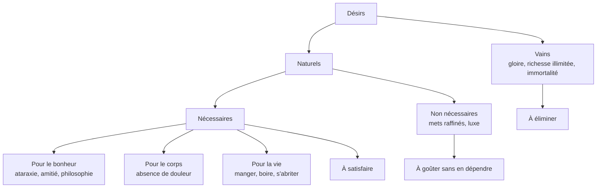
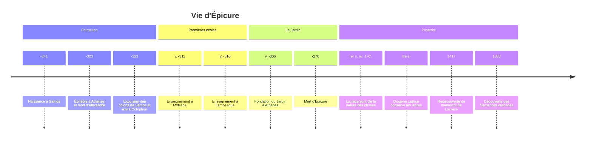

# Épicure (341-270 av. J.-C.)

## Biographie et contexte

**Épicure** naît en 341 av. J.-C. à Samos, dans une famille de colons athéniens installés sur l'île. Son père aurait été maître d'école. Il se forme d'abord auprès de maîtres liés à Platon et surtout à Démocrite (par l'intermédiaire de Nausiphane), dont il reprendra la physique tout en minimisant sa dette envers eux.

### Un monde qui bascule

Épicure a 18 ans quand meurt Alexandre le Grand (323), et il vient alors à Athènes accomplir son service d'éphèbe. Peu après, en 322, les colons athéniens sont expulsés de Samos : sa famille se réfugie à Colophon. Le monde des cités autonomes s'efface devant les grands royaumes hellénistiques gouvernés par les successeurs d'Alexandre. Le citoyen n'a plus guère de prise sur la politique ; la philosophie se recentre sur une question plus intime : **comment être heureux dans un monde que l'on ne maîtrise pas ?** Le [[Stoïcisme]], le scepticisme et l'épicurisme, écoles nées dans ces mêmes décennies, y répondent chacun à leur manière.

### Le Jardin

Après avoir enseigné à Mytilène, sur l'île de Lesbos, puis à Lampsaque, Épicure s'installe à Athènes vers 306 et achète une maison avec un **jardin** (*kêpos*) hors des murs. L'école en prend le nom. Elle a trois traits remarquables pour l'époque :

- elle accueille des **femmes**, dont certaines courtisanes, et des **esclaves**, comme Mys, que le testament d'Épicure affranchit ;
- elle repose sur l'**amitié** et une vie commune frugale plutôt que sur un enseignement public ;
- elle cultive la fidélité au fondateur : les disciples apprennent par cœur ses maximes, célèbrent son anniversaire, et la doctrine évoluera très peu pendant des siècles.

Malade durant ses dernières années, Épicure meurt en 270 d'une affection urinaire douloureuse. Diogène Laërce rapporte une lettre écrite ce jour-là, où il dit que le souvenir de ses conversations philosophiques compense l'intensité de ses souffrances.

## Œuvres majeures

Diogène Laërce attribue à Épicure environ trois cents rouleaux. Presque tout est perdu. Nous devons l'essentiel de ce qui reste au livre X des *Vies et doctrines des philosophes illustres* de Diogène Laërce (IIIe siècle apr. J.-C.), qui recopie trois lettres et les maximes.

| Texte | Contenu | Transmission |
|---|---|---|
| **Lettre à Hérodote** | Résumé de la physique : atomes, vide, âme, perception | Diogène Laërce |
| **Lettre à Pythoclès** | Phénomènes célestes et météorologiques ; authenticité discutée | Diogène Laërce |
| **Lettre à Ménécée** | Éthique : les dieux, la mort, les désirs, le plaisir | Diogène Laërce |
| **Maximes capitales** | 40 sentences résumant la doctrine | Diogène Laërce |
| **Sentences vaticanes** | 81 sentences, en partie communes aux Maximes | Manuscrit du Vatican découvert en 1888 |
| **Sur la nature** | Grand traité en 37 livres | Fragments carbonisés des papyrus d'Herculanum |

À ces sources s'ajoutent le poème latin de **Lucrèce**, *De la nature des choses* (Ier siècle av. J.-C.), exposé le plus complet de la physique épicurienne, les écrits de **Philodème de Gadara** retrouvés dans la villa des Papyrus à Herculanum, et l'immense inscription que **Diogène d'Œnoanda** fit graver sur un portique de sa ville d'Asie Mineure au IIe siècle apr. J.-C.

## Concepts clés

### Une philosophie-médecine

Pour Épicure, une philosophie qui ne guérit pas l'âme est aussi vaine qu'une médecine qui ne guérit pas le corps. Les disciples ont résumé la doctrine en un **quadruple remède** (*tetrapharmakos*), formulé ainsi chez Philodème :

| Crainte | Remède |
|---|---|
| Les dieux | Ils ne sont pas à craindre |
| La mort | Elle n'est pas à redouter |
| Le bien | Il est facile à obtenir |
| Le mal | Il est facile à supporter |

### La physique : atomes, vide et déclinaison

Épicure reprend l'atomisme de Démocrite (voir [[Présocratiques]]) : rien ne naît de rien, tout est composé d'**atomes** en nombre infini se mouvant dans le **vide** infini. L'âme elle-même est un agrégat d'atomes subtils, dispersé à la mort.

Il y ajoute une innovation décisive : les atomes, qui tombent tous à la même vitesse, s'écartent parfois de leur trajectoire de façon imprévisible, d'un écart minimal. Lucrèce appelle ce mouvement le **clinamen** (en grec *parenklisis*). Sans lui, aucune rencontre d'atomes ne se produirait, et surtout tout serait nécessité : la déclinaison ménage une place à la **liberté** humaine contre le déterminisme intégral.

La physique n'a pas de fin en elle-même : elle sert à délivrer de la peur. Qui sait que la foudre et les éclipses ont des causes naturelles ne tremble plus devant elles.

### Les dieux et la mort

Les dieux existent, mais ce sont des êtres bienheureux vivant dans les intervalles entre les mondes (*intermondes*), sans se soucier des humains. Ils ne punissent ni ne récompensent ; les prier par crainte est absurde, les contempler comme modèles de sérénité est bienfaisant.

Sur la mort, l'argument de la *Lettre à Ménécée* est célèbre : la mort n'est rien pour nous, car tout bien et tout mal résident dans la sensation, et la mort est privation de sensation. Tant que nous sommes, la mort n'est pas là ; quand elle est là, nous ne sommes plus. Ce qui est pénible, ce n'est pas la mort, mais l'attente angoissée de la mort.

### Le plaisir et la classification des désirs

Le **plaisir** est, selon la *Lettre à Ménécée*, le principe et la fin de la vie bienheureuse : c'est le critère naturel du bien, que tout vivant poursuit dès la naissance. Mais il s'agit d'abord d'une **absence de trouble** :

- l'**aponie**, absence de douleur dans le corps ;
- l'**ataraxie**, absence de trouble dans l'âme.

Épicure distingue le plaisir **en mouvement** (cinétique), comme boire quand on a soif, et le plaisir **en repos** (catastématique), l'état stable de qui n'a plus soif. Le second est supérieur. D'où une hiérarchie des désirs, qui organise toute l'éthique :

Il faut calculer : renoncer à un plaisir qui entraînera plus de peine, accepter une peine qui produira un plaisir plus grand. Du pain et de l'eau donnent le plaisir le plus haut à qui en a besoin, et l'habitude d'une vie simple rend capable de mieux goûter l'abondance quand elle se présente.

> [!warning] Piège
> Le mot « épicurien » désigne aujourd'hui un amateur de bonne chère. C'est presque le contresens exact. Épicure écrit lui-même, dans la *Lettre à Ménécée*, que le plaisir qu'il vise n'est ni celui des débauchés ni celui des jouisseurs, mais l'absence de douleur et de trouble. Le glissement vient en partie de la polémique antique : les adversaires stoïciens et plus tard chrétiens ont caricaturé l'école en porcherie, et certains Romains s'en sont réclamés pour justifier leur luxe.

### L'amitié et le retrait

L'**amitié** est le plus grand des biens que la sagesse procure pour le bonheur de toute la vie. Née de l'utilité, elle devient désirable pour elle-même. En revanche, Épicure conseille d'éviter la vie politique, source de trouble, ce que résume la formule attribuée à l'école : **vis caché** (*lathe biôsas*), contre laquelle Plutarque écrira tout un traité.

La **justice** n'a pas d'existence en soi : c'est un pacte d'utilité réciproque pour ne pas se nuire. On ne doit pas commettre d'injustice, non parce qu'elle est mauvaise en soi, mais parce que la crainte d'être découvert détruit l'ataraxie.

### La théorie de la connaissance : le canon

Les critères de vérité sont les **sensations**, toujours vraies en tant que telles, les **prolepses** (notions générales formées par la répétition des sensations) et les **affections** de plaisir et de douleur. L'erreur ne vient jamais des sens mais du jugement que nous ajoutons.

> [!important] Idée clé
> La comparaison avec le [[Stoïcisme]], son grand rival contemporain, éclaire les deux doctrines. Les deux visent la tranquillité de l'âme et une vie conforme à la nature. Mais le stoïcien place le bien dans la seule vertu et voit dans un cosmos rationnel et providentiel un ordre auquel consentir ; l'épicurien place le bien dans le plaisir, voit la vertu comme un moyen, et décrit un univers sans providence né de rencontres d'atomes. L'un demande de s'engager dans la cité, l'autre de s'en retirer. Ce sont deux réponses opposées à une même question hellénistique.

| | Épicurisme | Stoïcisme |
|---|---|---|
| Souverain bien | Le plaisir comme absence de trouble | La vertu |
| Univers | Atomes et vide, hasard, pas de providence | Logos, providence, destin |
| Dieux | Indifférents | Raison immanente au monde |
| Politique | S'en retirer | S'y engager comme devoir |
| Mort | Dispersion des atomes, rien pour nous | Retour au tout, à accepter |

## Influence et postérité

- **Rome** : Lucrèce donne à la doctrine sa forme poétique ; Cicéron la combat tout en la citant abondamment ; Horace et Virgile ont fréquenté des cercles épicuriens en Campanie. Même le stoïcien Sénèque cite volontiers Épicure dans ses *Lettres à Lucilius*.
- **Moyen Âge** : le christianisme rejette une doctrine niant la providence et l'immortalité de l'âme. Dante place Épicure et ses disciples en enfer, au chant X de l'*Enfer*.
- **Renaissance** : en 1417, l'humaniste Poggio Bracciolini retrouve un manuscrit de Lucrèce dans un monastère ; sa diffusion nourrit la pensée européenne. [[Montaigne]] cite Lucrèce à de très nombreuses reprises dans les *Essais*.
- **XVIIe siècle** : Pierre Gassendi tente de réconcilier atomisme épicurien et foi chrétienne et contribue à la naissance de la physique mécaniste (voir [[La Révolution Scientifique]]).
- **Lumières et modernité** : l'hédonisme calculateur annonce l'[[Utilitarisme]] de Bentham. Le jeune Marx consacre en 1841 sa thèse de doctorat à la différence entre la philosophie de la nature de Démocrite et celle d'Épicure. [[Nietzsche]] admire en Épicure un sage de la sérénité, tout en y voyant un signe de fatigue.
- **Aujourd'hui** : les réflexions sur la sobriété, sur la consommation et sur le bonheur (voir [[Qu'est-ce que le bonheur]] et [[Le Bonheur dans l'Histoire]]) redécouvrent la distinction entre désirs naturels et désirs vains, que l'on retrouve aussi dans l'analyse des [[Désirs]].

## Critiques

- **Cicéron et les stoïciens** : faire du plaisir le bien suprême abaisse l'homme au rang de l'animal, et définir le plaisir comme absence de douleur est un abus de langage.
- **Plutarque** : on ne peut même pas vivre agréablement selon Épicure, et le retrait politique est une désertion.
- **Le clinamen** : dès l'Antiquité, Cicéron le juge une invention arbitraire, un mouvement sans cause introduit pour sauver la liberté. Une déviation aléatoire fonde-t-elle vraiment la responsabilité, ou seulement le hasard ?
- **L'argument sur la mort** : les philosophes contemporains objectent que la mort peut être un mal par ce dont elle nous prive (argument de la privation, défendu notamment par Thomas Nagel), même si nous ne l'éprouvons pas.
- **L'égoïsme de l'amitié** : fonder l'amitié sur l'utilité semble contredire la gratuité qu'on lui prête ; la tension est présente dans les textes mêmes de l'école.

## Chronologie

## Ressources

- **Épicure**, *Lettres et maximes*, texte établi et traduit par Marcel Conche, PUF, 1987 : l'édition française de référence, avec un long commentaire.
- **Jean Salem**, *Tel un dieu parmi les hommes. L'éthique d'Épicure*, Vrin, 1989.
- **Pierre Hadot**, *Qu'est-ce que la philosophie antique ?*, Gallimard, 1995.
- **A. A. Long**, *Hellenistic Philosophy: Stoics, Epicureans, Sceptics*, Duckworth, 1974.
- **Stephen Greenblatt**, *The Swerve: How the World Became Modern*, 2011, trad. française *Quattrocento*, sur la redécouverte de Lucrèce.
