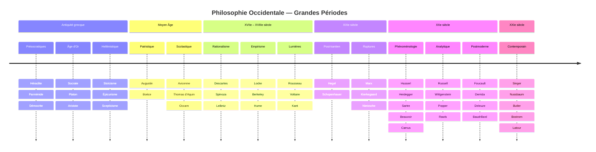
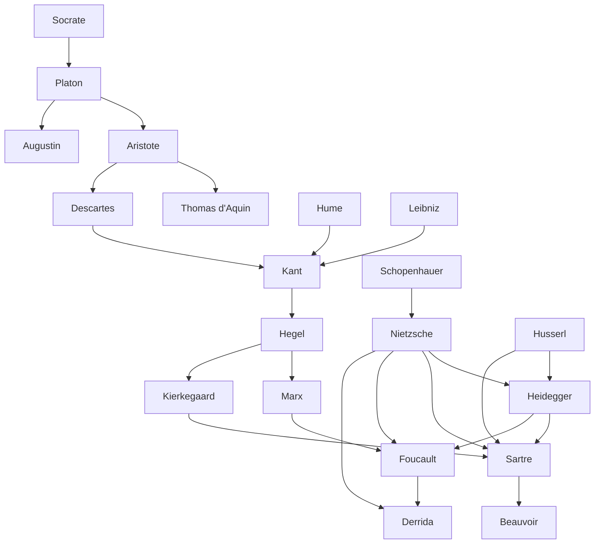

# Frise de la Philosophie Occidentale

## Vue d'ensemble — Diagramme chronologique

---

## Carte des influences majeures

---

## Antiquité — 6e siècle av. J.-C. au 5e siècle ap. J.-C.

### Les Présocratiques (–600 à –450)

Premiers philosophes grecs : ils cherchent à expliquer la nature (*physis*) sans recourir aux mythes.

| Philosophe | Dates | Idée centrale | Ce qui est encore discuté |
|---|---|---|---|
| Thalès de Milet | ~624–546 av. J.-C. | L'eau est le principe de toutes choses | Débuts du naturalisme — expliquer le monde par le monde |
| Héraclite | ~544–484 av. J.-C. | Tout s'écoule (*panta rhei*), le feu et le Logos | Préfigure Nietzsche (devenir), Hegel (dialectique), bouddhisme (impermanence) |
| Parménide | ~515–450 av. J.-C. | L'être est un, immuable — le changement est illusion | Opposition directe à Héraclite. Le premier argument logique soutenu en Occident |
| Démocrite | ~460–370 av. J.-C. | Atomisme — tout est atomes et vide | Préfigure la physique moderne de façon frappante |

**Tension fondatrice :** Héraclite (tout change) vs Parménide (rien ne change) — cette tension structure encore la métaphysique.

### L'Âge d'Or Grec (–450 à –322)

| Philosophe | Dates | Œuvres clés | Contribution majeure |
|---|---|---|---|
| **Socrate** | 470–399 av. J.-C. | Aucun écrit — connu par Platon et Xénophon | Maïeutique (accoucher les esprits), priorité de l'éthique, mort comme acte philosophique |
| **Platon** | 428–348 av. J.-C. | *La République*, *Le Banquet*, *Phédon*, *Théétète* | Monde des Idées, allégorie de la caverne, philosophie politique, premier système complet |
| **Aristote** | 384–322 av. J.-C. | *Éthique à Nicomaque*, *Politique*, *Métaphysique*, *Poétique* | Logique formelle, éthique des vertus, empirisme, classification de toutes les sciences |

**Ressource :** France Culture, *Les Chemins de la Philosophie* — série "Les Grecs" intégralement disponible en réécoute.

### Philosophie Hellénistique (–322 à +200)

Après Alexandre le Grand : la philosophie quitte les académies pour la vie pratique. *Comment bien vivre ?*

| École | Fondateur | Idée centrale | Ce qui reste vivant aujourd'hui |
|---|---|---|---|
| **Stoïcisme** | Zénon de Citium (~334–262) | Vertu, dichotomie du contrôle, cosmopolitisme | TCC, développement personnel, leadership, résilience |
| **Épicurisme** | Épicure (341–270) | Plaisir tranquille (*ataraxie*), amitié, simplicité | Psychologie positive, paradoxe du choix, slow life |
| **Cynisme** | Antisthène / Diogène (~412–323) | Vie conforme à la nature, rejet des conventions | Mouvements de décroissance, critique de la société de consommation |
| **Scepticisme** | Pyrrhon (~365–270) | Suspension du jugement (*épochè*), tranquillité | Épistémologie contemporaine, méthode scientifique |

---

## Philosophie Médiévale — 5e au 15e siècle

La philosophie se met au service de la théologie (*philosophia ancilla theologiae*) — mais conserve des tensions productives.

| Philosophe | Dates | Contribution | Tension |
|---|---|---|---|
| **Augustin** | 354–430 | Christianisme + platonisme. *Les Confessions*, *La Cité de Dieu* | Foi vs raison, prédestination vs libre arbitre |
| **Boèce** | ~480–524 | *La Consolation de la Philosophie* — pont entre Antiquité et Moyen Âge | Composé en prison, attendant son exécution |
| **Avicenne (Ibn Sîna)** | 980–1037 | Transmission d'Aristote via le monde arabe. Médecine et métaphysique | La philosophie arabe comme passeur de la pensée grecque |
| **Averroès (Ibn Rushd)** | 1126–1198 | Grand commentateur d'Aristote. Distingue raison et foi | L'Europe chrétienne lit Aristote en arabe avant de le lire en grec |
| **Thomas d'Aquin** | 1225–1274 | Christianisme + aristotélisme. *Somme théologique*. Cinq preuves de l'existence de Dieu | Synthèse la plus ambitieuse du Moyen Âge |
| **Guillaume d'Occam** | ~1287–1347 | Rasoir d'Occam — ne pas multiplier les entités inutilement. Nominalisme | "Les universaux n'existent que dans l'esprit" — préfigure l'empirisme |

---

## Philosophie Moderne — 15e au 18e siècle

### Rationalisme (17e siècle)

| Philosophe | Dates | Œuvres clés | Idée signature |
|---|---|---|---|
| **Descartes** | 1596–1650 | *Méditations Métaphysiques*, *Discours de la méthode* | Cogito, doute méthodique, dualisme corps/esprit |
| **Spinoza** | 1632–1677 | *Éthique*, *Traité théologico-politique* | Dieu = Nature (*Deus sive Natura*), déterminisme, immanence |
| **Leibniz** | 1646–1716 | *Monadologie*, *Nouveaux Essais* | Monades, harmonie préétablie, meilleur des mondes possibles |

### Empirisme britannique (17e–18e siècle)

| Philosophe | Dates | Œuvres clés | Idée signature |
|---|---|---|---|
| **Locke** | 1632–1704 | *Essai sur l'entendement humain*, *Deux Traités du gouvernement civil* | *Tabula rasa*, droits naturels, gouvernement limité |
| **Berkeley** | 1685–1753 | *Principes de la connaissance humaine* | *Esse est percipi* — être, c'est être perçu |
| **Hume** | 1711–1776 | *Enquête sur l'entendement humain*, *Traité de la nature humaine* | Scepticisme sur la causalité, problème de l'induction |

### Lumières (18e siècle)

| Philosophe | Dates | Œuvres clés | Idée signature |
|---|---|---|---|
| **Rousseau** | 1712–1778 | *Du Contrat Social*, *Émile*, *Discours sur l'inégalité* | Volonté générale, bonté naturelle, éducation |
| **Voltaire** | 1694–1778 | *Candide*, *Dictionnaire philosophique* | Critique religieuse, tolérance, liberté de pensée |
| **Kant** | 1724–1804 | *Critique de la raison pure*, *Fondements de la métaphysique des mœurs* | Révolution copernicienne, impératif catégorique, paix perpétuelle |

---

## Philosophie Contemporaine — 19e siècle à aujourd'hui

### 19e siècle — Ruptures

| Philosophe | Dates | Œuvres clés | Idée signature |
|---|---|---|---|
| **Hegel** | 1770–1831 | *Phénoménologie de l'esprit*, *Esthétique* | Dialectique, Esprit absolu, histoire comme réalisation de la raison |
| **Schopenhauer** | 1788–1860 | *Le Monde comme Volonté et Représentation* | Volonté aveugle, pessimisme, art comme salvation temporaire |
| **Marx** | 1818–1883 | *Manifeste*, *Le Capital* | Matérialisme historique, lutte des classes, aliénation |
| **Kierkegaard** | 1813–1855 | *Crainte et Tremblement*, *Ou bien… Ou bien* | Subjectivité, angoisse, saut de la foi, trois stades |
| **Nietzsche** | 1844–1900 | *Ainsi parlait Zarathoustra*, *La Généalogie de la morale* | Mort de Dieu, Übermensch, volonté de puissance, éternel retour |

### 20e siècle — Phénoménologie et existentialisme

| Philosophe | Dates | Idée centrale |
|---|---|---|
| **Husserl** | 1859–1938 | Phénoménologie — décrire les structures de la conscience |
| **Heidegger** | 1889–1976 | Question de l'Être, Dasein, être-pour-la-mort, technique |
| **Sartre** | 1905–1980 | Existence précède essence, liberté absolue, mauvaise foi |
| **Simone de Beauvoir** | 1908–1986 | Existentialisme féministe, "on ne naît pas femme" |
| **Camus** | 1913–1960 | Absurde, révolte, "il faut imaginer Sisyphe heureux" |
| **Merleau-Ponty** | 1908–1961 | Phénoménologie du corps, perception, chair du monde |

### 20e siècle — Philosophie analytique

| Philosophe | Dates | Idée centrale |
|---|---|---|
| **Frege** | 1848–1925 | Logique moderne, philosophie du langage |
| **Russell** | 1872–1970 | Logique, atomisme logique, paradoxes |
| **Wittgenstein** | 1889–1951 | *Tractatus* : limites du langage / *Investigations* : jeux de langage |
| **Popper** | 1902–1994 | Falsifiabilité, société ouverte |
| **Rawls** | 1921–2002 | Voile d'ignorance, justice comme équité |

### 20e siècle — Structuralisme et postmodernisme

| Philosophe | Dates | Idée centrale |
|---|---|---|
| **Lévi-Strauss** | 1908–2009 | Structures inconscientes de la pensée |
| **Foucault** | 1926–1984 | Pouvoir/savoir, disciplines, biopolitique |
| **Derrida** | 1930–2004 | Déconstruction, différance |
| **Deleuze** | 1925–1995 | Rhizome, différence et répétition |
| **Baudrillard** | 1929–2007 | Simulacre, hyperréalité |
| **Bourdieu** | 1930–2002 | Habitus, champ, capital culturel |

### 21e siècle — Philosophie en cours

- **Éthique de l'IA** : Nick Bostrom, Stuart Russell, Luciano Floridi
- **Philosophie de l'anthropocène** : Bruno Latour (*Face à Gaïa*), Timothy Morton
- **Altruisme efficace** : Peter Singer, Will MacAskill
- **Philosophie féministe et décoloniale** : bell hooks, Achille Mbembe, Judith Butler

---

## Grandes tensions traversant l'histoire

| Tension | Camp A | Camp B | Synthèse tentée |
|---|---|---|---|
| Raison vs Expérience | Descartes, Leibniz | Locke, Hume | Kant |
| Liberté vs Déterminisme | Sartre | Spinoza, Marx | Compatibilistes (Hume, Kant) |
| Individu vs Société | Mill, Locke | Rousseau, Marx | Rawls |
| Transcendance vs Immanence | Platon, Kant | Spinoza, Nietzsche | Hegel (immanence dialectique) |
| Raison vs Corps/Instinct | Platon, Descartes | Nietzsche, Merleau-Ponty | Phénoménologie |
| Sens vs Absurde | Hegel, Marx | Camus, Sartre | Viktor Frankl (sens choisi) |
| Être vs Devenir | Parménide | Héraclite | Hegel, Heidegger |

## Ressources

**Pour aller plus loin :**
- Luc Ferry, *Apprendre à vivre* (2006) — histoire de la philosophie comme arts de vivre. Très accessible.
- Simon Blackburn, *Think* (2001, traduit : *Penser*) — introduction thématique rigoureuse.
- France Culture, *Les Chemins de la Philosophie* — podcasts par période et par philosophe.
- Stanford Encyclopedia of Philosophy (plato.stanford.edu) — encyclopédie de référence, gratuite.
- Arte — *Philosophie*, émission de Raphaël Enthoven (archives disponibles).
