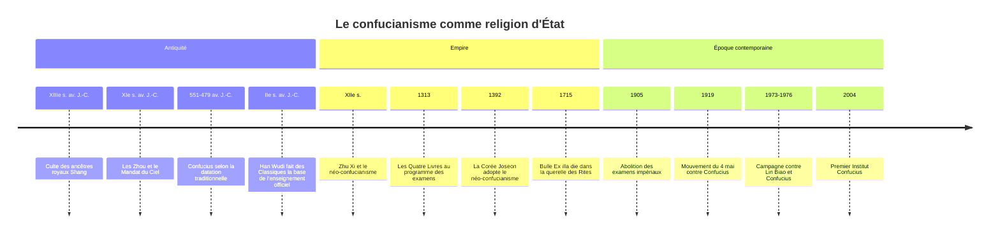

# Confucianisme

Le confucianisme est-il une religion ? La question divise depuis quatre siècles missionnaires, philosophes et sociologues. Il n'a ni Église, ni clergé propre, ni dogme de salut, ni rite d'adhésion. Pourtant, pendant deux mille ans, il a organisé en Chine, en Corée et au Vietnam un système complet de **rites** : sacrifices de l'empereur au Ciel, culte d'État rendu à [[Confucius]] dans des milliers de temples, culte domestique des ancêtres dans chaque famille. Cette note l'aborde sous cet angle, comme religion civique et rituelle ; sa dimension philosophique (humanité, homme de bien, éthique des vertus) est présentée dans [[Philosophies non-occidentales]].

## Origines : Confucius et les lettrés

### Un héritage plus ancien que Confucius

Ce que l'Occident appelle « confucianisme » porte en chinois le nom de *rujia* ou *rujiao*, la tradition des **ru**, les lettrés ritualistes. Elle est antérieure à Confucius. Dès la dynastie Shang (XVIe-XIe s. av. J.-C. environ), les inscriptions oraculaires sur os et carapaces montrent un culte intense rendu aux ancêtres royaux, consultés et nourris par des sacrifices. Les **Zhou**, qui renversent les Shang vers le milieu du XIe siècle av. J.-C., justifient leur conquête par le **Mandat du Ciel** (*tianming*) : le Ciel (*Tian*) confie le pouvoir à une lignée vertueuse et le lui retire si elle faillit. Ces deux piliers, le culte des ancêtres et la sacralité du Ciel, sont le socle sur lequel Confucius va bâtir.

### Confucius, transmetteur

**Kong Qiu**, dit maître Kong (*Kongzi*), latinisé en Confucius par les jésuites, vit selon la datation traditionnelle de 551 à 479 av. J.-C., dans l'État de Lu (actuel Shandong). Petit fonctionnaire, maître d'école, conseiller politique sans grand succès, il se décrit lui-même comme un **transmetteur et non un créateur**. Son projet est de restaurer l'ordre des premiers Zhou par la pratique scrupuleuse des rites (*li*) et la culture de la vertu d'humanité (*ren*). Ses propos, recueillis par ses disciples après sa mort, forment les *Entretiens* (*Lunyu*). Sur l'au-delà, il reste d'une sobriété célèbre : il recommande de respecter les esprits tout en s'en tenant à distance, et renvoie la question de la mort à celle de la vie qu'on ne connaît pas encore.

## Croyances

Le confucianisme ne propose ni création du monde, ni salut, ni jugement après la mort. Ses « croyances » sont moins des dogmes que des présupposés partagés :

| Notion | Sens religieux |
|---|---|
| **Tian** (Ciel) | Puissance suprême, plus ordre moral que dieu personnel, qui confère le mandat de gouverner |
| **Li** (rites) | Ensemble des conduites codifiées, du sacrifice d'État à la politesse quotidienne, qui mettent l'homme en accord avec l'ordre cosmique et social |
| **Xiao** (piété filiale) | Devoir envers les parents, prolongé après leur mort par le culte des ancêtres. Le *Classique de la piété filiale* en fait la racine de toutes les vertus |
| **Continuité des générations** | La vie se prolonge dans la lignée. Ne pas avoir de descendance, c'est interrompre le culte et abandonner ses ancêtres |
| **Harmonie Ciel-Terre-Homme** | Le souverain, par les rites, fait le lien entre les trois plans |

> [!important] Idée clé
> Le sociologue C. K. Yang a proposé de voir dans la religion chinoise une **religion diffuse** : au lieu de former une institution séparée, comme une Église, le sacré est incrusté dans les institutions séculières, la famille, le lignage, l'État, la corporation. Le confucianisme est l'exemple type de cette religiosité diffuse. Sa question n'est pas « à quoi faut-il croire ? » mais « comment faut-il se conduire envers les vivants et les morts ? ». C'est ce décalage, plus qu'une absence de sacré, qui rend la catégorie occidentale de « religion » si mal ajustée.

## Textes

| Corpus | Contenu | Statut |
|---|---|---|
| **Les Cinq Classiques** (*Wujing*) | *Classique des vers*, *Classique des documents*, *Classique des changements* (Yijing), *Mémoires sur les rites* (Liji), *Annales des Printemps et Automnes* | Canonisés sous les Han, base de l'enseignement officiel |
| **Les Quatre Livres** (*Sishu*) | *Entretiens*, *Mencius*, *Grande Étude*, *Invariable Milieu* | Regroupés et commentés par **Zhu Xi** (1130-1200). Programme des examens impériaux de 1313 à 1905 |
| **Classique de la piété filiale** (*Xiaojing*) | Bref traité sur la piété filiale | Texte élémentaire, appris par coeur |
| **Rites familiaux** de Zhu Xi (*Jiali*) | Manuel des rites domestiques : majorité, mariage, funérailles, sacrifices | Diffusé dans toute l'Asie orientale, il standardise le culte des ancêtres |

## Pratiques et rites

### Le culte des ancêtres

C'est la pratique religieuse la plus répandue en Asie orientale, bien au-delà de ceux qui se diraient confucéens. Chaque famille conserve des **tablettes ancestrales** portant le nom des défunts, devant lesquelles on offre encens, nourriture et prosternations aux dates prescrites. Les lignages aisés construisent des **temples ancestraux** (*citang*) où sont conservées les généalogies. Les funérailles obéissent à des degrés de deuil gradués selon la proximité de parenté, qui déterminent vêtements, durée et interdits. La fête de **Qingming**, au printemps, voit encore des centaines de millions de personnes balayer et fleurir les tombes.

### Le culte d'État

| Rite | Description |
|---|---|
| **Sacrifice au Ciel** | Célébré par l'empereur seul, au solstice d'hiver, sur l'autel circulaire du Temple du Ciel à Pékin (ensemble construit en 1406-1420, autel circulaire ajouté en 1530). Nul autre n'avait le droit de sacrifier au Ciel |
| **Sacrifices à la Terre, au Soleil, à la Lune, aux dieux du sol et des moissons** | Répartis entre autels spécialisés, selon un calendrier fixé par le ministère des Rites |
| **Culte de Confucius** | Offrandes rendues deux fois par an dans les temples de Confucius (*wenmiao*) de chaque chef-lieu, par les fonctionnaires et les étudiants. Le temple de Qufu, sa ville natale, en est le centre |
| **Culte impérial des ancêtres** | Rendu par la dynastie à ses propres ancêtres, dans le temple ancestral impérial |

## Organisation : l'État comme Église

Le confucianisme n'a pas de clergé parce que **l'État en tient lieu**. L'empereur est le grand pontife, les fonctionnaires lettrés sont les officiants, le ministère des Rites fixe la liturgie, et les **examens impériaux**, qui recrutent l'administration sur la maîtrise des Classiques, assurent la reproduction de ce corps. La famille, de son côté, a son propre prêtre : le chef de lignée ou l'aîné.

Sous l'empereur **Han Wudi** (règne 141-87 av. J.-C.), sur les conseils de Dong Zhongshu, les Classiques deviennent la base de l'enseignement officiel et une Académie impériale est créée. On parle souvent d'« adoption du confucianisme comme idéologie d'État » : les historiens nuancent aujourd'hui cette formule, car le légisme et d'autres courants restent influents longtemps après. Le néo-confucianisme de Zhu Xi, sous les Song, réintègre une métaphysique (principe et souffle) en réponse au bouddhisme et au taoïsme, et devient l'orthodoxie de la Chine des Ming et des Qing, de la Corée des **Joseon** (1392-1897), du Vietnam et, dans une moindre mesure, du Japon des Tokugawa.

## Le débat : est-ce une religion ?

### La querelle des Rites

Le débat naît avec les missionnaires jésuites. **Matteo Ricci** (mort en 1610) juge que les honneurs rendus à Confucius et aux ancêtres sont des rites civils et familiaux, compatibles avec le [[Christianisme]] ; les dominicains et les franciscains y voient de l'idolâtrie. La papauté tranche contre les jésuites, notamment par la bulle *Ex illa die* de Clément XI (1715) ; l'empereur Kangxi réagit en interdisant la prédication chrétienne (1721). Rome ne lève l'interdiction qu'en 1939. Ce conflit nourrit en Europe la réflexion sur la « religion naturelle » des Chinois, chez [[Leibniz]] ou Voltaire, qui voient dans la Chine une morale sans révélation.

### Kang Youwei et la « religion confucéenne »

À la fin de l'empire, le réformateur **Kang Youwei** veut faire du confucianisme une religion nationale sur le modèle du christianisme, avec Confucius en fondateur-prophète. Après la chute des Qing (1911-1912), une Association pour la religion confucéenne milite pour son inscription dans la constitution ; la tentative échoue face aux républicains, puis au mouvement du 4 mai 1919, qui fait de Confucius le symbole de l'archaïsme à abattre.

> [!warning] Piège
> Répondre « ce n'est pas une religion, c'est une philosophie » tranche trop vite, et selon un critère occidental. La catégorie « religion » (*zongjiao* en chinois) est elle-même un emprunt de la fin du XIXe siècle, passé par le japonais. Les deux réponses ont eu des usages politiques : dire que le confucianisme n'est pas une religion permettait aux jésuites de convertir sans détruire, et au régime communiste de le réhabiliter comme « culture traditionnelle » sans l'intégrer aux religions encadrées. Le philosophe Herbert Fingarette a résumé l'ambiguïté en décrivant Confucius comme celui qui fait du séculier un sacré.

Du point de vue de la [[Sociologie des Religions]], le confucianisme répond bien à la définition d'[[Émile Durkheim]] : un système de rites relatifs à des choses sacrées (ancêtres, Ciel, empereur) qui unit une communauté morale. Il correspond en revanche mal aux définitions centrées sur la croyance en des êtres surnaturels ou sur le salut individuel.

## Chronologie

## Présence aujourd'hui

Très peu de personnes se déclarent « confucéennes » dans les enquêtes : le Pew Research Center ne recense pas le confucianisme comme religion distincte, et ses pratiquants sont comptés parmi les bouddhistes, les adeptes des religions populaires ou les sans-religion. En Corée du Sud, les recensements n'en dénombrent qu'une très petite fraction de la population, bien inférieure à 1 %. Mais le culte des ancêtres, les degrés de parenté et l'idéal de piété filiale restent massivement pratiqués en Chine, à Taïwan, en Corée, au Vietnam et dans les diasporas.

| Lieu | Formes vivantes |
|---|---|
| **Chine** | Réhabilitation officielle depuis les années 2000, cérémonies à Qufu, essor des écoles de classiques, usage politique de l'« harmonie » |
| **Taïwan** | Cérémonie annuelle pour l'anniversaire de Confucius, qui y est la Journée des enseignants |
| **Corée du Sud** | Rites royaux du sanctuaire de Jongmyo (proclamés chef-d'œuvre du patrimoine immatériel par l'UNESCO en 2001, inscrits sur la liste représentative en 2008), rites à Confucius au Sungkyunkwan, rites ancestraux familiaux lors des fêtes |
| **Vietnam** | Autels des ancêtres dans presque tous les foyers, Temple de la Littérature à Hanoï |

## Influence

L'empreinte du confucianisme ne se mesure pas au nombre de fidèles déclarés mais à l'organisation des sociétés : respect de l'âge et de la hiérarchie, valeur de l'éducation et des concours, centralité de la famille, conception morale de l'État. [[Max Weber]], dans *Confucianisme et taoïsme*, y voyait une éthique d'adaptation au monde qui, à la différence de l'éthique protestante, n'aurait pas engendré le capitalisme. Le décollage économique de l'Asie orientale à la fin du XXe siècle a renversé l'argument : on a parlé de « valeurs asiatiques » confucéennes comme moteur de croissance, une thèse elle aussi contestée.

Il faut enfin rappeler que le confucianisme n'a jamais existé seul. Il a coexisté en Chine avec le [[Taoïsme]] et le [[Bouddhisme]], dans la formule des « trois enseignements », et au Japon avec le [[Shintoïsme]]. Une même famille pouvait honorer ses ancêtres selon les rites confucéens, appeler un prêtre taoïste pour un exorcisme et des moines bouddhistes pour les funérailles, sans y voir de contradiction.

## Ressources

- Anne Cheng, *Histoire de la pensée chinoise*, 1997.
- C. K. Yang, *Religion in Chinese Society*, 1961.
- Herbert Fingarette, *Confucius: The Secular as Sacred*, 1972.
- Xinzhong Yao, *An Introduction to Confucianism*, 2000.
- Anna Sun, *Confucianism as a World Religion*, 2013.
