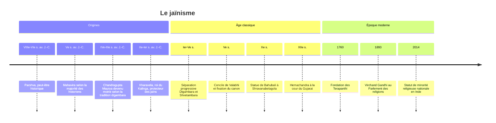

# Jaïnisme

Le jaïnisme est une religion indienne de renoncement, organisée autour d'un idéal de **non-violence** (*ahimsa*) poussé plus loin que dans toute autre tradition. Il ne reconnaît aucun dieu créateur : le salut est l'oeuvre de l'âme elle-même, qui se purifie de la matière karmique par l'ascèse jusqu'à l'omniscience et la libération. Ses maîtres sont les **Jina**, les « Vainqueurs » (d'où le nom de jaïn), vainqueurs non d'ennemis mais de leurs propres passions. Minoritaire (environ 4,5 millions de fidèles en Inde), le jaïnisme a exercé une influence considérable sur la culture indienne, du végétarisme à la pensée de Gandhi.

## Origines et fondateurs

### Mahavira, dernier des passeurs

Pour les jaïns, leur religion n'a pas de fondateur : elle est éternelle et redécouverte à chaque cycle cosmique par une série de vingt-quatre **Tirthankara**, les « faiseurs de gué » qui montrent le passage à travers l'océan des renaissances. Pour notre époque, le premier est **Rishabha**, figure mythique à qui la tradition prête une vie de millions d'années ; le vingt-troisième, **Parshva**, a peut-être existé : la tradition le place 273 ans avant le dernier, les historiens entre le VIIIe et le VIe siècle av. J.-C., certains à quelques décennies seulement de Mahavira.

Le vingt-quatrième, **Vardhamana**, appelé **Mahavira** (« Grand Héros »), est une figure historique. Contemporain du Bouddha, il naît dans une famille princière de la plaine du Gange, renonce au monde vers trente ans, mène douze ans et demi d'ascèse sévère, atteint l'omniscience (*kevala jnana*), enseigne pendant une trentaine d'années et meurt à Pava. La tradition Shvetambara date sa mort de 527 av. J.-C. (la tradition Digambara de 510) ; la plupart des historiens la placent plus tard, au Ve siècle av. J.-C., en cohérence avec la révision de la chronologie du Bouddha.

> [!warning] Piège
> Présenter Mahavira comme le « fondateur » du jaïnisme, à la manière dont le Bouddha fonde le [[Bouddhisme]], contredit la conception jaïne elle-même et probablement l'histoire. Mahavira réforme une communauté d'ascètes préexistante, rattachée à Parshva, dont les textes anciens mentionnent les disciples. Les deux religions naissent du même milieu, celui des *shramana*, ascètes errants qui contestaient l'autorité des Veda et le sacrifice brahmanique ; elles se sont d'ailleurs longtemps décrites l'une l'autre comme rivales.

## Croyances

### L'âme et la matière

L'univers jaïn est **éternel et incréé** ; il n'a besoin d'aucun dieu pour exister. Il se compose de deux grandes catégories :

| Catégorie | Contenu |
|---|---|
| **Jiva** (âmes) | Principes conscients, innombrables et éternels, présents non seulement chez les humains et les animaux mais dans les plantes, et même dans la terre, l'eau, le feu et l'air, sous forme d'êtres élémentaires à un seul sens |
| **Ajiva** (non-âme) | Matière, espace, temps, et les principes du mouvement et du repos |

### Le karma comme matière

Originalité majeure : le **karma** n'est pas une loi abstraite mais une **matière subtile**, qui s'attache à l'âme comme de la poussière à un corps huilé. Toute action motivée par la passion (colère, orgueil, tromperie, avidité) attire du karma, qui voile les qualités naturelles de l'âme : connaissance infinie, perception infinie, énergie infinie, félicité. Pour se libérer, il faut arrêter l'afflux de nouveau karma et brûler le karma accumulé par l'ascèse.

### La libération

L'âme délivrée de tout karma monte au sommet de l'univers, où elle demeure éternellement, omnisciente et bienheureuse, parmi les **siddha**. Les Tirthankara ne sont pas des dieux qui interviennent dans le monde : ils sont vénérés comme modèles, parvenus à la libération, qui ne répondent pas aux prières.

### Les trois joyaux et les cinq voeux

Le chemin de la libération repose sur les **trois joyaux** : foi juste, connaissance juste, conduite juste. La conduite s'organise autour de cinq voeux, pratiqués intégralement par les religieux (grands voeux) et de façon adaptée par les laïcs (petits voeux) :

| Voeu | Principe |
|---|---|
| **Ahimsa** | Non-violence envers tous les êtres vivants, y compris les plus petits |
| **Satya** | Vérité |
| **Asteya** | Ne pas prendre ce qui n'est pas donné |
| **Brahmacharya** | Chasteté totale pour les religieux, fidélité pour les laïcs |
| **Aparigraha** | Non-attachement et non-possession |

### Anekantavada : la pluralité des points de vue

Le jaïnisme a développé une théorie de la connaissance d'une grande originalité, l'**anekantavada**, ou doctrine de la non-unilatéralité : la réalité a une infinité d'aspects, et toute affirmation n'est vraie que d'un certain point de vue. Elle s'accompagne d'une logique à sept modalités (*syadvada*), où chaque proposition est précédée d'un « d'une certaine manière ». La parabole des aveugles et de l'éléphant, où chacun décrit l'animal d'après la seule partie qu'il touche, illustre souvent cette idée dans la littérature jaïne, comme ailleurs en Inde.

> [!important] Idée clé
> L'anekantavada est souvent présenté aujourd'hui comme une philosophie de la tolérance, la « non-violence de la pensée ». C'est en partie juste, mais ce fut d'abord une **arme de controverse** : en montrant que les thèses des écoles rivales (permanence brahmanique, impermanence bouddhique) sont chacune partiellement vraies, les logiciens jaïns plaçaient leur propre doctrine au-dessus de toutes, comme la seule à embrasser tous les points de vue. La tolérance est une conséquence, pas l'intention d'origine.

## Textes

| Corpus | Contenu | Reconnu par |
|---|---|---|
| **Agama** (canon) | Recueil des enseignements de Mahavira, fixé par écrit lors du concile de Valabhi, au Ve siècle apr. J.-C. | Shvetambara |
| **Shatkhandagama** et oeuvres de **Kundakunda** | Textes des premiers siècles apr. J.-C., car les Digambara tiennent le canon ancien pour perdu | Digambara |
| **Tattvartha Sutra** d'Umasvati | Synthèse systématique de la doctrine, datée entre le IIe et le Ve siècle | Les deux branches |
| **Kalpa Sutra** | Biographies des Tirthankara, lu lors de la fête de Paryushana | Shvetambara |

## Pratiques et rites

- **Alimentation** : végétarisme strict ; beaucoup de jaïns s'abstiennent aussi des légumes-racines (oignon, ail, pomme de terre), dont l'arrachage tue la plante entière et de nombreux micro-organismes, de miel, et de nourriture après le coucher du soleil.
- **Précautions des religieux** : balayette (*rajoharana*) pour écarter les insectes avant de s'asseoir ; chez certains groupes, un linge devant la bouche (*muhpatti*) ; déplacements uniquement à pied ; pas de séjour prolongé au même endroit hors saison des pluies.
- **Culte** : dans les courants qui l'admettent, vénération des statues des Tirthankara (*puja*) par des offrandes d'eau, de santal, de fleurs, de riz. La formule de dévotion la plus récitée est le *Namokar mantra*, hommage aux êtres libérés et aux maîtres.
- **Jeûne** : pratique centrale, de l'abstention d'un repas à des jeûnes de plusieurs semaines.
- **Paryushana** : principale fête annuelle, période de jeûne et d'introspection, close par une demande de pardon adressée à tous les êtres, *micchami dukkadam*.
- **Diwali** : pour les jaïns, commémoration de la libération de Mahavira.
- **Sallekhana** : jeûne volontaire jusqu'à la mort, admis pour les personnes en fin de vie. En 2015, la haute cour du Rajasthan l'assimile au suicide, mais la Cour suprême de l'Inde suspend cette décision la même année ; la question reste juridiquement ouverte.

Les lieux saints comptent parmi les chefs-d'oeuvre de l'architecture indienne : temples de marbre du mont Abu (XIe-XIIIe siècles pour les plus célèbres) et de Ranakpur (XVe siècle), colline sacrée de Shatrunjaya (Palitana), et la statue monolithe de Bahubali à Shravanabelagola (Xe siècle), haute d'environ dix-sept mètres, ondoyée tous les douze ans environ au cours d'une grande cérémonie.

## Organisation et courants

La communauté est traditionnellement décrite comme **quadruple** : moines, nonnes, laïcs hommes, laïques femmes. Les laïcs entretiennent les religieux, qui ne possèdent rien.

| Branche | Particularités |
|---|---|
| **Digambara** (« vêtus d'espace ») | Les moines de plus haut rang vont nus, signe de non-possession absolue. Ils ne possèdent qu'une balayette en plumes de paon et une gourde. Une femme doit renaître homme pour atteindre la libération. Surtout présents au Karnataka et au Maharashtra |
| **Shvetambara** (« vêtus de blanc ») | Religieux vêtus de blanc. Les femmes peuvent atteindre la libération ; une tradition fait même du 19e Tirthankara, Malli, une femme. Majoritaires, surtout au Gujarat et au Rajasthan |

La séparation, que la tradition shvetambara place au Ier siècle apr. J.-C. (82 ou 83) et que la tradition digambara fait remonter à l'époque de Bhadrabahu, s'est en réalité faite progressivement ; certains chercheurs situent la rupture définitive vers l'époque du concile de Valabhi, au Ve siècle. Au sein des Shvetambara, les **Sthanakvasi** (XVIIe siècle) et les **Terapanthi** (fondés en 1760) rejettent le culte des statues.

## Chronologie

## Histoire

Le jaïnisme se développe d'abord dans la plaine du Gange, puis essaime vers le sud et l'ouest. La tradition digambara rapporte que l'empereur **Chandragupta Maurya**, fondateur de l'empire maurya, aurait abdiqué pour suivre le maître Bhadrabahu dans le Sud et y mourir en ascète, récit invérifiable mais significatif. Le roi **Kharavela** du Kalinga (IIe ou Ier siècle av. J.-C.) laisse une inscription d'inspiration jaïne.

Aux époques médiévales, le jaïnisme bénéficie du patronage de dynasties du Karnataka puis du Gujarat, où le moine savant **Hemachandra** (XIIe siècle), grammairien et poète, conseille le roi Kumarapala. Il recule dans le Sud face aux mouvements dévotionnels shivaïtes et vishnouites, mais s'enracine durablement dans les milieux marchands de l'Ouest. À la cour moghole, le moine Hiravijaya Suri obtient d'Akbar, au XVIe siècle, des restrictions de l'abattage des animaux lors des fêtes jaïnes.

## Présence aujourd'hui

| Indicateur | Ordre de grandeur |
|---|---|
| Jaïns en Inde (recensement 2011) | Environ 4,5 millions, soit à peine 0,4 % de la population |
| Répartition | Maharashtra, Rajasthan, Gujarat, Madhya Pradesh, Karnataka |
| Diaspora | Quelques centaines de milliers : Royaume-Uni, États-Unis, Kenya, Belgique |
| Taux d'alphabétisation | Parmi les plus élevés de toutes les communautés religieuses indiennes |

Le Pew Research Center compte les jaïns parmi les « autres religions » dans ses projections mondiales. Leur poids économique est sans commune mesure avec leur nombre : l'interdiction de toute violence a écarté les jaïns de l'agriculture (le labour tue) et des métiers de la guerre, et les a orientés vers le commerce, la banque, la bijouterie et aujourd'hui le diamant. Des sociologues, dans la lignée de [[Max Weber]] qui leur consacre des pages dans son étude sur l'hindouisme et le bouddhisme, y voient un cas d'affinité entre éthique religieuse et esprit d'entreprise. Les jaïns sont reconnus comme minorité religieuse au niveau national depuis 2014, distincte de l'[[Hindouisme]] auquel ils ont souvent été rattachés administrativement.

## Influence

L'influence la plus célèbre du jaïnisme passe par **Gandhi**. Né au Gujarat, dans une région de forte présence jaïne, il prononce avant son départ pour Londres, devant un moine jaïn, les voeux de s'abstenir de viande, d'alcool et de femmes. Il fut surtout profondément influencé par l'homme d'affaires et penseur jaïn Shrimad Rajchandra, qu'il considérait comme un guide spirituel. L'*ahimsa* comme principe politique, le jeûne comme moyen d'action et la simplicité volontaire portent l'empreinte jaïne, et à travers Gandhi, Martin Luther King et les mouvements non violents du XXe siècle.

Plus largement, le jaïnisme a contribué à diffuser le végétarisme dans une grande partie de l'Inde, et ses exigences éthiques rencontrent aujourd'hui les débats occidentaux sur le véganisme, l'écologie et le droit des animaux. Sa théorie des points de vue multiples intéresse la [[Philosophie de la Religion]] comme modèle de pluralisme, et son organisation en communauté d'ascètes et de laïcs le rapproche structurellement du [[Bouddhisme]] et du [[Sikhisme]], dans le vaste paysage décrit par le [[Panorama des Religions Mondiales]].

## Ressources

- Padmanabh S. Jaini, *The Jaina Path of Purification*, 1979.
- Paul Dundas, *The Jains*, 1992.
- John E. Cort, *Jains in the World*, 2001.
- Jeffery D. Long, *Jainism: An Introduction*, 2009.
