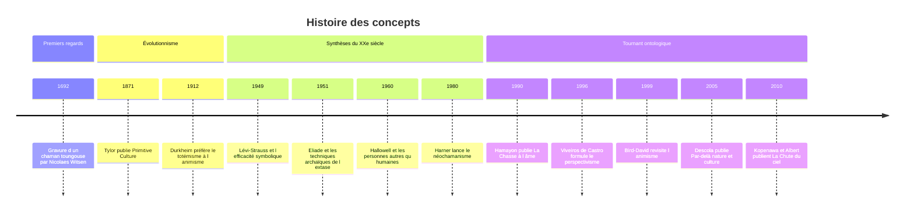

# Animisme et Chamanisme

« Animisme » et « chamanisme » sont deux mots que tout le monde croit comprendre : le premier désignerait la croyance que la nature est peuplée d'esprits, le second la pratique de guérisseurs en transe. En réalité, ce sont deux **concepts savants** forgés par des Européens, chargés d'une longue histoire théorique, plusieurs fois abandonnés puis réhabilités. Les comprendre, c'est autant faire l'histoire de l'anthropologie que celle des peuples qu'ils prétendent décrire.

## L'animisme selon Tylor : une théorie de l'origine des religions

Le mot existait déjà au début du XVIIIe siècle chez le médecin allemand Georg Ernst Stahl, pour qui l'âme gouvernait les fonctions du corps. Mais c'est l'anthropologue britannique **Edward Burnett Tylor** qui lui donne son sens moderne dans *Primitive Culture* (1871). Il y propose une « définition minimale » de la religion : la croyance en des êtres spirituels. L'animisme serait la forme première de cette croyance, née d'un raisonnement des « primitifs » sur le rêve, la mort et la transe : si je me vois ailleurs en rêve, c'est qu'un double de moi peut quitter mon corps ; ce double, étendu aux animaux, aux plantes et aux choses, devient l'âme universelle du monde.

Pour Tylor, l'humanité serait ensuite passée de l'animisme au polythéisme, puis au monothéisme. La théorie est **évolutionniste** : elle range les sociétés sur une échelle unique dont l'Angleterre victorienne occupe le sommet.

Les critiques sont venues très vite. Robert Marett (1900) soutient qu'avant l'idée d'âme viendrait le sentiment d'une force impersonnelle, qu'il nomme « animatisme ». [[Émile Durkheim]], dans *Les Formes élémentaires de la vie religieuse* (1912), rejette l'animisme comme origine de la religion au profit du totémisme et de la distinction entre sacré et profane (voir [[Sociologie des Religions]]). L'animisme tombe alors en désuétude dans l'anthropologie savante, tout en survivant comme étiquette administrative et missionnaire, souvent méprisante, pour désigner les religions « sans livre ».

> [!warning] Piège
> Affirmer que l'animisme est « la plus ancienne religion de l'humanité », comme le font de nombreux manuels (et la note [[Histoire des Religions]] en partie), revient à reprendre le schéma de Tylor. Or nous n'avons aucun moyen direct de connaître les croyances des chasseurs-cueilleurs du Paléolithique, et les sociétés de chasseurs actuelles ne sont pas des fossiles : elles ont une histoire aussi longue que la nôtre (voir [[Sociétés de Chasseurs-Cueilleurs]]). L'animisme est une manière de rapporter les êtres les uns aux autres, pas un stade de l'évolution.

## Le chamanisme : du mot toungouse au concept universel

Le mot *šaman* vient de l'évenki, une langue toungouse de Sibérie. Il entre dans les langues européennes par le russe au XVIIe siècle, grâce aux récits de voyageurs et d'exilés ; le Néerlandais Nicolaes Witsen publie en 1692 une gravure restée célèbre d'un chaman toungouse, présenté comme un « prêtre du diable ». Au XVIIIe siècle, les Lumières voient dans ces personnages des charlatans ; les romantiques, au XIXe, y verront plutôt des poètes inspirés.

C'est **Mircea Eliade** qui fait du chamanisme une catégorie mondiale avec *Le Chamanisme et les techniques archaïques de l'extase* (1951). Il y définit le chaman comme un spécialiste de la **transe extatique**, pendant laquelle son âme quitte le corps pour voyager vers le ciel ou les mondes inférieurs. Il repère des motifs récurrents de la Sibérie aux Amériques : vocation par la maladie, initiation par le démembrement et la reconstitution du corps, arbre ou pilier cosmique reliant les mondes, vol magique, tambour-monture.

Le livre a eu un succès immense, mais ses limites sont aujourd'hui bien connues : Eliade travaille sur des sources de seconde main, extrait les motifs de leurs contextes et construit un « chamanisme » idéal qui n'existe nulle part tel quel.

## Sibérie : l'alliance avec les esprits

En Sibérie, chez les Évenks, les Iakoutes (Sakha), les Bouriates ou les Touvains, le chaman est une figure sociale précise : il négocie avec les esprits pour obtenir le gibier, soigner les malades, accompagner les morts. Le tambour, les costumes chargés de pendeloques de métal et les séances nocturnes en sont les éléments les plus visibles.

L'anthropologue française **Roberte Hamayon** a renouvelé l'analyse dans *La Chasse à l'âme* (1990). Chez les peuples chasseurs, le chaman passe une **alliance** avec les esprits des animaux, pensée sur le modèle du mariage : il « épouse » la fille de l'esprit donneur de gibier. Sa séance est moins une « extase » qu'un **jeu** rituel, codifié, où il mime l'animal. Hamayon montre aussi comment le chamanisme se transforme quand les sociétés deviennent pastorales et que l'autorité passe aux ancêtres du lignage.

Le chamanisme sibérien a traversé une histoire violente : christianisation orthodoxe, puis persécution soviétique à partir des années 1930, où les chamans furent traités en ennemis de classe. Après 1991, un renouveau s'est organisé, parfois institutionnalisé, comme en Touva ou en Bouriatie, où existent des associations de chamans dotées de statuts officiels.

## Amazonie : des personnes non humaines

En Amazonie, les chamanes soignent, protègent de l'agression d'autres chamanes, négocient avec les « maîtres » des animaux et des plantes. Plusieurs traditions utilisent des substances psychotropes, comme l'*ayahuasca*, décoction à base de la liane *Banisteriopsis caapi*, ou des poudres à priser comme le *yopo*. Le chamane yanomami **Davi Kopenawa** a livré, avec l'anthropologue Bruce Albert, un témoignage de cette pensée dans *La Chute du ciel* (2010), qui est aussi un réquisitoire contre la destruction de la forêt.

C'est en Amazonie que l'animisme a été redécouvert par la théorie anthropologique. **Philippe Descola**, qui a vécu chez les Achuar (Jivaros de l'Équateur), a constaté que ceux-ci traitent les plantes cultivées comme des enfants et le gibier comme des beaux-frères : les relations sociales humaines s'étendent aux non-humains. **Eduardo Viveiros de Castro** en a tiré le **perspectivisme** amérindien (article de 1996 dans la revue *Mana*, version anglaise en 1998) : tous les êtres se voient eux-mêmes comme des humains, dotés d'une culture ; c'est leur corps qui diffère, et donc le monde qu'ils perçoivent. Le jaguar voit le sang comme de la bière de manioc ; ce que nous prenons pour sa nature est pour lui sa culture.

## Le « nouvel animisme »

À partir des années 1990, plusieurs anthropologues reprennent le mot animisme en le vidant de son sens tylorien. Il ne s'agit plus d'une erreur de raisonnement sur l'âme, mais d'une **ontologie**, une manière d'identifier ce qui existe et de relier les êtres entre eux.

Les sources de ce tournant sont diverses. Irving Hallowell avait déjà décrit en 1960 les « personnes autres qu'humaines » des Ojibwa, pour qui une pierre peut, dans certaines circonstances, être une personne. Nurit Bird-David, dans l'article « Animism revisited » (1999), parle d'une épistémologie relationnelle : on ne connaît pas un arbre en le classant, mais en entretenant une relation avec lui. Graham Harvey popularise l'expression de « nouvel animisme » (*Animism. Respecting the Living World*, 2005).

La proposition la plus systématique est celle de Descola dans *Par-delà nature et culture* (2005). Il croise deux dimensions : l'**intériorité** (esprit, âme, intentionnalité) et la **physicalité** (corps, matière, comportement). Chaque ontologie correspond à une combinaison de ressemblances et de différences :

| Ontologie | Intériorités | Physicalités | Exemples |
|---|---|---|---|
| **Animisme** | semblables | différentes | Amazonie, Subarctique, Sibérie |
| **Naturalisme** | différentes | semblables | Occident moderne |
| **Totémisme** | semblables | semblables | Aborigènes d'Australie |
| **Analogisme** | différentes | différentes | Chine ancienne, Mésoamérique, Europe de la Renaissance |

> [!important] Idée clé
> Le coup de force de Descola est de faire du **naturalisme occidental**, la conviction que tous les êtres partagent la même matière physique mais que seuls les humains ont une intériorité, une ontologie parmi d'autres et non le point de vue neutre à partir duquel on jugerait les autres. La distinction nature et culture, que l'anthropologie tenait pour universelle, devient elle-même un fait culturel local. Il prolonge ainsi, en la déplaçant, l'ambition comparative de son maître [[Claude Lévi-Strauss]] (voir [[Structuralisme]]).

Lévi-Strauss lui-même avait écrit sur le chamanisme : dans « Le sorcier et sa magie » et « L'efficacité symbolique » (1949, repris dans *Anthropologie structurale*, 1958), il analyse le cas de Quesalid, un Kwakiutl sceptique qui apprit les techniques des chamanes pour les démasquer et devint un guérisseur renommé, parce que la cure dépend d'abord de la croyance partagée du malade, du chamane et du groupe.

## Critiques et usages contemporains

Les deux termes restent contestés.

- **Généralisation abusive** : faire d'un mot évenki une catégorie applicable des Inuit aux Mapuche efface les différences entre des pratiques qui n'ont parfois en commun que l'intermédiaire rituel.
- **Exotisme** : l'animisme a longtemps servi à désigner l'autre du monothéisme, et le chamanisme l'autre de la raison. Leur valorisation actuelle peut reproduire ce partage en l'inversant, les « peuples premiers » devenant les dépositaires d'une sagesse écologique supposée intemporelle.
- **Néochamanisme** : depuis *The Way of the Shaman* (1980) de Michael Harner, un « chamanisme fondamental » détaché de toute culture particulière se pratique en stages dans les pays occidentaux. Le tourisme de l'ayahuasca en Amazonie péruvienne en est un autre visage. Les anthropologues y voient une recomposition religieuse légitime à étudier, mais distincte des traditions dont elle se réclame, et les communautés autochtones y dénoncent parfois une appropriation.
- **Politique** : dans les débats écologiques, le « nouvel animisme » est mobilisé pour penser des droits de la nature. En 2017, la Nouvelle-Zélande a reconnu la personnalité juridique du fleuve Whanganui, en accord avec la conception maorie. Descola lui-même met en garde contre l'idée qu'on pourrait adopter une ontologie comme on change d'opinion.

> [!tip] Méthode
> Devant un texte qui parle d'animisme, se demander de quel animisme il s'agit : celui de Tylor (une croyance erronée sur les âmes, stade primitif), celui de l'administration coloniale (une case de recensement pour les religions non révélées) ou celui de Descola (une ontologie, une façon de distribuer l'intériorité entre les êtres). Les trois usages coexistent encore et se contaminent.

## Chronologie

## Ressources

- Philippe Descola, *Par-delà nature et culture*, 2005.
- Mircea Eliade, *Le Chamanisme et les techniques archaïques de l'extase*, 1951.
- Roberte Hamayon, *La Chasse à l'âme. Esquisse d'une théorie du chamanisme sibérien*, 1990.
- Davi Kopenawa et Bruce Albert, *La Chute du ciel. Paroles d'un chaman yanomami*, 2010.
- Eduardo Viveiros de Castro, *Métaphysiques cannibales*, 2009.
