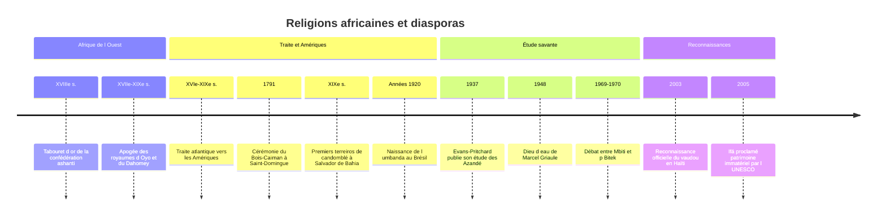

# Religions traditionnelles africaines

L'expression « religions traditionnelles africaines » désigne l'ensemble des systèmes religieux nés sur le continent africain, antérieurs ou extérieurs au [[Christianisme]] et à l'[[Islam]], et transmis pour l'essentiel oralement, par le rite, le chant, la danse et l'initiation. L'expression est commode mais trompeuse si on la prend au singulier : l'Afrique compte, selon les décomptes, de 1 250 à plus de 2 000 langues et des centaines de sociétés aux organisations politiques très différentes (royaumes centralisés, chefferies, sociétés lignagères sans État). Il n'existe pas plus *une* religion africaine qu'il n'existe *une* religion européenne. Cette note s'attache donc à quelques ensembles bien documentés d'Afrique de l'Ouest (yoruba, fon-ewe, akan), à des institutions récurrentes (culte des ancêtres, divination), puis à leur prolongement dans les Amériques par la [[Traite atlantique|traite atlantique]].

## Un objet mal nommé

> [!warning] Piège
> Les étiquettes héritées de l'époque coloniale, « fétichisme », « animisme », « paganisme », ont longtemps servi à classer ces religions tout en bas d'une échelle évolutionniste qui culminait dans le monothéisme européen (voir [[Animisme et Chamanisme]]). Leur abandon n'est pas une affaire de politesse : ces mots décrivaient mal les faits. Beaucoup de ces systèmes connaissent un dieu suprême, des théologies élaborées, un corpus oral immense et des spécialistes formés pendant des années.

Le débat a aussi traversé l'africanisme lui-même. Le théologien kényan John Mbiti, dans *African Religions and Philosophy* (1969), a voulu réhabiliter ces traditions en montrant que presque tous les peuples africains croient en un Dieu créateur doté d'attributs comparables à ceux du Dieu biblique. L'écrivain ougandais Okot p'Bitek lui a répondu dès 1970 (*African Religions in Western Scholarship*) qu'on « hellénisait » ainsi les divinités africaines : on les habillait d'omniscience et d'omniprésence pour les rendre respectables aux yeux chrétiens, au prix de leur originalité. Ce débat entre recherche d'universaux et respect des singularités traverse toute l'étude du sujet.

Quelques traits reviennent néanmoins souvent, avec d'innombrables variantes :

| Trait fréquent | Formes typiques | Nuance |
|---|---|---|
| Dieu suprême lointain | Olodumare (yoruba), Mawu-Lisa (fon), Onyame (akan) | Peu ou pas de culte direct, on s'adresse aux intermédiaires |
| Divinités intermédiaires | orisha, vodun, abosom | Liées à des lieux, des lignages, des métiers, des éléments |
| Ancêtres | morts devenus protecteurs du lignage | Tous les morts ne deviennent pas ancêtres |
| Divination | Ifá, Fa, oracles, devins-guérisseurs | Sert à diagnostiquer malheurs et décisions |
| Religion de pratique | sacrifice, possession, masques, initiation | L'orthopraxie prime souvent sur le dogme |
| Ouverture | cumul avec islam et christianisme | L'appartenance exclusive n'est pas toujours la norme |

## Les Yoruba et les orisha

Les Yoruba, aujourd'hui plus de quarante millions de personnes, vivent surtout dans le sud-ouest du Nigeria, au Bénin et au Togo. Leur ville sainte est Ilé-Ifè, lieu où, selon les mythes, la terre fut créée et d'où seraient issues les dynasties royales yoruba.

Au sommet se tient **Olodumare** (ou Olorun), créateur éloigné des affaires humaines. Le culte quotidien s'adresse aux **orisha**, puissances divines dont le nombre traditionnel est symboliquement immense. Parmi les plus connus :

- **Obatala**, modeleur des corps humains, associé au blanc et à la pureté ;
- **Ogun**, maître du fer, de la forge, de la guerre et aujourd'hui des routes et des machines ;
- **Shango**, orisha du tonnerre, identifié dans les récits à un ancien roi d'Oyo ;
- **Oshun**, divinité de la rivière du même nom, de la fécondité et de la douceur ; son bois sacré d'Osogbo est inscrit au patrimoine mondial de l'UNESCO depuis 2005 ;
- **Yemoja**, mère des eaux ;
- **Eshu** (ou Elegba), messager entre les hommes et les dieux, gardien des carrefours, figure rusée que les missionnaires ont assimilée à tort au diable ;
- **Orunmila**, témoin de la destinée, patron de la divination.

Deux notions structurent l'ensemble. L'**àṣẹ** désigne la force, le pouvoir de faire advenir, que les rites entretiennent et font circuler. L'**orí**, littéralement « la tête », est la destinée personnelle choisie avant la naissance : une bonne partie de la vie religieuse consiste à connaître et à accomplir ce destin.

### Ifá, une science divinatoire

Le système **Ifá**, pratiqué par les prêtres appelés *babalawo* (« père des secrets »), repose sur 256 figures (*odu*) obtenues en manipulant des noix de palme ou une chaîne divinatoire (*opele*). À chaque figure correspond un vaste corpus de vers oraux, récits, proverbes, prescriptions de sacrifice, que le devin récite et interprète pour le consultant. L'apprentissage dure des années. L'UNESCO a reconnu le système divinatoire d'Ifá comme patrimoine culturel immatériel de l'humanité (proclamation en 2005). Le système se retrouve sous le nom de **Fa** chez les Fon et d'**Afa** chez les Ewe.

> [!important] Idée clé
> La divination africaine n'est pas d'abord une prédiction de l'avenir, c'est un **diagnostic**. On consulte parce qu'un malheur survient : maladie, stérilité, mort suspecte, échec. Le devin identifie la cause (ancêtre négligé, divinité offensée, sorcellerie, destinée mal assumée) et prescrit le remède. C'est ce qu'avait montré E. E. Evans-Pritchard chez les Azandé du Soudan (*Witchcraft, Oracles and Magic among the Azande*, 1937) : ces systèmes répondent moins à la question « comment ? », à laquelle les Azandé savent très bien répondre, qu'à la question « pourquoi moi, pourquoi maintenant ? ».

## Le vodun du golfe du Bénin

Chez les peuples fon, ewe et apparentés (actuels Bénin et Togo, ancien royaume du Dahomey), les puissances divines se nomment **vodun**, mot qui a donné « vaudou ». Le couple créateur **Mawu-Lisa** (Mawu associée à la lune, Lisa au soleil) chapeaute un panthéon où l'on trouve Legba (messager et gardien, proche d'Eshu), Hevioso (tonnerre), Sakpata (terre et maladies éruptives, en particulier la variole), Dan (le serpent, souvent figuré en arc-en-ciel) et, sur la côte, Mami Wata, divinité des eaux devenue très populaire au XXe siècle.

Le vodun se vit dans des couvents où les adeptes sont initiés, parfois pendant de longs mois, et dans des cérémonies où la **possession** tient une place centrale : la divinité « monte » sur son adepte, qui devient pour un temps son support. Ouidah, ancien port de la traite, abrite le temple des pythons. Depuis une loi de 1997, le Bénin célèbre chaque année une fête nationale des religions endogènes, le 10 janvier (remplacé en 2024 par le deuxième vendredi de janvier et la veille), signe d'une réhabilitation publique après des décennies de dénigrement missionnaire puis, sous le régime marxiste-léniniste de Mathieu Kérékou, de lutte contre la « féodalité » et la sorcellerie (ordonnance de 1976).

## Le monde akan

Chez les Akan (Ghana et Côte d'Ivoire, dont les Ashanti sont le groupe le plus connu), le dieu suprême **Onyame** (ou Nyame) est accompagné d'**Asase Yaa**, la Terre, à qui l'on doit respect (on ne la cultive pas certains jours), des **abosom**, divinités souvent liées à des rivières comme le Tano, et des **nsamanfo**, les ancêtres.

La religion y est inséparable du pouvoir politique. Le **Tabouret d'or** (*Sika Dwa Kofi*) passe, selon la tradition, pour être descendu du ciel au début du XVIIIe siècle grâce au prêtre Okomfo Anokye, pour consacrer l'autorité d'Osei Tutu, fondateur de la confédération ashanti. Il est tenu pour le siège de l'âme de la nation : personne, pas même le roi, ne s'y assoit. Les tabourets noircis des chefs défunts, conservés dans une chambre spéciale, sont le support du culte royal des ancêtres, célébré lors des fêtes *adae* et de l'*odwira*.

## Les ancêtres

Le « culte des ancêtres » est sans doute l'institution la plus répandue, mais aussi la plus caricaturée. Dans la plupart des sociétés concernées, ne devient pas ancêtre qui veut : il faut en général avoir mené une vie accomplie, laissé une descendance et reçu des funérailles correctes. L'ancêtre reste membre du lignage ; il protège, punit les manquements, peut revenir dans un nouveau-né. On l'honore par des libations, des offrandes, des autels domestiques, et parfois par des mascarades, comme les **egungun** yoruba, où des danseurs entièrement masqués incarnent les morts revenus visiter les vivants.

> [!tip] Méthode
> L'anthropologue Igor Kopytoff a proposé en 1971 (« Ancestors as Elders in Africa ») une lecture qui a fait débat : chez les Suku du Congo qu'il étudiait, le même terme désigne les aînés vivants et les morts, et la relation qu'on entretient avec eux est de même nature. Parler de « culte » ou d'« adoration » projetterait alors une catégorie chrétienne sur ce qui relève d'une continuité de l'autorité lignagère au-delà de la mort. Face à un rite africain, se demander si nos mots « prière », « culte », « dieu » découpent bien la réalité observée est un réflexe utile, dans l'esprit de [[Méthodes - Ethnographie et Terrain|l'enquête ethnographique]].

## Devins, guérisseurs et sorcellerie

Partout, des spécialistes font le lien entre visible et invisible : *babalawo* yoruba, *bokɔnɔ* fon, *ɔkɔmfoɔ* akan, *nganga* dans l'aire bantoue d'Afrique centrale, *sangoma* et *inyanga* en Afrique australe. Ils cumulent souvent diagnostic, pharmacopée et rituel. Face à eux, la figure du **sorcier**, être malfaisant qui nuit par une puissance intérieure, souvent à l'intérieur même de la parenté, reste une préoccupation majeure, que la modernité urbaine n'a pas dissipée. Les anthropologues Peter Geschiere (*Sorcellerie et politique en Afrique*, 1995) et d'autres ont montré combien ces idées se recomposent autour de l'argent, de l'État et de la réussite individuelle.

Les études de cas célèbres ont parfois elles-mêmes construit leur objet. La cosmologie dogon exposée par Marcel Griaule dans *Dieu d'eau* (1948) a été remise en cause dans les années 1990 par Walter van Beek, qui n'en a pas retrouvé les éléments centraux sur le terrain et y voit le produit du dialogue entre l'ethnologue et un informateur exceptionnel. Le débat reste ouvert sur la part de chacun, mais il illustre la prudence nécessaire devant les grandes synthèses (voir [[Histoire de la Discipline|l'histoire de l'anthropologie]]).

Aujourd'hui, les religions traditionnelles déclarées sont minoritaires dans les recensements de la plupart des pays d'Afrique subsaharienne, où dominent christianisme et islam. Mais de nombreux fidèles de ces deux religions continuent de consulter des devins, d'honorer leurs ancêtres ou de porter des protections, ce qui rend les chiffres d'appartenance peu parlants.

## La traversée de l'Atlantique

Entre le XVIe et le XIXe siècle, la traite atlantique a déporté vers les Amériques environ 12,5 millions d'Africains embarqués selon les estimations de référence, dont une part considérable venait précisément du golfe du Bénin et d'Afrique centrale. Privés de leurs temples, de leurs lignages et souvent de leur langue, les captifs ont reconstruit des religions nouvelles, sous la contrainte du catholicisme imposé. Trois grandes traditions en sont issues.

| Tradition | Pays | Racines principales | Divinités | Traits marquants |
|---|---|---|---|---|
| **Candomblé** | Brésil, surtout Bahia | yoruba (nation ketu ou nagô), fon (jeje), bantoue (angola) | orixás, vodun, nkisi | *terreiros* dirigés par une *mãe* ou un *pai de santo*, forte place des femmes |
| **Vaudou haïtien** | Haïti | fon, yoruba, kongo | *lwa* : Legba, Ogou, Ezili, Danbala, les Gede | rites *rada* et *petwo*, *oungan* et *manbo*, possession |
| **Santería** ou Regla de Ocha | Cuba, puis États-Unis | yoruba, appelés *lucumí* à Cuba | *orishas* : Changó, Ochún, Yemayá, Obatalá | *babalawos* d'Ifá, initiation dite *asiento* |

Le **vaudou haïtien** est lié dans la mémoire nationale à la cérémonie du Bois-Caïman (août 1791), qui aurait précédé le soulèvement des esclaves de Saint-Domingue ; son historicité précise est débattue, mais son rôle de mythe fondateur est indiscutable. Longtemps persécuté, y compris lors des campagnes « anti-superstitieuses » soutenues par l'Église catholique au tournant des années 1940 (1939-1942), il a été reconnu officiellement comme religion par l'État haïtien en 2003. Au Brésil, le candomblé a subi des décennies de répression policière avant de devenir, au XXe siècle, un pilier revendiqué de la culture afro-brésilienne ; l'**umbanda**, apparue dans les années 1920, mêle pour sa part héritages africains, catholicisme et spiritisme.

> [!important] Idée clé
> Le **syncrétisme** avec les saints catholiques (Changó associé à sainte Barbe, Ochún à la Vierge de la Charité du Cuivre à Cuba, Oxalá au Senhor do Bonfim à Bahia) a longtemps été lu comme un simple masque destiné à tromper les maîtres. C'est trop simple : les correspondances sont aussi devenues des dévotions sincères, vécues par des fidèles à la fois catholiques et initiés. Inversement, un courant « anti-syncrétique », porté à Bahia à la fin du XXe siècle par plusieurs grandes prêtresses de terreiros (manifeste d'ialorixás contre le syncrétisme), a réclamé la séparation des orixás et des saints au nom d'un retour aux sources africaines. Le syncrétisme n'est donc ni un camouflage pur, ni une fusion achevée, mais un terrain de négociation permanent.

Ces religions ont aussi fait le voyage retour : des Américains initiés à la Santería vont se faire consacrer à Ilé-Ifè, et le Nigeria comme le Bénin accueillent un tourisme religieux de la diaspora, qui influence à son tour les pratiques locales.

## Chronologie

## Pour situer ces religions

Du point de vue de la [[Sociologie des Religions]], ces traditions ont servi de terrain à des théories générales : Durkheim s'appuyait sur l'Australie plutôt que sur l'Afrique, mais c'est en Afrique que l'anthropologie britannique a élaboré ses analyses de la sorcellerie, du rituel et de l'ordre politique. Face au [[Panorama des Religions Mondiales]], elles rappellent qu'une religion peut être sans livre, sans clergé centralisé et sans prétention à l'exclusivité tout en portant une pensée théologique et éthique élaborée ; les mythes qui les accompagnent relèvent des questions posées dans [[Qu'est-ce qu'un Mythe]].

## Ressources

- John S. Mbiti, *African Religions and Philosophy*, 1969.
- E. E. Evans-Pritchard, *Witchcraft, Oracles and Magic among the Azande*, 1937.
- Roger Bastide, *Les Religions africaines au Brésil*, 1960.
- Alfred Métraux, *Le Vaudou haïtien*, 1958.
- Pierre Verger, *Orisha. Les dieux yorouba en Afrique et au Nouveau Monde*, 1982.
