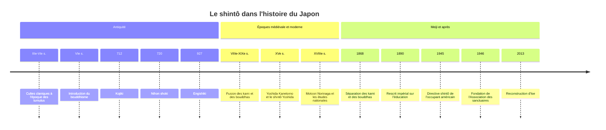

# Shintoïsme

Le shintô, ou shintoïsme, est l'ensemble des cultes rendus aux **kami**, les puissances divines du Japon, dans quelque 80 000 sanctuaires répartis sur l'archipel. Il n'a ni fondateur, ni texte révélé, ni doctrine du salut, ni morale codifiée. Il s'exprime avant tout par des gestes : purifier, offrir, prier, fêter. Religion d'une grande souplesse, il a vécu plus d'un millénaire mêlé au [[Bouddhisme]], avant d'être séparé de lui et transformé en culte national par l'État Meiji, puis rendu à la sphère privée après 1945. Aujourd'hui, une majorité de Japonais fréquente les sanctuaires tout en se déclarant « sans religion », paradoxe qui fait du shintô un cas d'école pour la [[Sociologie des Religions]].

## Origines

### Sans fondateur

Le shintô n'a pas de date de naissance. Il plonge ses racines dans les cultes agraires et claniques de l'archipel, développés à l'époque Yayoi (à partir du Ier millénaire av. J.-C., avec la riziculture irriguée) et à l'époque des grands tumulus (Kofun, IIIe-VIe siècle). Chaque clan (*uji*) honore son kami tutélaire ; celui du clan qui s'impose, la maison impériale du Yamato, est la déesse du soleil **Amaterasu**.

Le mot même de *shintô*, « la voie des kami », écrit en caractères chinois, n'apparaît dans les textes qu'au VIIIe siècle, et surtout par contraste avec la « voie du Bouddha », introduite au VIe siècle. Autrement dit, le shintô a pris conscience de lui-même au contact du bouddhisme.

> [!warning] Piège
> Présenter le shintô comme la religion primitive et immuable du Japon, restée pure depuis la préhistoire, est un récit du nationalisme moderne. L'historien Kuroda Toshio a montré que, pendant la majeure partie de son histoire, le culte des kami n'était pas un système autonome mais une composante d'un ensemble dominé par le bouddhisme. Le shintô comme religion distincte et homogène est, pour une large part, une construction des XVIIe-XIXe siècles, achevée par l'État Meiji.

## Croyances

### Les kami

Un **kami** est tout ce qui suscite un sentiment de révérence : divinités des récits mythiques, forces naturelles (soleil, vent, tonnerre), montagnes (le mont Fuji), rochers, cascades, arbres vénérables, ancêtres de clans, mais aussi grands hommes divinisés après leur mort, comme le lettré Sugawara no Michizane, devenu kami de l'étude. On parle traditionnellement des « huit cents myriades de kami », expression qui signifie simplement « innombrables ». Les kami ne sont ni omnipotents ni moralement parfaits : ils peuvent être bienveillants ou irrités, et le culte vise à les apaiser et à obtenir leur protection.

### Pureté et souillure

La notion centrale n'est pas le péché mais la **souillure** (*kegare*) : contact avec la mort, le sang, la maladie, qui trouble la relation avec les kami. On s'en libère par la **purification** (*harae*), l'ablution (*misogi*) ou l'exorcisme rituel. Ce souci de pureté marque profondément la culture japonaise, de l'usage du sel au sumo jusqu'aux bassins où l'on se rince les mains et la bouche à l'entrée des sanctuaires.

### Mythes des origines

| Épisode | Contenu |
|---|---|
| **Izanagi et Izanami** | Couple primordial qui fait naître les îles du Japon et de nombreux kami. Izanami meurt en enfantant le feu et descend au pays des morts |
| **Naissance d'Amaterasu** | Izanagi, en se purifiant au retour des enfers, fait naître Amaterasu (soleil), Tsukuyomi (lune) et Susanoo (tempête) |
| **La grotte céleste** | Offensée par Susanoo, Amaterasu se cache dans une grotte et le monde sombre dans la nuit. Les kami l'en font sortir par une fête et un miroir |
| **Descente du petit-fils** | Amaterasu envoie son petit-fils Ninigi gouverner la terre, avec le miroir, le joyau et le sabre. Son arrière-petit-fils Jinmu serait le premier empereur |

## Textes

Le shintô n'a pas d'Écriture sainte au sens des religions révélées. Ses textes de référence sont des chroniques et des recueils liturgiques compilés à la cour impériale :

| Texte | Date | Nature |
|---|---|---|
| **Kojiki** (Chronique des faits anciens) | 712 | Mythes des origines et généalogie impériale |
| **Nihon shoki** (Annales du Japon) | 720 | Histoire officielle en chinois, sur le modèle des annales chinoises |
| **Engishiki** | Achevé en 927 | Code administratif contenant les prières rituelles (*norito*) et la liste officielle des sanctuaires |

Ces textes ont d'abord une fonction politique : légitimer la dynastie par sa descendance d'Amaterasu. Ils ne sont redevenus des « écritures » shintô qu'avec l'école des études nationales (*kokugaku*) au XVIIIe siècle, en particulier chez **Motoori Norinaga** (1730-1801), qui consacre sa vie à un commentaire du *Kojiki*.

## Pratiques et rites

- **Le sanctuaire** (*jinja*) : on y entre par un portique, le **torii**, qui marque la limite de l'espace sacré. Le kami réside dans le bâtiment principal, dans un objet (miroir, pierre, sabre) que personne ne voit. Une corde tressée (*shimenawa*) signale les lieux et objets habités par un kami.
- **La prière** : on se purifie au bassin, on jette une pièce, on s'incline deux fois, on frappe deux fois dans ses mains, on s'incline encore.
- **Les fêtes** (*matsuri*) : processions où le kami, installé dans un palanquin portatif (*mikoshi*), parcourt son quartier. Elles rythment le calendrier agricole et communautaire.
- **Les rites de passage** : présentation du nouveau-né au sanctuaire, fête des enfants de trois, cinq et sept ans, mariage shintô (devenu courant seulement au XXe siècle). Les funérailles, en revanche, sont presque toujours bouddhiques, à cause du tabou de la mort.
- **Le quotidien** : amulettes (*omamori*), tablettes votives (*ema*), oracles écrits (*omikuji*), autel domestique (*kamidana*).
- **Le clergé** : prêtres (*kannushi*) souvent héréditaires, assistés de jeunes femmes (*miko*).

Le sanctuaire d'**Ise**, dédié à Amaterasu, est le plus sacré. Ses bâtiments principaux sont entièrement reconstruits à l'identique tous les vingt ans (*shikinen sengû*), rite pratiqué depuis plus de mille trois cents ans avec des interruptions ; la dernière reconstruction date de 2013.

> [!important] Idée clé
> La reconstruction périodique d'Ise renverse l'idée occidentale de la conservation du patrimoine. Ce n'est pas la matière qui est transmise mais le **savoir-faire** et la forme. Le sanctuaire est à la fois l'un des plus anciens du Japon et l'un des plus récents. Cette logique éclaire un trait général du shintô : ce qui compte est le renouvellement de la pureté par le geste répété, plus que la fidélité à une doctrine.

## Organisation et courants

| Forme | Description |
|---|---|
| **Shintô des sanctuaires** (*jinja shintô*) | La forme majoritaire. La plupart des sanctuaires sont fédérés depuis 1946 dans l'Association des sanctuaires shintô (*Jinja Honchô*), qui reconnaît Ise comme centre |
| **Shintô de la maison impériale** | Rites privés accomplis par l'empereur dans le palais, notamment l'offrande des premières récoltes |
| **Shintô des sectes** (*kyôha shintô*) | Treize groupes reconnus à l'époque Meiji, fondés au XIXe siècle par des personnalités charismatiques. Tenrikyô, fondé en 1838 par Nakayama Miki, s'en est détaché depuis |
| **Shintô populaire** | Pratiques sans organisation : cultes des montagnes, divination, fêtes de village |

### Le long compagnonnage avec le bouddhisme

Du VIIIe au XIXe siècle, domine le **shinbutsu shûgô**, la fusion des kami et des bouddhas. Selon la théorie de l'« essence originelle et de la trace manifestée » (*honji suijaku*), les kami sont des manifestations locales de bouddhas et de bodhisattvas. Temples bouddhiques et sanctuaires partagent souvent les mêmes enceintes et les mêmes desservants. Au XVe siècle, **Yoshida Kanetomo** renverse la perspective en faisant des kami la réalité première, ouvrant la voie aux courants qui chercheront un shintô « pur ».

## Chronologie

## Histoire : du shintô d'État à la sphère privée

En 1868, le nouveau gouvernement Meiji décrète la **séparation des kami et des bouddhas** (*shinbutsu bunri*). Elle provoque une vague de violences contre le bouddhisme (destruction de statues, défroquage de moines), avant que l'État ne la freine. Il construit ensuite ce que les historiens appellent le **shintô d'État** : les sanctuaires deviennent des institutions publiques, les prêtres des fonctionnaires, et le culte de l'empereur, descendant d'Amaterasu, est enseigné à l'école, notamment par le Rescrit impérial sur l'éducation de 1890. L'astuce juridique consiste à déclarer que les rites des sanctuaires ne sont **pas une religion** mais un devoir civique, ce qui permet de les imposer à tous tout en proclamant la liberté religieuse. Le sanctuaire Yasukuni, fondé en 1869 pour honorer les morts au service de l'empereur, en devient un pilier.

En décembre 1945, la **directive shintô** des forces d'occupation abolit le soutien de l'État aux sanctuaires. Le 1er janvier 1946, l'empereur Hirohito publie un rescrit dans lequel il nie le caractère divin de sa personne. La constitution de 1947 établit la séparation de l'État et de la religion. Les sanctuaires deviennent des institutions religieuses privées. La question n'est pourtant pas close : les visites de Premiers ministres à Yasukuni, où sont honorés depuis 1978 quatorze criminels de guerre de classe A, condamnés ou inculpés par le tribunal de Tokyo, provoquent régulièrement des protestations de la Chine et de la Corée du Sud.

## Présence aujourd'hui

Les chiffres du shintô illustrent l'inadéquation des catégories d'appartenance religieuse. Les statistiques du gouvernement japonais, fondées sur les déclarations des organisations religieuses, comptent de l'ordre de 80 à 90 millions d'adhérents shintô (84,7 millions fin 2016 selon l'Agence des affaires culturelles), et presque autant de bouddhistes (87,7 millions), soit bien plus que la population du pays. À l'inverse, dans les enquêtes où l'on interroge les individus, seule une petite minorité se déclare shintô, et le Pew Research Center classait 57 % des Japonais parmi les sans-affiliation religieuse (estimation pour 2010).

| Indicateur | Ordre de grandeur |
|---|---|
| Sanctuaires | Environ 80 000 (81 158 en 2016) |
| Adhérents selon les organisations religieuses | 80 à 90 millions |
| Japonais se déclarant shintô dans les enquêtes | 2 à 3 % (enquêtes ISSP de 2008 et 2018) |
| Visites de sanctuaires ou temples au Nouvel An | Plus de 3 millions au seul sanctuaire Meiji de Tokyo, et des millions dans chacun des grands sanctuaires et temples |

La clé du paradoxe tient à ce que *shûkyô*, « religion » en japonais, évoque une adhésion doctrinale et une organisation, que beaucoup rejettent, alors que visiter un sanctuaire relève de la coutume. C'est ce que les chercheurs décrivent comme une religiosité de pratique plutôt que de croyance, à rapprocher du [[Confucianisme]] chinois.

## Influence

Le shintô a façonné l'esthétique japonaise : l'architecture en bois brut, le goût de la simplicité et des matériaux naturels, la sacralisation de paysages entiers. Il imprègne les arts traditionnels (le théâtre nô est né dans les fêtes de sanctuaires et de temples), le sumo, dont les rituels de purification sont d'origine shintô, et la culture populaire contemporaine, du cinéma d'animation de Miyazaki Hayao, peuplé d'esprits de la nature, aux mangas. On en fait parfois une religion « écologique » en raison de la vénération des forêts et montagnes, lecture en partie anachronique mais qui a inspiré la protection des bois sacrés.

Enfin, le shintô est un laboratoire pour penser la relation entre religion et nation, abordée plus largement dans [[Histoire des Religions]] : il montre comment un État moderne peut réinventer une tradition, la déclarer non religieuse pour l'imposer, puis la rendre au privé sans qu'elle disparaisse. Pour une vue d'ensemble des autres traditions d'Asie, voir [[Panorama des Religions Mondiales]] et [[Autres Mythologies]].

## Ressources

- John Breen et Mark Teeuwen, *A New History of Shinto*, 2010.
- Helen Hardacre, *Shinto: A History*, 2017.
- Helen Hardacre, *Shintō and the State, 1868-1988*, 1989.
