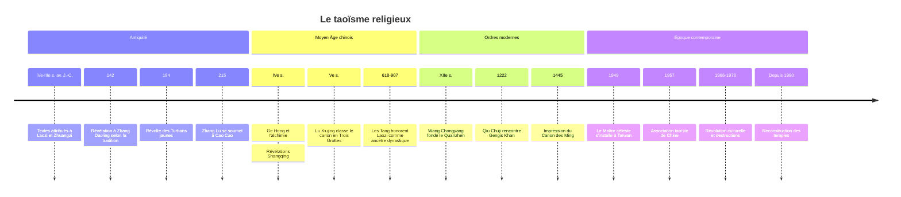

# Taoïsme

Le taoïsme religieux (*daojiao*, « l'enseignement du Tao ») est la seule grande religion née en Chine. Il ne se confond pas avec la philosophie de [[Laozi]] et de Zhuangzi, qu'il revendique pourtant comme sa source : c'est une religion à part entière, avec un clergé ordonné, des liturgies codifiées, un canon de près de 1 500 textes, un panthéon hiérarchisé et des techniques de longévité visant l'immortalité. Il se présente aujourd'hui sous deux grands ordres, les Maîtres célestes (Zhengyi) et la Complète Perfection (Quanzhen), et reste étroitement mêlé à la religion populaire chinoise, dont il est souvent la forme lettrée et rituelle.

## Philosophie et religion : une distinction à manier avec prudence

La tradition chinoise distingue depuis l'Antiquité le *daojia* (l'« école du Tao », catégorie bibliographique regroupant les penseurs comme Laozi et Zhuangzi) et le *daojiao* (l'organisation religieuse apparue sous les Han). Les sinologues occidentaux du XIXe et du début du XXe siècle en ont tiré une opposition tranchée : un taoïsme philosophique pur, mystique et rationnel, face à un taoïsme religieux jugé superstitieux et dégénéré. Cette lecture est aujourd'hui largement abandonnée. La philosophie du *Daode jing*, présentée dans [[Philosophies non-occidentales]], reste bien la matrice conceptuelle, mais le taoïsme religieux en fait un texte liturgique, récité, commenté et intériorisé.

> [!warning] Piège
> Opposer un « vrai » taoïsme philosophique à un taoïsme religieux « corrompu » reproduit un préjugé orientaliste que des chercheurs comme Kristofer Schipper et Isabelle Robinet ont démonté. Les maîtres taoïstes n'ont jamais vu de rupture entre la méditation sur le Tao et le rituel : pour eux, le *Daode jing* est une révélation de Laozi divinisé, et la liturgie est la mise en oeuvre concrète de la Voie. La distinction reste utile pour l'historien, pas comme hiérarchie de valeur.

## Origines : les Maîtres célestes

### Le terreau des Han

Sous la dynastie Han (206 av. J.-C. - 220 apr. J.-C.) convergent plusieurs courants : la quête de l'immortalité et des élixirs, très prisée à la cour depuis le Premier Empereur ; le culte de l'Empereur Jaune et de Laozi (courant dit Huang-Lao) ; la cosmologie du yin et du yang et des cinq phases ; et une religion populaire peuplée d'esprits et de démons. Au IIe siècle, Laozi est déjà divinisé : l'empereur Huan lui fait offrir des sacrifices officiels dans les années 160.

### Zhang Daoling et la Voie des Maîtres célestes

La tradition fait remonter la religion organisée à **Zhang Daoling**, qui aurait reçu en 142 apr. J.-C., dans le Sichuan, une révélation de *Taishang Laojun*, Laozi divinisé. Il fonde la **Voie des Maîtres célestes** (*Tianshi dao*), aussi appelée Voie des cinq boisseaux de riz, d'après la contribution demandée aux fidèles. La date et le détail de la révélation relèvent de l'hagiographie, mais l'existence du mouvement au IIe siècle est bien attestée.

Son petit-fils **Zhang Lu** organise dans la région de Hanzhong une véritable communauté théocratique, divisée en paroisses dirigées par des « libationnaires » : confession des fautes, guérison par le repentir, registres des fidèles, hospices pour les voyageurs. En 215, il se soumet au général Cao Cao, qui disperse la communauté mais laisse survivre l'Église. À la même époque, le mouvement millénariste des **Turbans jaunes** (révolte de 184), lié à une autre organisation, la Voie de la Grande Paix, ébranle l'empire Han ; il est apparenté au taoïsme naissant sans se confondre avec les Maîtres célestes.

## Croyances

### Le Tao, le souffle et le corps

Le Tao est l'origine indifférenciée de toute chose. Il se manifeste par le **souffle** (*qi*), qui se différencie en yin et yang puis en « dix mille êtres ». Le corps humain est un microcosme de l'univers : il contient montagnes, rivières, palais et divinités intérieures. Se cultiver, c'est remonter le processus de la création, du multiple vers l'Un, pour retrouver l'état originel.

### L'immortalité

Le but ultime est de devenir un **immortel** (*xian*), être parvenu à une longévité indéfinie et à une existence subtile, affranchie de la mort ordinaire. Selon les écoles, cet état s'obtient par l'alchimie, la méditation, la vertu, le rituel ou la grâce des dieux.

### L'alchimie extérieure et intérieure

| Voie | Principe | Figures et période |
|---|---|---|
| **Alchimie extérieure** (*waidan*) | Fabriquer un élixir à partir de minéraux, cinabre (sulfure de mercure) en tête, dont l'ingestion rendrait immortel | **Ge Hong** (283-343), *Baopuzi*. Apogée sous les Tang |
| **Alchimie intérieure** (*neidan*) | Transposer l'opération dans le corps : raffiner essence, souffle et esprit pour engendrer un « embryon d'immortalité » | Se développe à partir des Tang et domine sous les Song |

Plusieurs empereurs Tang passent pour être morts d'intoxication aux élixirs, ce qui a contribué au déclin de l'alchimie minérale au profit de sa version intérieure et méditative.

### Le panthéon

Le panthéon taoïste est une **bureaucratie céleste**, calquée sur l'administration impériale : les dieux ont des rangs, des bureaux, des archives, et reçoivent des requêtes écrites.

| Divinité | Rôle |
|---|---|
| **Les Trois Purs** (*Sanqing*) | Sommet du panthéon savant : le Vénérable céleste du Commencement originel, le Vénérable céleste du Joyau magique, et le Vénérable céleste du Tao et de la Vertu, c'est-à-dire Laozi divinisé |
| **L'Empereur de Jade** (*Yuhuang*) | Souverain de l'administration céleste, figure majeure de la religion populaire |
| **La Reine Mère de l'Occident** (*Xiwangmu*) | Déesse ancienne des pêches d'immortalité |
| **Les Huit Immortels** (*Baxian*) | Personnages légendaires très populaires dans l'art et le théâtre |
| **Les dieux des murs et des fossés** (*Chenghuang*) | Fonctionnaires divins de chaque ville, souvent d'anciens hommes vertueux |
| **Dieux intégrés** | Guandi (général divinisé), Mazu (protectrice des marins), etc. |

## Textes

Le **Canon taoïste** (*Daozang*) est la plus vaste collection religieuse chinoise. L'édition qui nous est parvenue a été imprimée sous les Ming en 1445, avec un supplément en 1607, et réunit près de 1 500 ouvrages. Son organisation en **Trois Grottes** (*sandong*) remonte au classement de **Lu Xiujing** (406-477) et reflète les grandes révélations médiévales.

| Corpus | Contenu |
|---|---|
| **Daode jing** | Attribué à Laozi, lu comme révélation divine et récité dans la liturgie |
| **Zhuangzi** | Paraboles et mystique de l'union au Tao |
| **Textes Shangqing** (« Pureté supérieure ») | Révélés au médium Yang Xi dans les années 360, compilés par **Tao Hongjing** (456-536) au mont Mao. Méditation, visualisation des divinités du corps |
| **Textes Lingbao** (« Joyau magique ») | Vers 400. Liturgie universaliste, forte influence bouddhique (salut de tous les êtres) |
| **Taiping jing** | Classique de la Grande Paix, utopie politique et morale |
| **Livres de moralité** (*shanshu*) | Tardifs, comptabilité des mérites et des fautes, très diffusés |

## Pratiques et rites

- **Le jiao** (offrande) : grande liturgie de renouvellement cosmique d'une communauté, qui peut durer plusieurs jours, avec présentation de mémoires écrits aux dieux, danses et musique.
- **Le zhai** (jeûne, purification) : rituels de pénitence et, surtout, rites funéraires pour sauver les âmes des morts.
- **Talismans** (*fu*) et **registres** (*lu*) : documents sacrés qui confèrent au prêtre l'autorité sur des troupes d'esprits. Le registre remis à l'ordination définit le rang du prêtre dans la hiérarchie céleste.
- **Exorcismes**, divination, choix de dates, consécrations de statues.
- **Techniques de longévité** : diététique, gymnastique (*daoyin*), respiration, méditation. Les pratiques modernes de qigong et de taiji quan en dérivent en partie, même si leur histoire est plus complexe.

> [!important] Idée clé
> Le rituel taoïste est une **procédure administrative**. Le prêtre agit comme un fonctionnaire accrédité auprès du ciel : il rédige des mémoires, les scelle, les « transmet » en les brûlant, et convoque des esprits enrôlés dans son registre d'ordination. Cette religion ne décalque pas seulement l'État impérial, elle en revendique la supériorité : le taoïste gouverne le monde invisible comme le mandarin gouverne le visible.

## Organisation et courants

| Ordre | Origine | Clergé | Centre |
|---|---|---|---|
| **Zhengyi** (« Unité orthodoxe »), héritier des Maîtres célestes | Lignée de Zhang Daoling, reconnue comme chef des taoïstes du Sud sous les Yuan (1304) | Prêtres (*daoshi*) mariés, vivant dans le siècle, transmettant souvent leur charge en famille | Mont Longhu (Jiangxi). Le 63e Maître céleste s'est replié à Taïwan en 1949 |
| **Quanzhen** (« Complète Perfection ») | Fondé par **Wang Chongyang** (1113-1170) | Monastique, célibataire, végétarien, synthèse des « trois enseignements » avec le bouddhisme et le confucianisme | Monastère des Nuages blancs (Pékin), branche Longmen |

Le patriarche Quanzhen **Qiu Chuji** rencontre Gengis Khan en 1222, dans l'Hindou Kouch, et obtient pour son ordre des privilèges qui assurent son essor sous les Mongols. La relation avec le [[Bouddhisme]] est faite à la fois d'emprunts massifs (monachisme, cosmologie des enfers, salut universel) et de rivalité : sous les Yuan, des débats de cour tranchés en faveur des bouddhistes entraînent des destructions de textes taoïstes.

## Chronologie

## Histoire : un compagnon de l'État impérial

Les rapports entre le taoïsme et le pouvoir ont oscillé entre patronage et méfiance. La dynastie **Tang** (618-907), dont la famille impériale Li revendique Laozi pour ancêtre, lui accorde un statut éminent ; l'empereur Xuanzong commente lui-même le *Daode jing*. Les **Song** favorisent les nouvelles liturgies et l'empereur Huizong (XIIe siècle) se fait proclamer incarnation divine. Sous les **Ming**, l'impression du canon marque un sommet ; sous les **Qing**, l'État mandchou privilégie le bouddhisme tibétain et le confucianisme officiel, et le taoïsme perd son prestige à la cour tout en restant omniprésent dans les villages.

Au XXe siècle, les réformateurs républicains puis communistes le rangent parmi les « superstitions » à éradiquer. La Révolution culturelle (1966-1976), évoquée dans [[Le Communisme au XXe siècle]], détruit temples et statues et disperse le clergé. Depuis les années 1980, le taoïsme fait partie des cinq religions officiellement reconnues en République populaire de Chine, encadrées par l'Association taoïste de Chine (fondée en 1957).

## Présence aujourd'hui

Compter les taoïstes est presque impossible, et c'est en soi une information. La plupart des Chinois qui fréquentent un temple taoïste ne se définissent pas comme « taoïstes » : ils font appel à des prêtres pour des funérailles, un exorcisme ou une fête, comme on consulte un spécialiste. Le Pew Research Center, dans son panorama mondial de 2012, ne compte pas le taoïsme à part et le range dans les « religions populaires », estimées à environ 400 millions de fidèles, en grande majorité chinois.

| Indicateur | Ordre de grandeur |
|---|---|
| Religions populaires chinoises (Pew, 2012) | Environ 400 millions, taoïsme inclus |
| Temples taoïstes officiels en Chine (livre blanc de 2018) | De l'ordre de 9 000 |
| Clergé taoïste officiel en Chine (même source) | De l'ordre de 40 000 religieux |
| Taïwan | Les temples enregistrés comme taoïstes y sont les plus nombreux |

Hors du monde chinois, le taoïsme est présent dans les diasporas d'Asie du Sud-Est (Malaisie, Singapour) et, sous une forme très différente, en Occident, où il circule surtout comme philosophie de vie, médecine douce ou art martial.

## Influence

Le taoïsme a imprégné en profondeur la civilisation chinoise : la **médecine traditionnelle** (théorie du qi, des méridiens, des cinq phases), les **arts martiaux**, la peinture de paysage et la poésie (Li Bai est ordonné taoïste), la géomancie, la chimie ancienne (la poudre à canon est souvent rattachée aux expériences alchimiques). Il forme avec le [[Confucianisme]] et le bouddhisme les « trois enseignements » (*sanjiao*) que la culture chinoise a longtemps pratiqués ensemble plutôt qu'en concurrence. [[Max Weber]], dans son étude sur le confucianisme et le taoïsme, y voyait une religion magique qui aurait détourné l'économie chinoise de la rationalisation, un diagnostic largement discuté depuis.

En Occident, l'image du taoïsme passe surtout par le *Daode jing*, l'un des textes les plus traduits au monde, et par la contre-culture des années 1960-1970. Cette réception retient le non-agir et l'harmonie avec la nature, et ignore presque entièrement la religion liturgique qui en a été, pendant deux millénaires, la forme vivante. Elle illustre bien ce que [[Sociologie des Religions]] et [[Histoire des Religions]] décrivent comme la recomposition des traditions religieuses lorsqu'elles circulent hors de leur cadre d'origine.

## Ressources

- Kristofer Schipper, *Le Corps taoïste*, 1982.
- Isabelle Robinet, *Histoire du taoïsme, des origines au XIVe siècle*, 1991.
- Henri Maspero, *Le Taoïsme et les religions chinoises*, 1971.
- Livia Kohn, *Daoism and Chinese Culture*, 2001.
- Vincent Goossaert et David A. Palmer, *The Religious Question in Modern China*, 2011.
