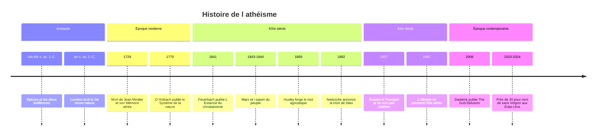

# Athéisme et Agnosticisme

L'athéisme n'a pas d'histoire unique : c'est une constellation d'arguments, de tempéraments et de mouvements sociaux qui, de l'Antiquité à nos jours, ont contesté l'existence des dieux, leur intervention dans le monde ou l'autorité des institutions qui parlent en leur nom. Longtemps, « athée » fut une insulte plutôt qu'une identité revendiquée. Aujourd'hui, les personnes « sans religion » forment l'un des groupes les plus nombreux de la planète, sans que ce groupe se confonde avec l'athéisme militant.

## Définitions

| Position | Question visée | Énoncé type |
|---|---|---|
| **Théisme** | croyance | Dieu existe et agit dans le monde |
| **Déisme** | croyance | un Dieu créateur existe, mais n'intervient pas et ne se révèle pas |
| **Athéisme fort** ou positif | croyance | il n'existe aucun dieu |
| **Athéisme faible** ou négatif | croyance | je ne crois en aucun dieu, sans affirmer qu'il n'en existe pas |
| **Agnosticisme** | connaissance | l'existence de Dieu ne peut pas être connue |
| **Sans religion** | appartenance | je ne me rattache à aucune religion |

Le mot « agnostique » a été forgé en 1869 par le naturaliste Thomas Henry Huxley, défenseur de Darwin, par opposition aux « gnostiques » de tout bord qui prétendaient savoir. L'agnosticisme porte donc sur la **connaissance**, l'athéisme sur la **croyance** : on peut être à la fois agnostique et athée (je ne sais pas, et je ne crois pas), ou agnostique et croyant (je ne sais pas, mais je crois, comme dans le pari de [[Pascal]]).

> [!warning] Piège
> « Sans religion » n'est pas synonyme d'« athée ». Les enquêtes montrent que beaucoup de personnes sans affiliation croient en Dieu, en une force supérieure ou en une forme de vie après la mort, et pratiquent parfois des rites (prière, méditation, fêtes familiales). Aux États-Unis, les athées et agnostiques déclarés ne forment qu'une minorité des *nones*, dont la majorité se dit « rien de particulier ». Additionner les sans-religion pour mesurer l'incroyance est une erreur fréquente.

## L'Antiquité : critiques des dieux et indifférence divine

Dans la Grèce ancienne, le mot *atheos* désigne celui qui ne reconnaît pas les dieux de la cité : c'est une accusation politique autant que théologique, portée contre [[Socrate]] et, plus tard, par les païens contre les chrétiens eux-mêmes. Quelques penseurs vont plus loin. Protagoras déclare qu'il ne peut savoir si les dieux existent ou non, à cause de l'obscurité du sujet et de la brièveté de la vie ; un fragment attribué à Critias (ou, selon d'autres philologues, à Euripide) fait de la crainte des dieux l'invention d'un homme habile pour faire respecter les lois.

La tradition la plus féconde est celle d'**Épicure** (341-270 av. J.-C.). Il n'est pas athée : les dieux existent, mais ils vivent dans une béatitude parfaite, indifférents au monde. L'univers est fait d'atomes et de vide, l'âme meurt avec le corps, et la crainte des dieux et de la mort est la principale source du malheur humain. Au Ier siècle av. J.-C., le poète latin **Lucrèce** en donne la version la plus éclatante dans le *De rerum natura*, avec ce vers souvent cité : *Tantum religio potuit suadere malorum*, « tant la religion a pu inspirer de crimes ». Redécouvert en 1417 par l'humaniste Poggio Bracciolini, le poème nourrit toute la pensée libre de la Renaissance.

Ailleurs, l'Inde ancienne a connu une école matérialiste, le **Carvaka** ou Lokayata, qui niait l'au-delà et l'autorité des Veda ; le [[Bouddhisme]] et le [[Jaïnisme|jaïnisme]] sont des traditions religieuses sans dieu créateur, ce qui rappelle que la question des dieux et celle de la religion ne se recouvrent pas.

## De l'accusation à la philosophie : XVIe-XVIIIe siècles

À l'époque moderne, « athée » reste d'abord une arme polémique : protestants et catholiques se l'envoient, les libertins érudits du XVIIe siècle avancent masqués, et [[Spinoza]], dont le Dieu se confond avec la nature, est dénoncé comme athée dans toute l'Europe.

Le premier athée systématique connu en France est un curé de campagne, **Jean Meslier** (1664-1729), curé d'Étrépigny dans les Ardennes. Il laisse à sa mort un long manuscrit, son *Mémoire*, qui nie l'existence de Dieu et l'immortalité de l'âme, et dénonce l'alliance des prêtres et des puissants. Voltaire n'en publie en 1762 qu'un extrait expurgé, transformé en plaidoyer déiste ; le texte intégral ne paraît qu'au XIXe siècle.

Le XVIIIe siècle des [[Lumières (XVIIIe siècle)|Lumières]] voit le matérialisme s'affirmer : La Mettrie (*L'Homme-machine*, 1747), Diderot, et surtout le baron **d'Holbach**, qui publie en 1770, sous le nom d'un auteur mort, le *Système de la nature*, véritable somme de l'athéisme matérialiste. Voltaire, déiste, lui répond. Dans le même temps, [[Hume]] ruine l'argument du dessein dans ses *Dialogues sur la religion naturelle* (posthumes, 1779), et [[Kant]] montre dans la *Critique de la raison pure* (1781) qu'aucune preuve théorique de l'existence de Dieu n'est possible, sans pour autant conclure à l'athéisme.

## Le XIXe siècle : les maîtres du soupçon

Au XIXe siècle, la question change : il ne s'agit plus seulement de réfuter Dieu, mais d'**expliquer pourquoi les humains y croient**.

- **Ludwig Feuerbach**, dans *L'Essence du christianisme* (1841), soutient que Dieu est la projection des qualités humaines idéalisées : l'homme se dépouille de ses perfections pour les attribuer à un être extérieur, et s'appauvrit d'autant. Il retourne ainsi la théologie de [[Hegel]] en anthropologie.
- **[[Karl Marx]]** prolonge Feuerbach en cherchant la cause sociale de cette projection. Dans l'introduction à la *Critique de la philosophie du droit de Hegel* (1843-1844), il écrit : « La religion est le soupir de la créature opprimée, l'âme d'un monde sans cœur, comme elle est l'esprit de conditions sociales d'où l'esprit est exclu. Elle est l'opium du peuple. » La formule est moins une insulte qu'un diagnostic : la religion console d'une misère réelle, qu'il faut abolir pour que l'illusion disparaisse (voir [[Marxisme]]).
- **[[Nietzsche]]**, dans *Le Gai Savoir* (1882), fait annoncer par un insensé que « Dieu est mort » et que « nous l'avons tué ». Il ne s'agit pas d'une thèse métaphysique mais d'un constat culturel : la croyance qui fondait les valeurs européennes s'effondre, et avec elle le sens, d'où la menace du [[Nihilisme]].
- **Sigmund Freud**, plus tard, voit dans la religion une illusion née du désir infantile de protection paternelle (*L'Avenir d'une illusion*, 1927).

> [!important] Idée clé
> Feuerbach, Marx, Nietzsche et Freud ne se contentent pas de dire que Dieu n'existe pas : ils transforment la religion en **objet d'explication**, psychologique, sociale ou généalogique. C'est le même geste que la [[Sociologie des Religions]] naissante, qui décide de traiter la religion comme un fait social sans se prononcer sur sa vérité. [[Émile Durkheim]] se distingue pourtant de Marx : là où ce dernier voit une illusion appelée à disparaître, il voit une fonction sociale indispensable, qui changera de forme sans s'éteindre.

## Le XXe siècle : de l'athéisme d'État aux nouveaux athées

Le philosophe britannique **[[Russell|Bertrand Russell]]** incarne un athéisme rationaliste et libéral. Sa conférence *Pourquoi je ne suis pas chrétien* (1927) passe en revue les preuves traditionnelles de Dieu ; il se disait volontiers agnostique devant un public de philosophes et athée devant le grand public, parce que la probabilité de Dieu lui semblait aussi faible que celle des dieux de l'Olympe. Sa « théière céleste » (1952) illustre le principe selon lequel la charge de la preuve revient à celui qui affirme. Dans la même veine, les positivistes logiques (voir [[Positivisme Logique]]) jugent les énoncés théologiques non pas faux mais dépourvus de sens, faute d'être vérifiables.

En France, l'athéisme existentialiste de [[Sartre]] tire les conséquences morales de l'absence de Dieu : si Dieu n'existe pas, l'homme est condamné à être libre et à inventer ses valeurs (voir [[Existentialisme]]). [[Camus]] cherche une morale sans transcendance face à l'absurde.

Le XXe siècle connaît aussi l'**athéisme d'État**. L'Union soviétique mène dès les années 1920 une propagande antireligieuse organisée, avec la Ligue des militants sans-Dieu, et persécute les clergés, surtout dans les années 1930 ; l'Albanie d'Enver Hoxha se proclame en 1967 premier État athée du monde et interdit tout culte. Ces politiques, étudiées dans [[Le Communisme au XXe siècle]], ont marqué durablement l'image de l'athéisme, y compris chez des athées qui les rejettent.

Après les attentats du 11 septembre 2001, un « nouvel athéisme » émerge dans le monde anglophone, plus offensif : Sam Harris (*The End of Faith*, 2004), Richard Dawkins (*The God Delusion*, 2006), Daniel Dennett (*Breaking the Spell*, 2006) et Christopher Hitchens (*God Is Not Great*, 2007). Ils considèrent la religion non seulement comme fausse mais comme nuisible, et défendent une critique publique sans ménagement. En France, Michel Onfray publie un *Traité d'athéologie* (2005). Le mouvement a été critiqué par des croyants comme par des athées, historiens ou philosophes, pour sa connaissance jugée sommaire de la théologie et sa lecture de la religion réduite à un ensemble de propositions factuelles.

## Les « sans religion » dans le monde

> [!tip] Méthode
> Les chiffres varient fortement selon la question posée : « Quelle est votre religion ? », « Croyez-vous en Dieu ? » et « Vous considérez-vous comme athée ? » donnent des résultats très différents dans un même pays. Toujours vérifier ce que mesure l'enquête avant de comparer.

Les ordres de grandeur les mieux établis sont les suivants, à prendre comme des estimations :

| Zone | Ordre de grandeur | Source et remarque |
|---|---|---|
| **Monde** | plus d'un milliard de personnes, entre un sixième et un quart de l'humanité selon les méthodes | Pew Research Center : 1,1 milliard (16 %) dans l'estimation de 2012, 1,9 milliard (24 %) pour 2020 dans celle de 2025 |
| **Chine** | environ les deux tiers des sans-religion du monde y vivent (Pew, 2020) | l'affiliation y est mal adaptée aux pratiques populaires, qui mêlent culte des ancêtres, bouddhisme et [[Taoïsme\|taoïsme]] |
| **États-Unis** | près de 30 % des adultes en 2023-2024 | Pew (29 %) ; ils étaient 9 % en 1993 selon le General Social Survey |
| **France** | environ la moitié des 18-59 ans se déclarent sans religion | enquête Trajectoires et Origines de l'Insee et de l'Ined, 2019-2020 |
| **Pays très sécularisés** | majorités sans religion | République tchèque, Japon, Pays-Bas, Uruguay, Nouvelle-Zélande, entre autres, selon Pew (2020) |

Plusieurs tendances se dégagent. La part des sans-religion progresse dans la plupart des pays occidentaux, d'une génération à l'autre plus que par conversion individuelle. Mais leur poids mondial est freiné par la démographie : les régions les plus religieuses ont aussi la fécondité la plus élevée. Enfin, dans de nombreux pays, se déclarer athée reste risqué : l'apostasie ou le blasphème y sont encore pénalement sanctionnés, parfois très lourdement, ce qui rend les chiffres invérifiables.

## Chronologie

## Ressources

- Georges Minois, *Histoire de l'athéisme*, 1998.
- Ludwig Feuerbach, *L'Essence du christianisme*, 1841.
- Bertrand Russell, *Why I Am Not a Christian*, 1957 (recueil).
- Charles Taylor, *A Secular Age*, 2007.
- Tim Whitmarsh, *Battling the Gods. Atheism in the Ancient World*, 2015.
