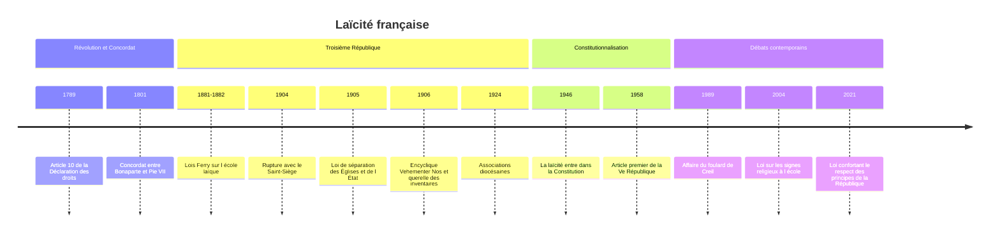

# Laïcité

La laïcité est souvent présentée comme une « exception française ». Le mot, en effet, se traduit mal : les anglophones disent *secularism*, ce qui ne recouvre pas exactement la même chose. Mais le problème qu'elle résout est universel : comment un État peut-il gouverner des citoyens qui ne partagent pas la même foi, ou n'en ont aucune ? La réponse française, fixée pour l'essentiel par la loi du 9 décembre 1905, n'est qu'une solution parmi d'autres, et elle-même a beaucoup évolué.

## Trois mots à ne pas confondre

| Terme | Nature | Définition | Exemple |
|---|---|---|---|
| **Sécularisation** | processus social | recul de l'emprise de la religion sur les institutions, les normes et les consciences | baisse de la pratique catholique en Europe au XXe siècle |
| **Sécularisme** | doctrine ou politique | principe selon lequel l'État et la vie publique doivent être indépendants de la religion | *secularism* indien ou américain |
| **Laïcité** | régime juridique et politique | séparation des Églises et de l'État, neutralité de l'État, liberté de conscience et égalité des citoyens quelle que soit leur croyance | France depuis 1905 |

> [!warning] Piège
> Une société peut être très sécularisée sans être laïque au sens juridique, et inversement. Le Royaume-Uni, où l'Église d'Angleterre est Église établie et où le monarque en est le gouverneur suprême, est l'une des sociétés les moins pratiquantes d'Europe. Les États-Unis, dont la Constitution interdit toute religion d'État, comptent parmi les pays riches les plus religieux. La laïcité organise les rapports entre l'État et les cultes ; elle ne dit rien, par elle-même, du degré de croyance de la population (voir [[Sociologie des Religions]]).

Le mot « laïque » vient du grec *laos*, le peuple : dans l'Église, le laïc est le fidèle qui n'est pas clerc. Le substantif « laïcité » apparaît dans les années 1870 et est popularisé par Ferdinand Buisson, grand artisan de l'école républicaine, qui lui consacre un article de son *Dictionnaire de pédagogie*.

## Les racines françaises

### Révolution et Concordat

La [[04 - La Révolution française|Révolution française]] pose le principe de la liberté religieuse dans l'article 10 de la Déclaration des droits de l'homme et du citoyen : « Nul ne doit être inquiété pour ses opinions, même religieuses, pourvu que leur manifestation ne trouble pas l'ordre public établi par la Loi. » Elle ouvre ensuite une décennie de conflits avec l'Église (Constitution civile du clergé en 1790, déchristianisation de l'an II), prolongeant les débats des [[Lumières (XVIIIe siècle)|Lumières]] sur la tolérance, que [[Locke]] ou [[Spinoza]] avaient déjà formulés au XVIIe siècle.

Bonaparte referme la crise par le **Concordat de 1801** avec le pape Pie VII, complété par des Articles organiques. Le catholicisme y est reconnu comme « religion de la grande majorité des citoyens français », et non plus religion d'État. L'État salarie les prêtres et nomme les évêques, que le pape investit. Les cultes luthérien et réformé sont également reconnus, puis le culte israélite, dont les rabbins sont rémunérés par l'État à partir de 1831. Ce régime des **cultes reconnus** n'est pas une séparation : c'est un pluralisme contrôlé par l'État.

### La République contre l'influence cléricale

Sous la Troisième République, le conflit oppose les républicains, qui veulent émanciper l'État et l'école de l'autorité de l'Église, aux catholiques largement acquis à la monarchie. Les **lois Ferry** de 1881-1882 rendent l'école primaire publique gratuite, obligatoire et laïque ; la loi Goblet de 1886 laïcise son personnel. L'affaire Dreyfus radicalise les camps. Le gouvernement d'Émile Combes interdit l'enseignement aux congrégations en 1904, et la France rompt la même année ses relations diplomatiques avec le Saint-Siège.

## La loi du 9 décembre 1905

Préparée par le député Aristide Briand, rapporteur de la commission, et soutenue par Jean Jaurès, la loi de séparation est un texte de compromis plus libéral que ne le souhaitaient les anticléricaux les plus durs. Ses deux premiers articles en résument l'esprit :

- **Article 1er** : « La République assure la liberté de conscience. Elle garantit le libre exercice des cultes sous les seules restrictions édictées ci-après dans l'intérêt de l'ordre public. »
- **Article 2** : « La République ne reconnaît, ne salarie ni ne subventionne aucun culte. »

> [!important] Idée clé
> L'ordre des articles n'est pas anodin. La loi commence par une **liberté** (de conscience et de culte) avant d'énoncer une **séparation**. La laïcité de 1905 n'est pas d'abord une restriction de la religion, mais une restriction de l'État : c'est lui qui s'interdit de reconnaître, de financer ou de favoriser un culte, ce qui garantit à chacun la liberté de croire, de ne pas croire et de pratiquer. La neutralité s'impose à l'État et à ses agents, non aux citoyens dans l'espace public, qui restent libres de manifester leur foi dans les limites de l'ordre public.

La loi confie la gestion des biens des cultes à des **associations cultuelles**. Le pape Pie X la condamne dans l'encyclique *Vehementer Nos* (février 1906), puis interdit aux catholiques de former ces associations par l'encyclique *Gravissimo officii munere* (août 1906). Les inventaires des biens d'Église provoquent des affrontements en 1906. Une solution est trouvée en 1923-1924 avec les **associations diocésaines**, placées sous l'autorité de l'évêque. Entre-temps, une loi de 1907 a laissé les églises construites avant 1905, devenues propriété publique, à la disposition des fidèles et du clergé : c'est pourquoi les communes entretiennent encore aujourd'hui la plupart des églises de France.

### Une laïcité à géométrie variable

La loi ne s'applique pas partout. L'**Alsace et la Moselle**, allemandes en 1905, ont conservé à leur retour en 1918 le régime concordataire : prêtres, pasteurs et rabbins y sont rémunérés par l'État et l'enseignement religieux figure à l'école publique. La **Guyane** relève d'une ordonnance royale de 1828 qui fait rémunérer le clergé catholique par la collectivité, et plusieurs territoires d'outre-mer ont des régimes particuliers. La laïcité acquiert enfin valeur constitutionnelle : selon l'article 1er de la Constitution de 1958, reprenant celle de 1946, la France est « une République indivisible, laïque, démocratique et sociale ».

## Les débats contemporains

À partir de la fin du XXe siècle, la question change de nature. Il ne s'agit plus d'arracher l'État à l'Église catholique, mais de faire vivre la neutralité dans une société marquée par la présence durable de l'[[Islam]], deuxième religion du pays, et par la visibilité de pratiques religieuses minoritaires.

- **1989** : l'exclusion de collégiennes voilées à Creil ouvre l'« affaire du foulard ». Le Conseil d'État estime alors que le port de signes religieux par les élèves n'est pas en soi incompatible avec la laïcité.
- **2004** : après les travaux de la commission Stasi, la loi du 15 mars interdit aux élèves des écoles, collèges et lycées publics les signes manifestant ostensiblement une appartenance religieuse (voile, kippa, grandes croix, turban [[Sikhisme|sikh]]).
- **2010** : la loi interdisant la dissimulation du visage dans l'espace public vise surtout le voile intégral, mais se fonde juridiquement sur l'ordre public plutôt que sur la laïcité.
- **2021** : la loi « confortant le respect des principes de la République » étend l'obligation de neutralité aux organismes privés chargés d'un service public et renforce le contrôle des associations cultuelles.

Ces évolutions nourrissent une controverse durable. Pour les uns, elles défendent l'égalité, l'émancipation individuelle et la cohésion civique. Pour d'autres, dont l'historien Jean Baubérot, elles s'éloignent de l'esprit libéral de 1905 en étendant aux usagers une neutralité qui ne visait que l'État. Baubérot distingue ainsi plusieurs « laïcités françaises » concurrentes, de la laïcité « séparatiste » de Briand à une laïcité « identitaire » récente. Le débat porte sur l'interprétation d'un même héritage, non sur l'adhésion au principe, que presque tous revendiquent.

## Les autres modèles

| Pays | Texte fondateur | Principe | Particularités |
|---|---|---|---|
| **France** | loi de 1905, Constitution de 1958 | séparation et neutralité de l'État | exceptions d'Alsace-Moselle et d'outre-mer, entretien public des églises d'avant 1905 |
| **États-Unis** | Premier amendement, 1791 | pas de religion établie et libre exercice des cultes | forte religiosité publique, devise *In God We Trust* depuis 1956 |
| **Turquie** | Constitution, principe inscrit en 1937 | *laiklik*, contrôle de la religion par l'État | Diyanet, présidence des affaires religieuses, qui rémunère les imams |
| **Inde** | Constitution de 1950, mot *secular* ajouté en 1976 | égale considération de toutes les religions | droits personnels propres à chaque communauté |
| **Allemagne** | Loi fondamentale de 1949 | neutralité coopérative | impôt ecclésial prélevé par l'État, enseignement religieux à l'école |
| **Royaume-Uni** | tradition constitutionnelle | Église établie en Angleterre | évêques siégeant à la Chambre des lords |

### États-Unis : protéger les religions de l'État

Le Premier amendement interdit au Congrès de légiférer pour établir une religion ou pour en empêcher le libre exercice. Thomas Jefferson, dans une lettre de 1802 aux baptistes de Danbury, parle d'un « mur de séparation » entre l'Église et l'État. Mais la logique diffère de celle de la France : il s'agissait surtout de protéger la pluralité des Églises protestantes, souvent dissidentes, contre un État qui en favoriserait une. D'où une séparation stricte des institutions, coexistant avec une vie publique saturée de références religieuses, ce que Robert Bellah a analysé comme une **religion civile**.

### Turquie : contrôler la religion

Mustafa Kemal abolit le califat en 1924 et crée la même année la Diyanet. La *laiklik* turque, inspirée du modèle français, n'est pas une séparation mais une **tutelle** : l'État forme et rémunère les imams, rédige les sermons du vendredi, encadre un islam sunnite officiel. L'interdiction du voile dans les universités et la fonction publique, longtemps emblématique, a été levée progressivement au cours des années 2010.

### Inde : l'égale distance

Le *secularism* indien, inscrit au préambule de la Constitution par le 42e amendement de 1976, ne sépare pas l'État des religions. Le philosophe Rajeev Bhargava parle de « distance de principe » : l'État peut intervenir dans les affaires religieuses, par exemple pour abolir l'intouchabilité, administrer des temples ou réglementer des pratiques, à condition de traiter équitablement toutes les communautés. Le droit de la famille reste différencié entre hindous, musulmans, chrétiens et parsis, et le projet d'un code civil uniforme est l'un des débats les plus vifs de la vie politique indienne, dans un contexte de tensions entre nationalisme hindou et minorités (voir [[Hindouisme]]).

> [!tip] Méthode
> Pour comparer deux régimes, poser trois questions distinctes. Qui finance les cultes ? Qui nomme ou forme les ministres du culte ? Qui doit être neutre, l'État seul ou aussi les usagers de certains lieux ? Les réponses françaises (personne, les cultes eux-mêmes, l'État et ses agents plus les élèves) diffèrent de celles de la Turquie (l'État, l'État, l'État et longtemps les usagers) alors que les deux pays revendiquent le même mot.

## Chronologie

## Ressources

- Jean Baubérot, *Histoire de la laïcité en France*, collection Que sais-je ?, 2000 (1re édition parue sous le titre *Histoire de la laïcité française*).
- Jean Baubérot, *Les 7 laïcités françaises*, 2015.
- Charles Taylor, *A Secular Age*, 2007.
- Jacqueline Lalouette, *La Séparation des Églises et de l'État. Genèse et développement d'une idée (1789-1905)*, 2005.
- Henri Pena-Ruiz, *Qu'est-ce que la laïcité ?*, 2003.
