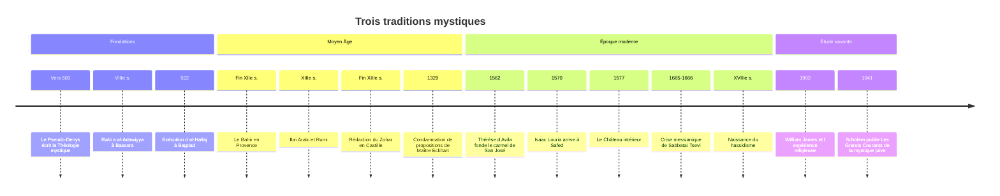

# Mystiques

Dans chacune des grandes religions monothéistes, des femmes et des hommes ont cherché plus qu'obéir à une loi ou adhérer à une doctrine : ils ont voulu faire l'**expérience directe** de Dieu, jusqu'à l'union avec lui. On les appelle des mystiques. Le soufisme en [[Islam]], la kabbale dans le [[Judaïsme]] et la mystique chrétienne ont produit certains des plus grands textes spirituels et poétiques de l'humanité. Ils ont aussi inquiété les autorités religieuses, car celui qui prétend rencontrer Dieu sans intermédiaire peut se passer des clercs.

## Qu'est-ce que la mystique ?

Le mot vient du grec *mystikos*, « ce qui concerne les mystères », c'est-à-dire les rites secrets des cultes antiques. Au tournant du VIe siècle, un auteur chrétien se présentant comme Denys l'Aréopagite, disciple de saint Paul (on le nomme pour cette raison le Pseudo-Denys), écrit une *Théologie mystique* où Dieu n'est atteint que par la négation de tout ce qu'on peut en dire. L'historien Michel de Certeau a montré dans *La Fable mystique* (1982) que « la mystique », employée comme nom pour désigner un domaine à part, ne s'impose qu'aux XVIe et XVIIe siècles.

Le psychologue américain William James, dans *Les Formes multiples de l'expérience religieuse* (1902), propose quatre marques de l'état mystique : l'**ineffabilité** (il ne peut être dit), la **qualité noétique** (il se donne comme une connaissance), la **fugacité** et la **passivité** (le sujet se sent saisi par une puissance supérieure).

> [!warning] Piège
> Il est tentant de croire que tous les mystiques disent au fond la même chose, sous des vocabulaires différents. C'est la thèse **pérennialiste**, popularisée par Aldous Huxley dans *La Philosophie éternelle* (1945). Elle a été vivement contestée par l'approche dite **constructiviste**, notamment par le philosophe Steven Katz à la fin des années 1970 : l'expérience mystique ne précède pas la tradition, elle est façonnée par elle. Un kabbaliste ne cherche pas à rencontrer le Christ, et une carmélite ne cherche pas à s'effacer dans l'unicité divine comme un soufi. Le débat reste ouvert, mais la prudence impose de comparer sans fusionner.

## Le soufisme

Le soufisme (*tasawwuf*) est la dimension intérieure de l'islam. L'étymologie la plus répandue le rattache à *suf*, la laine, par allusion au vêtement grossier des premiers ascètes. Les soufis s'appuient sur le Coran et sur l'exemple du Prophète, et la plupart se situent dans le cadre de la loi religieuse, qu'ils veulent vivre de l'intérieur plutôt que remplacer.

### Grandes figures

- **Rabi'a al-Adawiyya** (VIIIe siècle, Bassora) fait de l'**amour désintéressé** de Dieu le cœur de la voie : aimer Dieu ni par crainte de l'enfer ni par désir du paradis, mais pour lui-même.
- **Al-Hallaj**, exécuté à Bagdad en 922, est resté célèbre pour la phrase *Ana al-Haqq*, « Je suis la Vérité » (l'un des noms de Dieu), comprise par ses juges comme un blasphème et par ses disciples comme l'expression de l'union.
- **Junayd de Bagdad** (mort en 910) défend au contraire une mystique « sobre », qui revient de l'union pour vivre au milieu des hommes, face à la mystique « ivre » associée à Bistami.
- **Al-Ghazali** (1058-1111), grand juriste et théologien, raconte sa crise intellectuelle et sa conversion à la voie soufie ; sa *Revivification des sciences de la religion* réconcilie durablement le soufisme avec l'orthodoxie sunnite.
- **Ibn Arabi** (1165-1240), né à Murcie, pense un monde où toute chose manifeste l'Être divin ; ses disciples systématiseront cette pensée sous le nom d'unicité de l'être (*wahdat al-wujud*).
- **Djalal ad-Din Rumi** (1207-1273), poète de langue persane installé à Konya, auteur du *Masnavi*, inspire l'ordre des Mevlevis, les « derviches tourneurs ».

### Voie, maître et confréries

Le soufi suit une **voie** (*tariqa*) sous la direction d'un **maître** (*cheikh*, *pir*) auquel il est lié par un pacte. Il progresse par des **stations** (*maqamat*), acquises par l'effort, et reçoit des **états** (*ahwal*), donnés par grâce. La pratique centrale est le *dhikr*, le rappel répétitif du nom de Dieu, seul ou en groupe, parfois accompagné de musique et de danse. Le but est l'**extinction** du moi en Dieu (*fana*), suivie de la **subsistance** en lui (*baqa*).

À partir du XIIe siècle, ces voies s'organisent en **confréries** qui couvrent tout le monde musulman : Qadiriyya, Shadhiliyya, Naqshbandiyya, puis Tijaniyya, et au Sénégal les Mourides d'Amadou Bamba. Le soufisme a joué un rôle majeur dans la diffusion de l'islam en Afrique, en Asie centrale et en Inde, où il a côtoyé la dévotion hindoue au point d'influencer le [[Sikhisme]]. Depuis le XVIIIe siècle, le wahhabisme puis divers courants salafistes le combattent, lui reprochant le culte des saints et des tombeaux (voir les [[Social Sciences/Religion/Islam/Branches|branches de l'islam]]).

## La kabbale

La kabbale (*qabbalah*, « réception » ou « tradition reçue ») désigne la mystique juive qui se développe au Moyen Âge, héritière de courants plus anciens comme la mystique du Char céleste (*merkavah*) de l'Antiquité tardive et du *Sefer Yetsirah*, bref traité sur la création par les lettres et les nombres, de datation discutée.

### Le Zohar et les sefirot

La kabbale apparaît en Provence à la fin du XIIe siècle avec le *Bahir*, puis s'épanouit en Catalogne et en Castille. Son œuvre maîtresse, le **Zohar** (« Livre de la splendeur »), commentaire mystique de la Torah en araméen, est attribué par la tradition au sage Shimon bar Yohaï (IIe siècle), mais Gershom Scholem l'a attribué pour l'essentiel à Moïse de León, en Castille, à la fin du XIIIe siècle ; les recherches récentes y voient plutôt une œuvre collective.

Au cœur du système se trouve la distinction entre l'**Ein Sof**, l'Infini divin inaccessible, et les dix **sefirot**, émanations ou attributs par lesquels Dieu se manifeste (Sagesse, Intelligence, Grâce, Rigueur, Beauté, etc.). La dixième, la **Shekhina**, présence divine féminine, est exilée dans le monde : l'accomplissement des commandements, avec l'intention juste (*kavanah*), contribue à réunir Dieu et sa présence.

### Safed et Isaac Louria

Après l'expulsion des Juifs d'Espagne en 1492, la kabbale se renouvelle à Safed, en Galilée, au XVIe siècle, avec Moïse Cordovero puis **Isaac Louria** (1534-1572). Louria pense la création comme un **retrait** de Dieu (*tsimtsoum*) pour laisser place au monde, suivi d'une **brisure des vases** qui devaient contenir la lumière divine : des étincelles sont tombées dans la matière. La tâche humaine est de les relever par la **réparation** (*tikkoun*), notion que le judaïsme moderne a transposée en éthique sociale (voir [[Tikkoun Olam]]). Cette pensée nourrit la crise messianique de Sabbataï Tsevi (1665-1666), puis, sous une forme plus populaire, le **hassidisme** fondé en Europe orientale par le Baal Shem Tov au XVIIIe siècle.

> [!important] Idée clé
> Contrairement à une idée reçue, la kabbale n'est pas une marge ésotérique opposée au judaïsme rabbinique. La plupart des kabbalistes étaient des maîtres du [[Talmud]] et de la loi, et leur mystique consiste à donner une portée cosmique à la pratique ordinaire des commandements. De même, les grands soufis étaient souvent juristes, et les grands mystiques chrétiens moines ou religieux. Dans les trois traditions, la mystique est moins une fuite hors de l'orthodoxie qu'une intensification de la pratique commune, ce qui explique que les institutions aient oscillé entre soupçon et canonisation.

## La mystique chrétienne

Le [[Christianisme]] hérite de la philosophie néoplatonicienne, qui passe par [[Augustin]] et le Pseudo-Denys, l'idée d'une ascension de l'âme vers l'Un, au-delà des images (voir [[Platon]] et [[Philosophie Médiévale]]). Le monachisme, oriental puis occidental, en fait un mode de vie. Dans l'Orient orthodoxe, l'**hésychasme**, défendu au XIVe siècle par Grégoire Palamas, cherche la contemplation de la lumière divine par la prière du cœur.

### Maître Eckhart

Le dominicain rhénan **Maître Eckhart** (vers 1260-1328), théologien à Paris et prédicateur en langue allemande, parle d'une « déité » au-delà de Dieu tel que nous le nommons, et d'un « fond » de l'âme où Dieu et l'âme ne font qu'un. Il appelle au **détachement** et au « laisser-être » (*Gelassenheit*) : se vider de tout, même de la volonté de plaire à Dieu, pour que Dieu naisse dans l'âme. Poursuivi pour hérésie, il meurt avant la fin de son procès ; en 1329, la bulle *In agro dominico* du pape Jean XXII condamne une série de propositions extraites de ses œuvres. Ses disciples Jean Tauler et Henri Suso diffusent une version plus prudente de sa pensée. La même époque voit brûler à Paris en 1310 la béguine Marguerite Porete, auteure du *Miroir des âmes simples*.

### Thérèse d'Avila et Jean de la Croix

Dans l'Espagne de la Contre-Réforme, surveillée par l'Inquisition qui traque les « illuminés » (*alumbrados*), deux carmélites renouvellent la mystique.

**Thérèse d'Avila** (1515-1582) réforme l'ordre du Carmel en fondant en 1562 à Ávila le premier couvent des carmélites « déchaussées », vouées à une vie plus austère. Dans le *Château intérieur* (1577), elle décrit l'âme comme un château de cristal aux sept **demeures**, que l'on traverse par l'oraison jusqu'à la dernière, celle du mariage spirituel. Ses récits d'extases, dont la transverbération que le Bernin sculptera à Rome, sont d'une précision presque clinique. Elle est en 1970 l'une des deux premières femmes proclamées docteurs de l'Église, avec Catherine de Sienne.

**Jean de la Croix** (1542-1591), qu'elle associe à sa réforme, est emprisonné plusieurs mois à Tolède en 1577-1578 par ses frères opposés à la réforme. C'est là qu'il compose une partie de son œuvre poétique. Dans la *Montée du Carmel* et la *Nuit obscure*, il décrit la **nuit** que l'âme doit traverser : nuit des sens, puis nuit de l'esprit, où tout appui sensible et même toute consolation spirituelle disparaissent. Son *Cantique spirituel* reprend le langage amoureux du Cantique des cantiques. Il est proclamé docteur de l'Église en 1926.

## Points communs et différences

| | Soufisme | Kabbale | Mystique chrétienne |
|---|---|---|---|
| **But** | extinction du moi en Dieu (*fana*) | attachement à Dieu (*devekut*), réparation du monde | union de l'âme avec Dieu, mariage spirituel |
| **Pratique centrale** | *dhikr*, rappel du nom divin | étude, commandements accomplis avec intention | oraison, contemplation, sacrements |
| **Transmission** | maître et confréries | cercles d'initiés autour d'un maître | monastères, ordres religieux, directeurs spirituels |
| **Langage** | amour, ivresse, vin, bien-aimé | lettres, lumière, noces divines | nuit, château, noces |
| **Rapport à l'institution** | intégré à l'islam sunnite et chiite, contesté par le salafisme | tenue pour une tradition réservée, longtemps limitée aux érudits | condamnations suivies parfois de canonisations |

Les trois traditions partagent plusieurs traits : une **théologie négative**, qui affirme que Dieu dépasse tout concept ; le recours au **langage amoureux**, faute de mieux pour dire l'union ; le besoin d'un **guide** pour éviter l'illusion ; une tension avec l'autorité, qui craint l'orgueil spirituel et l'antinomisme, c'est-à-dire l'idée que l'union dispenserait de la loi. Elles ont aussi circulé entre elles : dans l'Espagne médiévale, penseurs juifs et musulmans lisaient les mêmes néoplatoniciens, et certains historiens ont relevé des parallèles entre images soufies et images carmélitaines, sans que des influences directes soient établies.

Les différences ne sont pas moindres. Le christianisme pense l'union à travers le Christ, Dieu fait homme, ce qui n'a pas d'équivalent en islam ni dans le judaïsme. La kabbale donne une portée cosmique aux commandements et à la vie collective du peuple juif, là où le soufisme et le carmel insistent davantage sur le chemin de l'âme individuelle. Le rapport au corps, à la musique et à la danse varie enfin considérablement, des derviches tourneurs à la clôture carmélitaine. Au-delà des monothéismes, l'[[Hindouisme]] et le [[Bouddhisme]] ont développé des traditions contemplatives que l'on qualifie aussi de mystiques, au prix d'un élargissement du mot.

## Chronologie

## Ressources

- Gershom Scholem, *Les Grands Courants de la mystique juive*, 1941.
- Annemarie Schimmel, *Mystical Dimensions of Islam*, 1975.
- Michel de Certeau, *La Fable mystique*, 1982.
- William James, *Les Formes multiples de l'expérience religieuse*, 1902.
- Éric Geoffroy, *Initiation au soufisme*, 2003.
