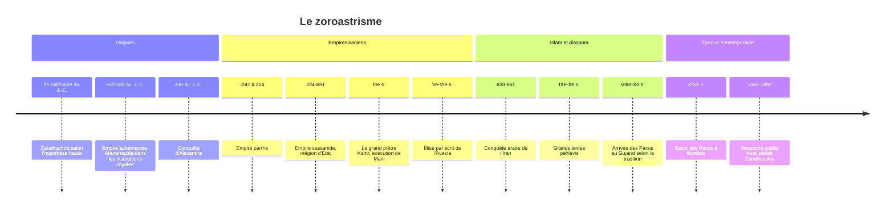

# Zoroastrisme

Le zoroastrisme, ou mazdéisme, est la religion fondée par le prophète iranien **Zarathushtra** (Zoroastre en grec) autour du culte d'**Ahura Mazda**, le « Seigneur Sagesse ». Religion d'État des grands empires perses pendant plus d'un millénaire, elle compte aujourd'hui moins de 200 000 fidèles, principalement les Parsis d'Inde et les zoroastriens d'Iran. Son importance historique dépasse de loin ce chiffre : sa vision d'un combat cosmique entre le bien et le mal, d'un jugement individuel après la mort, d'une résurrection et d'un renouvellement final du monde est souvent présentée comme l'une des sources des eschatologies juive, chrétienne et musulmane, même si l'ampleur de cette influence reste débattue.

## Origines et fondateur

### Un prophète difficile à dater

On ne sait presque rien de sûr sur la vie de Zarathushtra, sinon ce que laissent entrevoir les **Gathas**, dix-sept hymnes qui lui sont attribués. Il s'y présente comme un prêtre (*zaotar*) en conflit avec les puissants et les prêtres de son temps, cherchant la protection d'un prince nommé Vishtaspa.

Sa datation est l'un des grands débats de l'histoire des religions :

| Hypothèse | Arguments |
|---|---|
| **Haute** (vers 1500-1000 av. J.-C.) | La langue des Gathas (avestique ancien) est très proche du sanskrit du *Rig-Veda* ; la société décrite est pastorale, sans trace d'empire ni de ville. Mary Boyce le situait entre 1500 et 1000 av. J.-C. |
| **Basse** (VIIe-VIe s. av. J.-C.) | Une tradition zoroastrienne tardive le place « 258 ans avant Alexandre ». Elle est aujourd'hui considérée par la plupart des spécialistes comme une reconstruction savante sans valeur historique |

La majorité des chercheurs penche aujourd'hui pour une date haute, sans consensus sur le siècle, et localise le prophète dans l'est du plateau iranien ou en Asie centrale, bien avant les Perses achéménides. Le texte [[Histoire des Religions]] du vault donne une fourchette cohérente avec cette hypothèse.

### Une réforme de la religion indo-iranienne

Les ancêtres des Iraniens et des Indiens védiques partageaient une religion commune, dont on retrouve des échos dans la [[Mythologie Indienne]] : sacrifice, boisson sacrée (*haoma* en Iran, *soma* en Inde), notion d'ordre cosmique (*asha* en avestique, *rta* en védique). Zarathushtra réorganise ce fonds autour d'un dieu suprême et d'un choix moral. Signe de cette rupture, les *daeva*, dieux dans l'Inde védique (*deva*), deviennent en Iran des démons.

## Croyances

### Ahura Mazda et les deux esprits

**Ahura Mazda** est le créateur sage et bon, source de l'ordre (*asha*). Face à lui se dresse le principe du mensonge et de la destruction (*druj*), incarné par **Angra Mainyu** (Ahriman en moyen-perse). Les Gathas parlent de deux esprits jumeaux originels, l'un bienfaisant (*Spenta Mainyu*), l'autre destructeur, qui ont choisi l'un le bien, l'autre le mal. Chaque être humain est placé devant ce même choix.

> [!warning] Piège
> On range souvent le zoroastrisme parmi les « dualismes » comme s'il posait deux dieux égaux. Ce n'est pas la position zoroastrienne : le mal n'est pas créateur, il est une force de destruction, et il sera définitivement vaincu à la fin des temps. On parle plutôt de **dualisme éthique et cosmique** au sein d'une perspective monothéiste. Le dualisme strict, avec deux principes éternels égaux, caractérise plutôt le manichéisme, religion distincte fondée au IIIe siècle par Mani, que l'Iran sassanide a d'ailleurs persécutée.

### Les Amesha Spenta

Ahura Mazda agit par six (ou sept, avec l'Esprit saint) entités divines, les **Amesha Spenta**, « Immortels bienfaisants », qui sont à la fois des aspects de Dieu, des vertus humaines et les protecteurs des éléments de la création : Bonne Pensée (bétail), Ordre juste (feu), Pouvoir souhaitable (métal), Dévotion (terre), Intégrité (eau), Immortalité (plantes). À côté d'eux sont vénérées des divinités appelées *yazata* (« dignes d'adoration »), comme Mithra, Anahita ou Verethragna.

### Éthique et eschatologie

| Notion | Contenu |
|---|---|
| **Bonnes pensées, bonnes paroles, bonnes actions** | *Humata, hukhta, hvarshta* : la triade morale au coeur de la pratique |
| **Libre arbitre** | Chacun choisit son camp et en porte la responsabilité |
| **Pont Chinvat** | Après la mort, l'âme est jugée au « pont du trieur », qui s'élargit pour le juste et devient tranchant comme une lame pour le méchant |
| **Paradis et enfer** | Maison du chant pour les justes, maison du mensonge pour les méchants, en attendant la fin des temps |
| **Saoshyant** | Sauveur à venir, né de la semence du prophète, qui annonce la fin |
| **Frashokereti** | Renouvellement final du monde : résurrection des morts, épreuve du métal en fusion, défaite du mal, monde rendu parfait |

## Textes

L'**Avesta** a d'abord été transmis oralement pendant des siècles. Il n'a été mis par écrit que sous les Sassanides, vers le Ve-VIe siècle apr. J.-C., dans un alphabet créé pour noter précisément sa prononciation. Seule une partie de ce corpus nous est parvenue.

| Texte | Contenu |
|---|---|
| **Gathas** | Dix-sept hymnes attribués à Zarathushtra, insérés dans le Yasna |
| **Yasna** | Liturgie principale du culte, récitée par les prêtres |
| **Vendidad** (Videvdad) | Code de pureté et de purification contre les démons |
| **Yashts** | Hymnes aux divinités (*yazata*), riches en mythes |
| **Khordeh Avesta** | « Petit Avesta », recueil de prières quotidiennes pour les laïcs |
| **Textes pehlevis** | Écrits en moyen-perse, surtout aux IXe-Xe siècles, après la conquête arabe : *Bundahishn* (cosmogonie), *Denkard* (encyclopédie religieuse) |

## Pratiques et rites

- **Le feu** : symbole de la pureté et de l'ordre divin, il est entretenu en permanence dans les temples du feu. Les feux de plus haut rang, les *Atash Behram*, sont consacrés par des rites longs et complexes. Le plus vénéré, l'*Iranshah*, brûle aujourd'hui à Udvada, au Gujarat.
- **L'initiation** (*navjote* chez les Parsis, *sedreh-pushi* en Iran) : vers sept à quinze ans, l'enfant reçoit la chemise sacrée (*sudreh*) et le cordon (*kusti*), qu'il nouera et dénouera chaque jour en priant.
- **Les prières** : cinq fois par jour, aux cinq « veilles » (*gah*), face à une source de lumière.
- **La pureté** : préserver les éléments de la souillure, en particulier le feu, l'eau et la terre, d'où les règles strictes sur les cadavres.
- **Les funérailles** : traditionnellement, les corps sont exposés aux vautours dans des **tours du silence** (*dakhma*), pour ne souiller ni la terre ni le feu. Cette pratique, abandonnée en Iran au XXe siècle (à Yazd, les tours ont servi jusqu'en 1974) au profit de l'inhumation dans des tombes cimentées, se heurte en Inde à la quasi-disparition des vautours, ce qui a conduit à des alternatives (concentrateurs solaires, crémation).
- **Les fêtes** : **Norouz**, le nouvel an de l'équinoxe de printemps, d'origine iranienne ancienne et aujourd'hui fêté par toutes les populations iraniennes quelle que soit leur religion ; les six *gahambar* saisonniers ; Sadeh, fête du feu en hiver ; Mehregan, fête de Mithra à l'automne.

> [!important] Idée clé
> On a longtemps appelé les zoroastriens des « adorateurs du feu ». Eux-mêmes récusent l'expression : le feu n'est pas un dieu mais le symbole visible de l'*asha*, l'ordre juste, et la présence d'Ahura Mazda, comme la croix ou l'orientation vers La Mecque ailleurs. L'erreur est instructive : elle vient de ce que l'observateur extérieur voit le geste (se tourner vers le feu) sans la théologie qui l'interprète.

## Organisation et courants

Le clergé est héréditaire : on naît dans une famille de prêtres (*mobed*, *dastur* pour les plus élevés). Il n'existe pas d'autorité centrale mondiale.

| Communauté | Profil |
|---|---|
| **Zoroastriens d'Iran** | Communauté restée au pays, concentrée à Yazd, Kerman et Téhéran. Minorité reconnue par la constitution de la République islamique, avec un siège réservé au Parlement |
| **Parsis** | Descendants de zoroastriens partis d'Iran vers l'Inde, au Gujarat, après la conquête arabe. La date de leur arrivée, fixée par un récit tardif, le *Qissa-i Sanjan*, reste discutée entre le VIIIe et le Xe siècle |
| **Iranis** | Zoroastriens arrivés d'Iran en Inde plus tard, surtout aux XIXe et XXe siècles |
| **Diaspora** | Amérique du Nord, Royaume-Uni, Australie |

Deux débats traversent la communauté : l'acceptation des **conversions** et des enfants de mariages mixtes, refusée par les Parsis orthodoxes et acceptée par les réformistes, et le déclin démographique qui en découle en partie.

## Chronologie

## Histoire

Les rois **achéménides** (550-330 av. J.-C.) invoquent Ahuramazda dans leurs inscriptions, à commencer par Darius Ier à Behistun, mais ne nomment jamais Zarathushtra ; la question de savoir s'ils étaient zoroastriens au sens plein est débattue. Leur politique de tolérance est illustrée par l'édit attribué à Cyrus, que la Bible hébraïque célèbre comme l'« oint » qui permet le retour des exilés juifs à Jérusalem (Isaïe 45). La tradition zoroastrienne accuse **Alexandre** d'avoir détruit les livres sacrés, récit qui exprime surtout le traumatisme de la conquête. Sous les **Parthes**, le zoroastrisme coexiste avec d'autres cultes.

Les **Sassanides** (224-651) en font une religion d'État, dotée d'une hiérarchie sacerdotale puissante, dont le grand prêtre Kartir (IIIe siècle) est la figure emblématique. Le pouvoir persécute alors chrétiens, manichéens et juifs par intermittence. La conquête arabe du VIIe siècle, rappelée dans la note sur l'[[Islam]], met fin à ce statut. La conversion à l'islam est lente, s'étalant sur plusieurs siècles, et le zoroastrisme devient une religion minoritaire, protégée comme « gens du Livre » selon certaines interprétations mais souvent marginalisée.

Aux XIXe et XXe siècles, les **Parsis** de Bombay jouent un rôle économique et politique hors de proportion avec leur nombre : les Tata dans l'industrie, Dadabhai Naoroji comme pionnier du nationalisme indien, et, dans un autre registre, le chanteur Freddie Mercury, né Farrokh Bulsara dans une famille parsie.

## Présence aujourd'hui

| Indicateur | Ordre de grandeur |
|---|---|
| Zoroastriens dans le monde | Environ 110 000 à 120 000 selon l'enquête communautaire FEZANA de 2012 ; d'autres estimations vont plus haut |
| Parsis en Inde (recensement 2011) | Environ 57 000, en déclin continu depuis 1941 |
| Zoroastriens en Iran (recensements récents) | 25 271 en 2011, 23 109 en 2016 |
| Diaspora occidentale | Quelques dizaines de milliers |

Le Pew Research Center, dans ses projections mondiales, ne distingue pas le zoroastrisme et le compte parmi les « autres religions ». Le déclin démographique est au coeur des préoccupations : faible natalité, mariages tardifs, non-reconnaissance des enfants de mères parsies mariées hors de la communauté. On observe à l'inverse, depuis les années 2010, des conversions dans le Kurdistan irakien et parmi des Iraniens de la diaspora, qui voient dans le zoroastrisme une identité iranienne préislamique.

## Influence

L'hypothèse d'une influence zoroastrienne sur le [[Judaïsme]] du Second Temple, puis sur le [[Christianisme]] et l'islam, s'appuie sur des parallèles frappants : jugement individuel, résurrection des corps, anges et démons organisés en armées, figure d'un adversaire du bien, sauveur de la fin des temps. Ces idées apparaissent dans les textes juifs surtout après l'exil, au contact de l'empire perse. La thèse maximaliste, défendue notamment par Mary Boyce, fait du zoroastrisme la matrice de ces croyances ; d'autres historiens soulignent les incertitudes de datation des textes avestiques et pehlevis, dont beaucoup sont postérieurs aux textes juifs et chrétiens, et préfèrent parler d'un milieu d'échanges. Les **mages** venus d'Orient de l'Évangile de Matthieu renvoient, eux, aux prêtres de tradition iranienne.

Dans la culture européenne, Zoroastre est devenu une figure de sage oriental, du Sarastro de *La Flûte enchantée* de Mozart au Zarathoustra de [[Nietzsche]], choisi précisément parce que le prophète iranien passait pour l'inventeur de la morale du bien et du mal que Nietzsche voulait dépasser. Pour situer le zoroastrisme parmi les autres traditions, voir le [[Panorama des Religions Mondiales]].

## Ressources

- Mary Boyce, *Zoroastrians: Their Religious Beliefs and Practices*, 1979.
- Jenny Rose, *Zoroastrianism: An Introduction*, 2011.
- Michael Stausberg, *Die Religion Zarathushtras*, 3 volumes, 2002-2004.
- Michael Stausberg et Yuhan Sohrab-Dinshaw Vevaina (dir.), *The Wiley Blackwell Companion to Zoroastrianism*, 2015.
