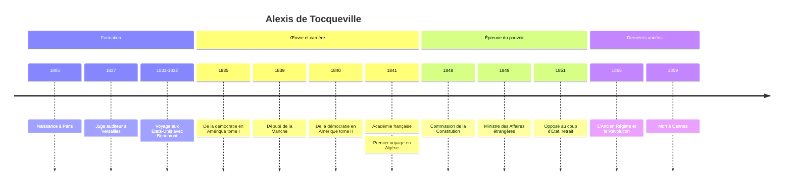

# Alexis de Tocqueville (1805-1859)

Magistrat, voyageur, député et brièvement ministre, Alexis de Tocqueville n'a jamais revendiqué le titre de sociologue, mot que son contemporain Auguste Comte venait à peine de forger. Il est pourtant l'un des premiers à avoir pensé la démocratie non comme un simple régime politique, mais comme un **état social** : une manière nouvelle d'organiser les rapports entre les hommes, qui transforme les mœurs, les sentiments, la famille, la religion et la pensée. Raymond Aron l'a installé au panthéon de la discipline, aux côtés de Montesquieu, de [[Karl Marx]], d'[[Émile Durkheim]] et de [[Max Weber]].

## Biographie

### Un aristocrate au lendemain de la Révolution

Alexis de Tocqueville naît à Paris le 29 juillet 1805, dans une famille de la noblesse normande. La [[04 - La Révolution française|Révolution française]] a marqué sa famille dans sa chair : son arrière-grand-père Malesherbes, qui avait défendu Louis XVI devant la Convention, est guillotiné en 1794, et ses parents, emprisonnés sous la Terreur, n'échappent à l'échafaud que grâce à la chute de Robespierre. Tocqueville grandit ainsi dans un milieu légitimiste, nostalgique de l'ordre ancien, mais il acquiert très tôt la conviction que cet ordre ne reviendra pas.

Après des études de droit, il devient en 1827 juge auditeur au tribunal de Versailles, où il se lie avec un autre jeune magistrat, Gustave de Beaumont. La révolution de 1830 le place dans une situation inconfortable : il prête serment à la monarchie de Juillet, ce que sa famille lui reproche, sans y adhérer avec enthousiasme.

### Le voyage en Amérique

En 1831, Tocqueville et Beaumont obtiennent une mission officielle pour étudier le système pénitentiaire américain. Ils séjournent aux États-Unis d'avril 1831 à février 1832, parcourant la côte Est, les Grands Lacs, le Canada francophone, la vallée du Mississippi jusqu'à La Nouvelle-Orléans. Le rapport attendu paraît en 1833 (*Du système pénitentiaire aux États-Unis et de son application en France*), mais Tocqueville rapporte surtout la matière d'un livre bien plus vaste.

Le premier volume de *De la démocratie en Amérique* paraît en 1835 et lui vaut une célébrité immédiate ; le second, plus abstrait, suit en 1840. Entre-temps, il voyage en Angleterre et en Irlande, rédige un *Mémoire sur le paupérisme* (1835) et épouse une Anglaise, Mary Mottley. Il entre à l'Académie des sciences morales et politiques en 1838 et à l'Académie française en 1841.

### L'homme politique

Élu député de la Manche en 1839, il siège jusqu'en 1851. Il est rapporteur en 1839 d'une commission sur l'abolition de l'esclavage dans les colonies françaises, à laquelle il est favorable. Il se rend aussi en Algérie en 1841 et en 1846 et soutient la colonisation ; ses textes sur ce sujet, qui acceptent une guerre de destruction comme une nécessité tout en critiquant certains excès de l'administration militaire, sont aujourd'hui au centre d'un débat sur les limites de son libéralisme (voir [[05 - Colonisation de l'Algérie|la colonisation de l'Algérie]]).

Après la révolution de 1848, il est élu à l'Assemblée constituante et participe à la commission qui rédige la Constitution de la IIe République. Il est ministre des Affaires étrangères de juin à octobre 1849. Opposé au coup d'État du 2 décembre 1851, il est brièvement arrêté avec d'autres députés, puis se retire de la vie publique. Il rédige alors *L'Ancien Régime et la Révolution* (1856), dont la suite restera inachevée. Atteint de tuberculose, il meurt à Cannes le 16 avril 1859. Ses *Souvenirs* sur 1848, écrits pour lui-même, ne paraissent qu'en 1893.

## De la démocratie en Amérique

La note consacrée à l'ouvrage, [[De la Démocratie en Amérique - Tockeville|De la démocratie en Amérique]], en présente le contenu ; on se concentre ici sur ce qui en fait un texte fondateur pour la sociologie.

### L'égalité des conditions, fait générateur

L'introduction pose le principe de toute l'analyse : ce qui frappe le plus Tocqueville en Amérique, c'est l'**égalité des conditions**, dont découlent les lois, les opinions et les mœurs. Il y voit un mouvement séculaire qui travaille aussi l'Europe, et écrit que « le développement graduel de l'égalité des conditions est donc un fait providentiel ». L'Amérique n'est pas un modèle à copier, mais un laboratoire où l'on observe à l'état pur ce qui attend la France.

L'égalité des conditions n'est pas l'égalité des revenus. Elle désigne la disparition des différences héréditaires de statut : plus d'ordres, plus de rangs fixés par la naissance, des positions ouvertes en droit à tous. Les riches existent toujours, mais la richesse circule et ne crée plus de lien de dépendance permanent.

> [!important] Idée clé
> Tocqueville invente une démarche que la sociologie reprendra : partir d'un **principe générateur** d'une société et en déduire les conséquences sur tous les domaines de la vie, de la famille à la littérature. C'est la méthode du second volume de 1840, qui traite de l'influence de la démocratie sur la philosophie, la langue, les rapports entre maîtres et serviteurs ou la condition des femmes. Montesquieu l'avait esquissée avec l'« esprit » des lois ; Tocqueville l'applique à un type de société plutôt qu'à un type de gouvernement.

### Les passions démocratiques

L'homme démocratique aime l'égalité plus que la liberté : l'égalité procure des jouissances quotidiennes et visibles, la liberté des bienfaits lointains et incertains. Il est animé par le goût du bien-être matériel et par une inquiétude permanente, car dans un monde où tout semble possible, chacun se compare à tous. Tocqueville note ainsi que les inégalités deviennent d'autant plus insupportables qu'elles diminuent, intuition proche de ce que la sociologie appellera plus tard la frustration relative.

Il décrit aussi l'**individualisme**, mot encore récent, qu'il distingue soigneusement de l'égoïsme : « L'individualisme est un sentiment réfléchi et paisible qui dispose chaque citoyen à s'isoler de la masse de ses semblables et à se retirer à l'écart avec sa famille et ses amis. » L'égoïsme est un vice de toutes les époques ; l'individualisme est un produit propre à la démocratie, qui dissout les solidarités de rang et de lignage.

### Les deux menaces

| Menace | Mécanisme | Tocqueville la voit à l'œuvre |
|---|---|---|
| **Tyrannie de la majorité** | la toute-puissance de l'opinion commune décourage la pensée indépendante, sans violence physique | dans la vie intellectuelle américaine, où il juge qu'il y a peu de véritable liberté d'esprit |
| **Despotisme doux** | des individus repliés sur leur bien-être abandonnent la gestion des affaires communes à un État protecteur | dans la tendance à la centralisation, qu'il redoute surtout pour la France |

La seconde menace est la plus originale. Tocqueville imagine une foule d'hommes semblables et égaux, absorbés dans leurs petits plaisirs, au-dessus desquels « s'élève un pouvoir immense et tutélaire, qui se charge seul d'assurer leur jouissance et de veiller sur leur sort ». Ce pouvoir ne tyrannise pas, il infantilise.

### Les contrepoids

Contre ces dangers, l'Amérique offre des remèdes qui font la matière de la [[Sociologie Politique]] tocquevillienne : la décentralisation et la vie communale, qui font l'apprentissage de la liberté ; la liberté de la presse ; le jury ; et surtout les **associations**, grâce auxquelles des individus isolés et faibles recréent des puissances collectives. Tocqueville y ajoute la religion, qui modère les passions et fixe des repères que le débat démocratique ne remet pas en cause, et la doctrine de l'intérêt bien entendu, par laquelle les Américains se persuadent que servir la collectivité sert aussi leur propre intérêt. Son analyse du rôle social de la religion annonce certaines questions de la [[Sociologie des Religions]].

Tocqueville ne se limite pas aux institutions : il consacre de longues pages à la condition des Amérindiens et des Noirs, et voit dans l'esclavage et le préjugé racial la plus grande menace pour l'avenir de l'Union.

## L'Ancien Régime et la Révolution

Le livre de 1856 est un travail d'historien fondé sur les archives administratives, ce qui était alors novateur. Sa thèse bouscule les récits de rupture : la Révolution a moins inventé qu'achevé. La **centralisation administrative**, que l'on croit fille de la Révolution et de l'Empire, était déjà largement construite par la monarchie, à travers les intendants et le Conseil du roi. La noblesse, dépossédée de ses fonctions locales mais conservant ses privilèges, était devenue une caste aussi odieuse qu'inutile. L'[[03 - Ancien Régime et Louis XIV|Ancien Régime]] avait lui-même préparé l'uniformité qu'il prétendait combattre.

Tocqueville relève un second paradoxe : la Révolution n'éclate pas dans les régions les plus misérables ni au moment le plus sombre, mais dans une France qui s'enrichit et sous un roi qui réforme. D'où la formule célèbre : « le moment le plus dangereux pour un mauvais gouvernement est d'ordinaire celui où il commence à se réformer ». Raymond Boudon a donné le nom d'« effet Tocqueville » à ce mécanisme par lequel l'amélioration d'une situation accroît le mécontentement.

> [!warning] Piège
> On lit parfois Tocqueville comme un simple adversaire nostalgique de la démocratie. C'est un contresens. Il la tient pour inévitable et juste dans son principe ; ce qu'il interroge, c'est la forme qu'elle prendra, libre ou servile. Son libéralisme n'est pas non plus celui du marché : il se méfie de l'industrialisme et craint qu'une nouvelle aristocratie manufacturière naisse de la division du travail. Sa position est celle d'un aristocrate qui accepte la fin de son monde et cherche comment sauver la liberté dans le monde nouveau.

## Méthode et postérité

Tocqueville pratique une sociologie **comparative** (Amérique, France, Angleterre), attentive aux mœurs et aux croyances autant qu'aux lois, et raisonne par types : société aristocratique contre société démocratique, dont il construit les traits par contraste. Cette démarche annonce les types idéaux de Weber.

Longtemps négligé en France, notamment par l'école durkheimienne, il est redécouvert au milieu du XXe siècle. Raymond Aron lui consacre un chapitre des *Étapes de la pensée sociologique* (1967), François Furet s'appuie sur *L'Ancien Régime* pour relire la Révolution dans *Penser la Révolution française* (1978), et la sociologie américaine du capital social, avec Robert Putnam, se réclame de ses analyses des associations. Sa réflexion sur l'égalité éclaire les débats sur la [[Stratification et Classes Sociales|stratification]] et sur la [[Mobilité Sociale]], et sa crainte d'une souveraineté populaire sans contrepoids répond, en creux, à l'idéal de volonté générale de [[Rousseau]].

## Chronologie

## Ressources

- Alexis de Tocqueville, *De la démocratie en Amérique*, 1835-1840.
- Alexis de Tocqueville, *L'Ancien Régime et la Révolution*, 1856.
- Raymond Aron, *Les Étapes de la pensée sociologique*, Gallimard, 1967.
- François Furet, *Penser la Révolution française*, Gallimard, 1978.
- André Jardin, *Alexis de Tocqueville, 1805-1859*, Hachette, 1984.
