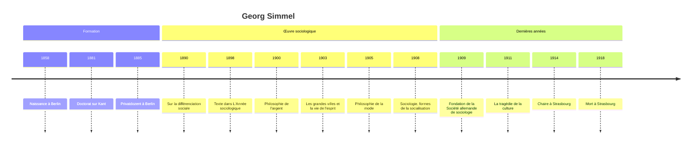

# Georg Simmel (1858-1918)

Philosophe et sociologue allemand, Georg Simmel est le plus inclassable des fondateurs de la sociologie. Contemporain de [[Max Weber]] et d'[[Émile Durkheim]], il n'a pas laissé de système ni d'école, mais une œuvre d'essayiste d'une étonnante variété : l'argent, la grande ville, la mode, l'étranger, le secret, la coquetterie, les ruines, l'anse d'un vase. Derrière cette dispersion apparente se tient une idée forte : la société n'est pas une substance mais un **tissu d'interactions**, et la sociologie doit étudier les formes que prennent ces interactions. Il est ainsi à l'origine d'une sociologie à l'échelle des relations, que prolongeront l'école de Chicago et l'[[Interactionnisme Symbolique]].

## Biographie

### Un Berlinois

Simmel naît le 1er mars 1858 à Berlin, au croisement de la Leipziger Straße et de la Friedrichstraße, en plein cœur d'une ville qui deviendra bientôt la capitale du nouvel Empire allemand. Sa famille, d'origine juive, s'est convertie au christianisme, et il est baptisé protestant. Son père, négociant, meurt alors qu'il est adolescent ; un ami de la famille, éditeur de musique, devient son tuteur et lui laisse une fortune qui lui permettra de vivre sans traitement universitaire.

Il étudie l'histoire, la philosophie et la psychologie à l'université de Berlin. Sa première thèse, consacrée à la musique, est refusée ; il obtient son doctorat en 1881 avec un travail sur la conception de la matière chez [[Kant]]. Habilité en 1885, il enseigne comme *Privatdozent*, rémunéré par les seuls droits d'inscription des étudiants.

### Une carrière entravée

Ses cours sont parmi les plus courus de Berlin, fréquentés par un public mêlé d'étudiants, d'artistes et de femmes, alors exclues des cursus réguliers. Mais sa carrière piétine : il n'obtient au tournant du siècle qu'un titre de professeur extraordinaire, honorifique et sans chaire. Ses candidatures à des postes de professeur ordinaire, notamment à Heidelberg, échouent à plusieurs reprises, malgré le soutien de Weber. Les raisons invoquées mêlent la méfiance envers un style jugé trop brillant et trop peu systématique, et un antisémitisme universitaire que les documents de l'époque rendent explicite.

Il participe en 1909, avec Weber et Ferdinand Tönnies notamment, à la fondation de la Société allemande de sociologie. Ce n'est qu'en 1914, à cinquante-six ans, qu'il obtient une chaire, à Strasbourg, alors ville allemande, au moment où la guerre vide les amphithéâtres. Il meurt d'un cancer à Strasbourg le 26 septembre 1918, quelques semaines avant l'armistice.

## La sociologie formelle

### Forme et contenu

Simmel part d'un constat : la société n'existe que là où plusieurs individus entrent en **action réciproque** (*Wechselwirkung*). Ce qu'on appelle « société » n'est pas une chose au-dessus des individus, mais le processus par lequel ils se lient, la **socialisation** (*Vergesellschaftung*). La sociologie ne doit donc pas se poser en science de tout ce qui se passe en société, ce qui la dissoudrait dans l'histoire, l'économie ou le droit. Elle a un objet propre : les **formes** de la socialisation, abstraites de leurs **contenus**.

Les contenus sont les intérêts, les buts, les pulsions qui poussent les hommes les uns vers les autres : le profit, la foi, l'amour, la défense. Les formes sont les configurations relationnelles qu'ils prennent : la domination et la subordination, la concurrence, l'imitation, la division du travail, le conflit. Une même forme se retrouve dans des contenus très différents : la subordination à un chef structure aussi bien une armée, une Église qu'une entreprise.

| Forme | Contenus possibles | Ce que Simmel y observe |
|---|---|---|
| **Conflit** | guerre, procès, rivalité amoureuse, concurrence commerciale | le conflit est une forme de socialisation, il relie les adversaires et soude chaque camp |
| **Secret** | société secrète, vie privée, diplomatie | le secret crée une frontière entre initiés et profanes et une tension permanente vers la révélation |
| **Subordination** | État, Église, famille, entreprise | la domination suppose toujours une part d'action du dominé |
| **Sociabilité** | salon, conversation, bal | forme « ludique » de la socialisation, pratiquée pour elle-même, sans contenu utilitaire |

> [!important] Idée clé
> La distinction forme-contenu est ce qui sépare Simmel de ses contemporains. Durkheim part de la société comme totalité qui s'impose aux individus ; Marx, des rapports de production ; Simmel, de la relation elle-même, à l'échelle de deux ou trois personnes. D'où son intérêt pour les situations minuscules (un regard, un repas, une lettre), qui ne sont pas des objets secondaires : ce sont les lieux où l'on voit la société se faire. Durkheim, qui publia un texte de Simmel dans le premier numéro de *L'Année sociologique* (1898), lui reprocha ensuite le caractère arbitraire de cette séparation.

### Le nombre et la géométrie sociale

Simmel montre que le simple **nombre** de participants transforme la nature d'une relation. La **dyade** est la plus intime et la plus fragile : elle ne survit pas au départ d'un des deux, et aucun ne peut s'abriter derrière une entité collective. Le passage à la **triade** change tout, car le tiers peut jouer trois rôles : le médiateur ou l'arbitre qui apaise ; le *tertius gaudens*, le troisième larron qui profite de la querelle des deux autres ; et celui qui divise pour régner. C'est avec trois membres qu'apparaît la possibilité d'une majorité, donc d'une structure qui dépasse les individus.

Il s'intéresse de même à la taille des groupes, à la manière dont les petits groupes favorisent le radicalisme et l'égalité, et à l'**entrecroisement des cercles sociaux** : l'individu moderne appartient à de multiples groupes (famille, profession, confession, association, parti), et c'est la combinaison singulière de ces appartenances qui fait sa personnalité.

## Les grandes analyses

### L'étranger

Dans une digression de la *Sociologie* (1908), Simmel définit l'étranger non comme le voyageur de passage, mais comme « celui qui vient aujourd'hui et reste demain ». Il est dans le groupe sans en être issu, à la fois proche et lointain. Cette position lui donne une **objectivité** particulière : il n'est pas pris dans les loyautés locales, on lui fait des confidences qu'on ne ferait pas à un proche, on lui confie le rôle de juge ou de commerçant. L'exemple historique est celui des marchands juifs dans l'Europe médiévale. Cette figure alimentera la sociologie de l'« homme marginal » à Chicago et les recherches présentées dans [[Sociologie des Migrations]].

### Le pauvre

Dans le même ouvrage, Simmel affirme que le pauvre, sociologiquement, n'est pas défini par un manque de ressources mais par le fait de **recevoir une assistance**. C'est la relation d'assistance qui constitue la catégorie. L'idée annonce les approches constructivistes des catégories sociales et sera reprise, en France, par Serge Paugam dans ses travaux sur la disqualification sociale.

### La mode

*Philosophie de la mode* (1905) décrit la mode comme la réunion de deux tendances contraires : l'**imitation**, qui permet de se fondre dans un groupe, et la **distinction**, qui permet de s'en séparer. Les classes supérieures adoptent une mode pour se distinguer, les classes inférieures l'imitent, et les premières l'abandonnent aussitôt pour une autre. Cette dynamique de poursuite et de fuite annonce les analyses de la distinction développées par [[Pierre Bourdieu]] et évoquées dans [[Stratification et Classes Sociales]].

### Les grandes villes et la vie de l'esprit

La conférence de 1903 sur *Les grandes villes et la vie de l'esprit* est son texte le plus lu. La métropole bombarde l'individu de stimulations nerveuses : trafic, foule, affiches, rencontres. Pour s'en protéger, le citadin développe une attitude **intellectualiste** et **blasée** : il réagit avec la tête plutôt qu'avec le cœur, devient indifférent aux différences, tient les autres à distance par une **réserve** qui confine à l'aversion. Mais cette réserve est aussi la condition d'une liberté personnelle inconnue du village, où chacun est sous le regard de tous. L'analyse fonde une tradition présentée dans [[Sociologie Urbaine]].

### La philosophie de l'argent

*Philosophie de l'argent* (1900), son œuvre maîtresse, n'est pas un traité d'économie mais une étude des effets de l'argent sur la culture et les relations. L'argent, pur moyen d'échange, rend toutes les choses commensurables et transforme les qualités en quantités. Il libère l'individu des liens personnels de dépendance (le serf qui paie une redevance en argent est plus libre que celui qui doit des corvées), mais il rend aussi les relations plus impersonnelles et calculatrices. Le passage d'une économie de liens à une économie de monnaie est retracé dans [[Histoire de la Monnaie]].

Simmel y développe la distinction entre **culture objective**, l'ensemble croissant des objets, savoirs et techniques produits par une société, et **culture subjective**, la capacité des individus à se les approprier. La première croît infiniment plus vite que la seconde : c'est ce qu'il nommera en 1911 la **tragédie de la culture**.

> [!warning] Piège
> On range parfois Simmel parmi les critiques de l'argent et de la modernité. Sa position est plus ambivalente. L'argent et la grande ville dépersonnalisent, mais ils émancipent aussi : ils arrachent l'individu à la tutelle du groupe restreint. Simmel décrit une tension, pas une décadence. C'est cette ambivalence qui le distingue du romantisme anticapitaliste de son époque et qui le rapproche de la réflexion de Weber sur la [[Rationalisation]].

## Influence et postérité

L'influence de Simmel a été diffuse mais considérable. Robert Park, qui a suivi ses cours à Berlin, en a transmis l'esprit à l'école de Chicago ; Lewis Coser a systématisé ses thèses dans *Les Fonctions du conflit social* (1956) ; [[Erving Goffman]] lui doit en partie son attention aux formes de l'interaction ordinaire. En Allemagne, Georg Lukács et Ernst Bloch ont fréquenté son séminaire, et Siegfried Kracauer comme Walter Benjamin ont prolongé son regard sur la vie urbaine moderne. Ses écrits sur l'argent et l'échange nourrissent aujourd'hui la [[Sociologie Économique]], ses essais sur l'art, la mode et le style la [[Sociologie de la Culture]].

Philosophe, il a aussi écrit sur [[Nietzsche]] et [[Schopenhauer]] (1907), sur Kant, sur Goethe et sur Rembrandt, et sa pensée tardive tourne vers une philosophie de la vie. La note d'ensemble [[Les Pères Fondateurs]] le situe parmi les autres classiques de la discipline.

## Chronologie

## Ressources

- Georg Simmel, *Philosophie de l'argent*, 1900 (trad. fr. PUF, 1987).
- Georg Simmel, *Sociologie. Études sur les formes de la socialisation*, 1908 (trad. fr. PUF, 1999).
- Georg Simmel, *Les grandes villes et la vie de l'esprit*, 1903.
- Lewis A. Coser, *The Functions of Social Conflict*, 1956.
- Frédéric Vandenberghe, *La Sociologie de Georg Simmel*, La Découverte, 2001.
