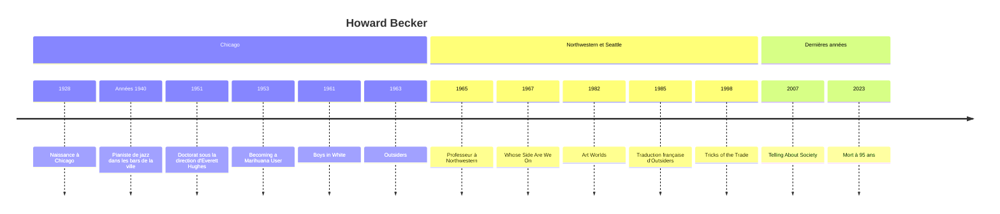

# Howard Becker (1928-2023)

Sociologue américain, pianiste de jazz, photographe à ses heures, Howard S. Becker est l'une des grandes figures de la seconde École de Chicago. Son nom reste attaché à *Outsiders* (1963), qui a renversé la manière d'étudier la [[Sociologie de la Déviance|déviance]], et aux *Mondes de l'art* (1982), qui a fait de la création artistique une activité collective ordinaire. Méfiant envers les grandes théories, attaché au travail de terrain et à l'écriture claire, il a aussi été, par ses livres de méthode, l'un des sociologues les plus lus par les étudiants du monde entier.

## Biographie et contexte

Becker naît à Chicago en 1928. Adolescent, il joue du piano dans les bars et les boîtes de nuit de la ville, activité qu'il poursuivra pendant ses études et qui lui fournira son premier terrain. Il fait toute sa formation à l'université de Chicago, alors le principal foyer de l'[[Interactionnisme Symbolique]], sous la direction d'Everett C. Hughes, sociologue des professions, et dans l'entourage d'Herbert Blumer. Il y obtient son doctorat en 1951, avec une thèse sur les enseignants des écoles publiques de Chicago et leur carrière.

Faute de poste universitaire stable, il enchaîne pendant une quinzaine d'années les contrats de recherche, notamment l'enquête sur les étudiants en médecine de l'université du Kansas, publiée en 1961 sous le titre *Boys in White*. Il enseigne ensuite à Northwestern University de 1965 à 1991, puis à l'université de Washington à Seattle. Retiré à San Francisco, il séjourne régulièrement en France, où son œuvre a reçu un accueil particulièrement chaleureux à partir de la traduction d'*Outsiders* en 1985. Il meurt en 2023, à 95 ans.

Son contexte est celui d'une sociologie américaine dominée, dans les années 1950, par le fonctionnalisme de Parsons et de [[Robert K. Merton]] et par les grandes enquêtes par questionnaire. Becker appartient au courant qui lui oppose l'observation directe, l'attention aux processus et aux interactions concrètes, à la suite de [[Erving Goffman]] — son contemporain à Chicago.

## Œuvres majeures

| Titre | Date | Apport principal |
|---|---|---|
| « Becoming a Marihuana User » | 1953 | On apprend à fumer, à percevoir les effets et à les trouver agréables |
| *Boys in White* (avec Geer, Hughes et Strauss) | 1961 | La socialisation professionnelle des étudiants en médecine |
| *Outsiders* | 1963 (trad. 1985) | La déviance comme produit d'un étiquetage, les entrepreneurs de morale |
| « Whose Side Are We On? » | 1967 | La hiérarchie de crédibilité et la question du point de vue du sociologue |
| *Les Mondes de l'art* (*Art Worlds*) | 1982 (trad. 1988) | L'œuvre comme produit d'une chaîne de coopération |
| *Écrire les sciences sociales* | 1986 | L'écriture comme partie du travail de recherche |
| *Les Ficelles du métier* (*Tricks of the Trade*) | 1998 (trad. 2002) | Recettes pour penser et enquêter |
| *Comment parler de la société* (*Telling About Society*) | 2007 | Les formes de représentation de la société, du tableau statistique au roman |

## Concepts clés

### L'apprentissage de la marijuana

Le premier article de Becker, tiré d'entretiens avec des musiciens, soutient une thèse simple et dérangeante : on ne fume pas de la marijuana par prédisposition psychologique, on apprend à en fumer. Il faut apprendre la technique, puis apprendre à percevoir les effets, puis apprendre à les définir comme plaisants, et cet apprentissage se fait au contact d'usagers plus expérimentés. La motivation déviante n'est pas la cause de l'acte, elle en est le résultat. Le raisonnement ouvre la voie à *Outsiders*.

### La déviance comme étiquetage

*Outsiders* contient la formule la plus citée de Becker : « deviance is not a quality of the act the person commits, but rather a consequence of the application by others of rules and sanctions to an "offender". » Autrement dit, les groupes sociaux créent la déviance en instituant des normes dont la transgression constitue la déviance, puis en appliquant ces normes à certaines personnes qu'ils étiquettent comme déviantes.

Becker en tire un tableau qui croise l'acte et la réaction sociale :

| | Comportement conforme | Comportement transgressif |
|---|---|---|
| **Perçu comme déviant** | Accusé à tort | Déviant pur |
| **Non perçu comme déviant** | Conforme | Déviant secret |

Les deux cases diagonales sont les plus instructives : l'accusé à tort montre qu'on peut être traité en déviant sans avoir rien transgressé, le déviant secret qu'on peut transgresser sans jamais devenir déviant aux yeux des autres.

> [!important] Idée clé
> Le déplacement opéré par Becker n'est pas moral mais méthodologique. La question classique « pourquoi certains individus enfreignent-ils les règles ? », qui guidait aussi bien la criminologie que la théorie de l'[[Anomie]] de Merton, suppose que les règles vont de soi. Becker ajoute deux questions préalables : qui fait les règles, et qui décide de les appliquer à qui ? La déviance devient une relation entre des groupes, et l'enquête doit porter autant sur les policiers, les juges et les législateurs que sur les « déviants ».

### Les entrepreneurs de morale

Les normes ne tombent pas du ciel. Becker distingue ceux qui les créent — les croisés de la morale, persuadés qu'un mal doit être combattu par une loi — et ceux qui les font appliquer, policiers et agents spécialisés, dont l'intérêt professionnel est de montrer à la fois que le problème existe et qu'ils le maîtrisent. Son exemple est le Marihuana Tax Act de 1937, adopté aux États-Unis au terme d'une campagne menée par le Federal Bureau of Narcotics.

### La carrière déviante

Empruntant à Hughes la notion de carrière, Becker décrit la déviance comme une suite d'étapes : un premier acte transgressif, souvent sans conséquence ; le fait d'être pris et publiquement désigné ; l'adoption d'une identité déviante qui devient un **statut principal** (*master status*) écrasant tous les autres ; enfin l'entrée dans un groupe organisé qui fournit justifications et savoir-faire. Chaque étape n'est franchie que par une partie de ceux qui ont franchi la précédente, ce qui en fait un modèle séquentiel plutôt que causal.

> [!warning] Piège
> Becker lui-même a récusé l'étiquette de « théorie de l'étiquetage ». Dans un chapitre ajouté en 1973 à *Outsiders*, il explique n'avoir jamais voulu faire de l'étiquetage la cause unique de la déviance, ni nier que des actes réels soient commis. Il préférait parler d'une « théorie interactionniste de la déviance » : la déviance est une action collective à laquelle participent tous ceux qui la commettent, la dénoncent, la jugent et la répriment.

### Les mondes de l'art

*Les Mondes de l'art* applique la même démarche à un objet réputé opposé : le génie créateur. Une œuvre, montre Becker, n'est pas le produit d'un artiste isolé, mais d'une chaîne de coopération — fabricants de pinceaux et de papier, éditeurs, techniciens, interprètes, critiques, marchands, publics. Un **monde de l'art** est ce réseau de personnes dont l'activité, coordonnée par des **conventions** partagées, produit les œuvres qui font sa réputation. L'artiste occupe une place dans ce réseau ; changer les conventions est possible mais coûteux, car il faut alors se passer des coopérations qu'elles rendaient faciles.

Becker distingue ainsi le professionnel intégré, le franc-tireur (*maverick*) qui rompt avec les conventions de son monde, l'artiste populaire et l'artiste naïf qui travaillent hors de tout monde de l'art. La perspective rejoint et nuance celle de la [[Sociologie de la Culture]] et de la [[Théorie de l'Art]] : elle ne cherche pas à expliquer la valeur des œuvres, mais comment elles sont concrètement produites et reconnues.

## Méthode

Becker est un défenseur de l'observation participante et de l'enquête de terrain (voir [[Méthodes de Recherche]]). Ses « ficelles » sont des gestes de pensée : se demander « comment » plutôt que « pourquoi », chercher le cas qui contredit l'hypothèse, remplacer les personnes par des activités (ne pas étudier « les déviants » mais ce que font des gens en situation), se méfier des catégories officielles.

Dans « Whose Side Are We On? » (1967), il pose une question qui reste vive : toute institution est structurée par une **hiérarchie de crédibilité**, dans laquelle la parole des dirigeants est présumée plus fiable que celle des subordonnés. Le sociologue qui donne voix aux subordonnés — les patients plutôt que les médecins, les détenus plutôt que les gardiens — sera accusé de partialité, alors que celui qui adopte le point de vue officiel ne le sera pas. On ne peut éviter de prendre un point de vue ; on doit seulement éviter de se laisser aveugler par lui.

## Influence

- **Sociologie de la déviance** : *Outsiders* a durablement réorienté l'étude de la délinquance, des drogues et de la maladie mentale vers les processus de désignation et les institutions de contrôle.
- **Sociologie des professions et de l'éducation** : *Boys in White* reste un modèle d'enquête sur la socialisation professionnelle (voir [[Sociologie de la Santé]] et [[Sociologie de l'Éducation]]).
- **Sociologie de l'art** : *Les Mondes de l'art* a fondé une sociologie de la production artistique attentive au travail et aux métiers plutôt qu'aux seuls chefs-d'œuvre, un point commun avec la [[Sociologie du Travail]].
- **Réception française** : traduit et commenté à partir des années 1980, Becker est devenu en France l'une des références centrales de l'enseignement des méthodes qualitatives.

## Critiques

- **L'acte laissé dans l'ombre** : en insistant sur la réaction sociale, l'approche expliquerait mal pourquoi certains commettent l'acte initial. Becker répond qu'il n'a pas prétendu en fournir la théorie.
- **Une sociologie des outsiders sympathiques** : Alvin Gouldner, dans « The Sociologist as Partisan » (1968), reproche à Becker une sympathie de collectionneur pour les marginaux pittoresques, et une critique qui s'en prend aux petits agents du contrôle social sans remonter aux pouvoirs qui les commandent.
- **Le relativisme des normes** : pour les crimes graves, dont la réprobation est quasi universelle, la part de la définition sociale paraît plus faible, ce qui limite la portée du modèle.
- **Le consensus dans les mondes de l'art** : l'insistance sur la coopération et les conventions laisserait peu de place aux rapports de domination et aux luttes de légitimité, que la théorie des champs de [[Pierre Bourdieu]] place au contraire au centre de l'analyse.

## Chronologie

## Ressources

- Howard S. Becker, *Outsiders. Études de sociologie de la déviance*, Métailié, 1985.
- Howard S. Becker, *Les Mondes de l'art*, Flammarion, 1988.
- Howard S. Becker, *Les Ficelles du métier. Comment conduire sa recherche en sciences sociales*, La Découverte, 2002.
- Howard S. Becker, *Écrire les sciences sociales*, Economica, 2004.
- Jean-Michel Chapoulie, *La Tradition sociologique de Chicago, 1892-1961*, Seuil, 2001.
