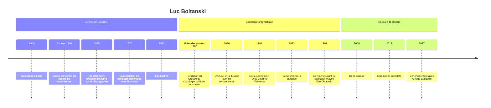

# Luc Boltanski (né en 1940)

Sociologue français, directeur d'études émérite à l'École des hautes études en sciences sociales (EHESS), Luc Boltanski est le principal fondateur de la sociologie dite « pragmatique » ou « sociologie de la critique ». Formé auprès de [[Pierre Bourdieu]], dont il fut l'un des plus proches collaborateurs, il s'en est éloigné au début des années 1980 pour proposer une autre manière de faire de la sociologie : prendre au sérieux la capacité des personnes ordinaires à critiquer, à se justifier et à mettre à l'épreuve le monde qui les entoure. Son œuvre, de *De la justification* (1991, avec Laurent Thévenot) au *Nouvel Esprit du capitalisme* (1999, avec Ève Chiapello), est l'une des plus discutées de la sociologie française depuis Bourdieu.

## Biographie et contexte

Luc Boltanski naît à Paris en 1940, dans une famille d'intellectuels : il est le frère du plasticien Christian Boltanski et du linguiste Jean-Élie Boltanski. Après des études de sociologie, il rejoint dans les années 1960 le Centre de sociologie européenne animé par Bourdieu. Il participe aux grandes enquêtes collectives de l'équipe, comme *Un art moyen* (1965) sur les usages sociaux de la photographie, et publie en 1976 avec Bourdieu « La production de l'idéologie dominante » dans la revue *Actes de la recherche en sciences sociales*, analyse du discours des élites technocratiques de l'époque.

Sa thèse de doctorat d'État (1981), publiée en 1982 sous le titre *Les Cadres. La formation d'un groupe social*, marque déjà un déplacement : plutôt que de supposer l'existence d'une catégorie sociale, il montre comment le groupe des « cadres » a été construit, par des mobilisations, des nomenclatures et des représentations, dans la France des années 1930 aux années 1970. Au milieu des années 1980, il fonde avec Laurent Thévenot et d'autres chercheurs le Groupe de sociologie politique et morale, à l'EHESS, foyer de la nouvelle sociologie pragmatique.

Le contexte de cette rupture est double. Intellectuellement, la sociologie critique bourdieusienne domine, et ses dissidents lui reprochent de traiter les acteurs comme des agents aveugles aux ressorts de leur propre domination. Politiquement, la gauche arrive au pouvoir en 1981 et les grands récits marxistes s'essoufflent : la question n'est plus seulement de dévoiler la domination, mais de comprendre comment les gens contestent, négocient et s'accordent.

## Œuvres majeures

| Titre | Date | Apport principal |
|---|---|---|
| *Les Cadres* | 1982 | La construction historique d'un groupe social |
| *L'Amour et la Justice comme compétences* | 1990 | Les régimes d'action, de la dispute à l'agapè |
| *De la justification* (avec Laurent Thévenot) | 1991 | Les économies de la grandeur et les six cités |
| *La Souffrance à distance* | 1993 | Le spectacle de la souffrance d'autrui dans les médias |
| *Le Nouvel Esprit du capitalisme* (avec Ève Chiapello) | 1999 | Comment le capitalisme se relégitime en absorbant sa critique |
| *La Condition fœtale* | 2004 | Sociologie de l'engendrement et de l'avortement |
| *Rendre la réalité inacceptable* | 2008 | Retour sur l'article de 1976 écrit avec Bourdieu |
| *De la critique* | 2009 | Tentative de réconcilier sociologie critique et sociologie de la critique |
| *Énigmes et complots* | 2012 | Roman policier, roman d'espionnage et naissance de la sociologie |
| *Enrichissement* (avec Arnaud Esquerre) | 2017 | Une économie qui tire sa valeur du passé, du patrimoine et du luxe |

## Concepts clés

### De la sociologie critique à la sociologie de la critique

Le point de départ est une observation de terrain. Dans une enquête sur les lettres de dénonciation d'injustices adressées au journal *Le Monde*, Boltanski constate que les gens ordinaires critiquent sans cesse, et selon des règles : pour qu'une plainte soit recevable, il faut qu'elle monte en généralité, qu'elle rattache un tort particulier à un principe de justice partagé. Les acteurs ne sont donc pas les « idiots culturels » que suppose une sociologie qui prétend seule dévoiler ce qu'ils ne voient pas. Ils disposent de **compétences critiques**, que le sociologue doit décrire au lieu de les remplacer par les siennes.

> [!important] Idée clé
> Le passage de la « sociologie critique » à la « sociologie de la critique » ne signifie pas que Boltanski renonce à la critique. Il change son point d'appui : au lieu que le sociologue, depuis une position de surplomb, révèle aux dominés la vérité de leur domination, il s'appuie sur les critiques que les personnes formulent déjà, et cherche à en comprendre la grammaire, la force et les limites. La question devient : qu'est-ce qui rend une critique efficace, et pourquoi tant de critiques échouent-elles ?

### Les économies de la grandeur et les cités

*De la justification* part d'une question : comment des personnes peuvent-elles se mettre d'accord, ou se disputer de manière réglée, sur ce qui est juste ? Boltanski et Thévenot identifient plusieurs **ordres de grandeur**, chacun fondé sur un principe supérieur commun qui définit ce qui fait la valeur d'une personne ou d'une chose. Ils les reconstituent à partir de textes de philosophie politique qui en ont donné une formulation canonique, puis les retrouvent dans des guides pratiques contemporains destinés aux entreprises.

| Cité | Principe de grandeur | Texte de référence |
|---|---|---|
| Inspirée | La grâce, la créativité, l'inspiration | [[Augustin]], *La Cité de Dieu* |
| Domestique | La tradition, la hiérarchie, la confiance personnelle | Bossuet, *Politique tirée des propres paroles de l'Écriture sainte* |
| De l'opinion | La renommée, la reconnaissance par les autres | [[Hobbes]], *Léviathan* |
| Civique | L'intérêt général, la volonté collective | [[Rousseau]], *Du contrat social* |
| Marchande | Le prix, la concurrence, le désir des biens rares | Adam Smith, *La Richesse des nations* |
| Industrielle | L'efficacité, la performance, la planification | Saint-Simon |

Chaque situation concrète mêle des objets et des personnes relevant de plusieurs mondes. Les disputes se règlent par des **épreuves**, où l'on vérifie la grandeur des êtres selon un principe donné : l'examen scolaire, le concours, le prix sur un marché, l'élection. On peut aussi les apaiser par des **compromis** entre cités, comme le « service public », qui associe grandeur civique et efficacité industrielle, ou les dénoncer en montrant qu'une grandeur illégitime s'est glissée dans une épreuve (le piston dans un recrutement, qui fait entrer du domestique là où l'on attendait de l'industriel).

> [!warning] Piège
> Les cités ne sont ni des [[Stratification et Classes Sociales|classes sociales]], ni des milieux, ni des institutions. Une même personne mobilise plusieurs cités dans une même journée, voire dans une même dispute : l'ouvrier invoque l'efficacité industrielle contre un chef incompétent, puis la solidarité civique contre un licenciement. Ce sont des grammaires de justification disponibles pour tous, qui ne désignent aucun groupe. Les confondre avec des « mondes sociaux » au sens de [[Howard Becker]] ou des champs au sens de Bourdieu est le contresens le plus courant.

### Le nouvel esprit du capitalisme

Avec Ève Chiapello, Boltanski reprend à [[Max Weber]] la notion d'**esprit du capitalisme** : l'ensemble des justifications qui rendent l'engagement dans le capitalisme désirable, alors que ce système n'offre par lui-même aucune raison morale d'y participer. En comparant des textes de management des années 1960 et des années 1990, ils identifient une nouvelle cité, la **cité par projets**, où l'on est grand quand on est mobile, connecté, capable de passer d'un projet à l'autre.

Leur thèse est que le capitalisme se transforme en répondant à ses critiques. Ils distinguent la **critique sociale**, qui dénonce l'exploitation, la misère et les inégalités, et la **critique artiste**, qui dénonce l'oppression, l'inauthenticité et le manque d'autonomie. Après [[12 - Mai 68|Mai 68]], le patronat aurait concédé aux salariés plus d'autonomie et de créativité, répondant à la critique artiste, tout en affaiblissant les protections collectives que visait la critique sociale — d'où une précarisation habillée des valeurs mêmes de la contestation (voir [[Sociologie Économique]] et [[Sociologie du Travail]]).

### Institutions, épreuves et domination

Dans *De la critique* (2009), Boltanski revient vers les questions de domination qu'on lui reprochait d'avoir abandonnées. Il distingue la **réalité**, construite et stabilisée par les institutions qui disent ce qui est et ce qui vaut, et le **monde**, tout ce qui arrive et déborde ces qualifications. La critique puise dans le monde pour contester la réalité. Il oppose trois types d'épreuves : les épreuves de vérité, qui confirment rituellement l'ordre institué ; les épreuves de réalité, qui testent la validité d'un format ; les épreuves existentielles, qui partent d'expériences d'injustice ou d'humiliation encore sans langage. Les sociétés contemporaines exerceraient une domination « gestionnaire », qui intègre le changement permanent et désarme la critique en se présentant comme simple adaptation à la réalité.

## Méthode

Boltanski pratique une sociologie qui suit les acteurs dans des situations d'incertitude : disputes, affaires, procès, controverses. Plutôt que de partir de structures cachées, elle décrit les opérations par lesquelles les personnes qualifient des situations, rassemblent des preuves et construisent des accords. Elle mobilise à la fois des corpus de textes (lettres, manuels de management, romans), l'analyse de philosophie politique et l'enquête de terrain. La « sociologie pragmatique » française doit son nom à cette attention à l'action en situation ; elle ne se confond pas avec le [[Pragmatisme]] philosophique américain, même si elle lui emprunte le goût de l'enquête et le refus des essences.

## Influence

- **Une école** : la sociologie pragmatique a structuré une large part de la sociologie française depuis les années 1990, dans l'étude des controverses, des mobilisations, de la justice et des organisations.
- **Économie des conventions** : la théorie des cités a nourri, avec Thévenot, l'économie des conventions, qui étudie la coordination sur les marchés à partir de la pluralité des formes de valeur.
- **Débat international** : *Le Nouvel Esprit du capitalisme*, traduit en anglais en 2005, est entré dans les discussions sur le néomanagement, le travail par projets et la récupération des contestations, en dialogue avec la théorie critique de l'École de Francfort et d'[[Habermas]].

## Critiques

- **Le retour de la domination** : les bourdieusiens reprochent à la première sociologie pragmatique de décrire un monde de disputes symétriques où chacun dispose des mêmes ressources critiques, en oubliant l'inégale capacité des groupes à se faire entendre (voir [[Violence Symbolique]] et [[Domination]]). Boltanski a en partie repris la critique à son compte dans *De la critique*.
- **Le choix des cités** : le nombre et la définition des cités ont été discutés ; pourquoi six, puis sept ? Claudette Lafaye et Laurent Thévenot ont eux-mêmes examiné, au début des années 1990, la possibilité d'une cité « verte » fondée sur l'environnement, sans la tenir pour pleinement constituée.
- **Le corpus de management** : *Le Nouvel Esprit du capitalisme* infère l'esprit d'une époque à partir de textes prescriptifs destinés aux cadres ; on peut douter qu'ils décrivent ce qui se passe réellement dans les entreprises, reproche comparable à celui adressé aux manuels de civilité étudiés par [[Norbert Elias]].
- **Le schéma de la récupération** : l'idée que le capitalisme absorbe ses critiques est puissante, mais risque de devenir infalsifiable si toute concession est lue comme une ruse.

## Chronologie

## Ressources

- Luc Boltanski et Laurent Thévenot, *De la justification. Les économies de la grandeur*, Gallimard, 1991.
- Luc Boltanski et Ève Chiapello, *Le Nouvel Esprit du capitalisme*, Gallimard, 1999.
- Luc Boltanski, *De la critique. Précis de sociologie de l'émancipation*, Gallimard, 2009.
- Luc Boltanski, *Les Cadres. La formation d'un groupe social*, Minuit, 1982.
