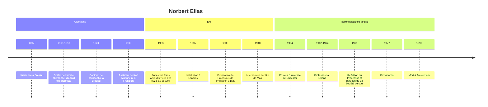

# Norbert Elias (1897-1990)

Sociologue allemand d'origine juive, exilé en Angleterre, Norbert Elias est l'auteur d'une des œuvres les plus singulières du XXe siècle : une sociologie historique de très longue durée qui relie la formation des États modernes aux transformations les plus intimes de la sensibilité — la manière de se moucher, de manger, de dormir, d'éprouver la honte ou le dégoût. Longtemps ignorée, son œuvre majeure, *Sur le processus de civilisation* (1939), n'est reconnue qu'à la fin des années 1960, quand son auteur a déjà plus de soixante-dix ans. Elias figure pour cette raison aussi bien parmi les [[Sociologues Contemporains]] que parmi les fondateurs : un classique d'avant-guerre découvert tardivement.

## Biographie et contexte

Elias naît en 1897 à Breslau (aujourd'hui Wrocław, en Pologne), fils unique d'une famille juive aisée et assimilée. Il sert dans l'armée allemande pendant la Première Guerre mondiale, d'abord comme télégraphiste, puis étudie la médecine et la philosophie à Breslau, où il soutient en 1924 une thèse de philosophie. Il se tourne ensuite vers la sociologie à Heidelberg, dans l'entourage d'Alfred Weber (le frère de [[Max Weber]]) et de Karl Mannheim, dont il devient l'assistant à Francfort en 1930.

Sa thèse d'habilitation, consacrée à la société de cour, est achevée au moment où les nazis prennent le pouvoir en 1933 ; la procédure n'aboutit pas et Elias prend le chemin de l'exil — Paris d'abord, puis Londres à partir de 1935 (voir [[Montée du nazisme]]). C'est là qu'il rédige, en lecteur assidu de la salle de lecture du British Museum, *Über den Prozess der Zivilisation*, publié en deux volumes à Bâle en 1939. L'ouvrage paraît au pire moment : la guerre éclate, un livre allemand écrit par un juif exilé ne trouve presque aucun lecteur. Son père meurt à Breslau en 1940 ; sa mère, déportée à Theresienstadt en 1942, est assassinée à Treblinka. Elias lui-même est interné quelques mois comme ressortissant ennemi sur l'île de Man.

Après la guerre, il vit de cours pour adultes et participe avec le psychiatre S. H. Foulkes aux débuts de la psychothérapie de groupe. Il n'obtient un poste universitaire stable qu'en 1954, à l'université de Leicester, à 57 ans. Il enseigne ensuite deux ans au Ghana (1962-1964). La reconnaissance vient avec la réédition allemande de 1969, les traductions françaises des années 1970 et le prix Adorno qu'il reçoit en 1977. Il passe ses dernières années à Amsterdam, où il meurt en 1990, en publiant jusqu'au bout.

## Œuvres majeures

| Titre (français) | Date originale | Apport principal |
|---|---|---|
| *La Civilisation des mœurs* et *La Dynamique de l'Occident* | 1939 (trad. 1973 et 1975) | Les deux volumes du *Processus de civilisation* : l'évolution des manières, puis la sociogenèse de l'État |
| *La Société de cour* | 1969 (rédigé dans les années 1930) | La cour de Louis XIV comme configuration de pouvoir et laboratoire de l'autocontrôle |
| *Logiques de l'exclusion* (*The Established and the Outsiders*, avec John Scotson) | 1965 | Enquête sur une banlieue anglaise : la domination d'un groupe ancien sur des nouveaux venus sans différence de classe ni d'origine |
| *Qu'est-ce que la sociologie ?* | 1970 | Manifeste de la sociologie configurationnelle, modèles de jeu, critique de l'*homo clausus* |
| *La Solitude des mourants* | 1982 | La mort refoulée hors de la vie sociale dans les sociétés avancées |
| *Engagement et distanciation* | 1983 | Épistémologie des sciences sociales |
| *Sport et civilisation* (avec Eric Dunning) | 1986 | Le sport comme « décontrôle contrôlé » des émotions |
| *La Société des individus* | 1987 | Recueil de textes sur le rapport individu-société |
| *Mozart. Sociologie d'un génie* | 1991 (posthume) | Un musicien bourgeois pris dans une configuration de cour |

## Concepts clés

### Le processus de civilisation

Le point de départ est empirique et presque anecdotique : Elias dépouille des traités de civilité, du *De civilitate morum puerilium* d'Érasme (1530) aux manuels de savoir-vivre des XVIIIe et XIXe siècles. Il y observe un déplacement régulier de ce qui peut être fait, dit ou montré. On recommande d'abord de ne pas se moucher dans la nappe ; plus tard, la recommandation elle-même devient inconvenante, parce que la conduite visée est devenue impensable. Le seuil de la pudeur et du dégoût avance ; ce qui était réglé par des interdits explicites finit par l'être par des sentiments intériorisés.

Elias résume ce mouvement par le passage de la **contrainte extérieure** (*Fremdzwang* : peur du châtiment, de la vengeance, du regard d'autrui) à l'**autocontrainte** (*Selbstzwang* : maîtrise de soi devenue automatique, qui s'exerce même dans la solitude). La lecture est explicitement nourrie de Freud, dont Elias reprend l'idée d'un surmoi, mais en l'historicisant : l'économie psychique n'est pas une donnée invariable de l'espèce, elle change avec la structure de la société.

> [!warning] Piège
> « Civilisation » n'est pas ici un jugement de valeur. Elias ne dit pas que les Européens du XVIIIe siècle sont meilleurs que ceux du XIIe, ni que l'Occident serait « plus civilisé » que d'autres sociétés : il décrit un processus, non planifié et sans auteur, qui modifie la structure de l'affectivité. Le mot est pris comme la société européenne l'employait pour se désigner elle-même, et c'est cette auto-désignation qu'il s'agit d'expliquer. Le processus n'est d'ailleurs ni linéaire ni irréversible : Elias parle lui-même de poussées de « décivilisation ».

### Sociogenèse de l'État et psychogenèse de l'individu

Le second volume donne l'explication. Au terme d'une longue concurrence entre seigneurs féodaux, un mécanisme d'élimination (le « mécanisme monopolistique ») concentre entre les mains d'un seul pouvoir central le monopole de la violence physique et celui de l'impôt, qui se soutiennent mutuellement. Elias prolonge ici la définition de l'État par [[Max Weber]], mais en fait un processus plutôt qu'une définition.

Deux conséquences en découlent. D'abord, la pacification de l'espace social : quand la violence est monopolisée, la vie devient plus prévisible et l'explosion de colère cesse d'être payante. Ensuite, l'allongement des **chaînes d'interdépendance** : avec la division du travail et la monétarisation, chacun dépend d'un nombre croissant de personnes qu'il ne voit jamais, ce qui exige calcul, anticipation et maîtrise de ses affects. La transformation des structures sociales (sociogenèse) et celle des structures psychiques (psychogenèse) sont les deux faces d'un même processus.

### La société de cour

La cour de Versailles sous Louis XIV (voir [[03 - Ancien Régime et Louis XIV]]) est le lieu où ce processus se voit le mieux. Une noblesse guerrière y est « curialisée » : elle échange l'épée contre l'étiquette. Chaque geste — qui tend la chemise au roi à son lever, qui peut s'asseoir en sa présence — marque un rang, et la moindre erreur peut coûter une position. L'observation fine d'autrui, la dissimulation des émotions, le calcul des effets de sa propre conduite deviennent des compétences vitales. Le roi, loin d'être un souverain tout-puissant, gouverne en entretenant les rivalités entre groupes, dans un équilibre qu'il doit sans cesse ajuster.

### Configuration et interdépendance

Contre l'image de l'*homo clausus* — un individu fermé, face à une « société » extérieure à lui — Elias propose le concept de **configuration** (*Figuration*) : un réseau mouvant d'individus interdépendants, dont les rapports de force sont toujours relatifs et changeants. Il l'illustre par des modèles de jeu : dans une partie à deux joueurs de force très inégale, le plus fort contrôle largement le cours du jeu ; plus les joueurs sont nombreux et leurs forces proches, plus le déroulement échappe à chacun et prend l'allure d'un processus autonome que personne n'a voulu.

> [!important] Idée clé
> La configuration dissout le faux problème « individu contre société » que [[Pierre Bourdieu]] cherchera lui aussi à dépasser par l'[[Habitus]]. Chez Elias, la société n'est pas une chose au-dessus des individus, ni une somme d'individus préexistants : elle est le tissu même de leurs dépendances réciproques. L'individu n'est pas « dans » la société comme un objet dans une boîte ; il est fait par les relations qui le lient aux autres, depuis la naissance.

### Établis et marginaux

L'enquête menée avec John Scotson dans une banlieue ouvrière de Leicester, rebaptisée Winston Parva, montre deux groupes que rien ne distingue par la classe, la nationalité ou la religion. Seule l'ancienneté de résidence les sépare. Les « établis », plus cohésifs, parviennent pourtant à stigmatiser durablement les nouveaux venus par le commérage, en leur attribuant les traits de leur pire minorité et en s'attribuant ceux de leur meilleure. Le modèle établis/marginaux montre qu'un différentiel de cohésion suffit à produire une domination, ce qui en fait un outil pour analyser racisme et exclusion sans postuler de différence préalable.

## Méthode

Elias pratique une sociologie « processuelle » : il refuse d'étudier les sociétés comme des états figés et cherche les transformations de longue durée, sur plusieurs siècles. Sa matière première est hétérogène — manuels de civilité, mémoires de Saint-Simon, peintures, chroniques — et il la traite comme la trace de régularités non voulues.

Dans *Engagement et distanciation*, il décrit la tension propre aux sciences sociales : le chercheur est pris dans les configurations qu'il étudie et doit conquérir une distance, jamais définitive, à l'égard de ses propres affects et intérêts. Il rejoint par là les réflexions sur la neutralité axiologique de Weber, tout en les historicisant : la capacité de distanciation est elle-même un produit du processus de civilisation (voir [[Épistémologie]] et [[Méthodes de Recherche]]).

## Influence

- **Sociologie du sport et des émotions** : avec Eric Dunning, Elias fonde pratiquement la sociologie du sport, conçu comme un espace où les sociétés pacifiées autorisent une excitation émotionnelle encadrée par des règles.
- **Sociologie historique française** : l'œuvre, traduite dans les années 1970, rencontre les historiens des mentalités et de la vie privée, et nourrit l'étude des mœurs, de la violence et du corps. Roger Chartier en est l'un des principaux passeurs.
- **Pays-Bas et Royaume-Uni** : une école « éliasienne » s'y développe, autour de la revue et de la fondation qui portent son nom.
- **Dialogue avec Bourdieu et Foucault** : Bourdieu reconnaît sa dette à propos de la genèse de l'État ; la comparaison avec [[Foucault]] est classique, les deux auteurs décrivant l'intériorisation des contraintes — mais Elias la rapporte à des interdépendances non planifiées, là où Foucault analyse des dispositifs de pouvoir et de savoir.

## Critiques

- **Le démenti ethnologique** : l'anthropologue allemand Hans Peter Duerr, dans *Der Mythos vom Zivilisationsprozess* (cinq volumes publiés de 1988 à 2002), soutient que les sociétés dites « simples » connaissent aussi une forte régulation de la pudeur et de la violence, et que le point de départ médiéval d'Elias est une caricature.
- **Le XXe siècle** : les deux guerres mondiales et la [[Shoah]] semblent contredire la thèse d'une pacification progressive. Elias y répond dans *Les Allemands* (1989) par l'analyse des processus de « décivilisation » : l'autocontrainte dépend d'un monopole stable de la violence, et peut s'effondrer quand celui-ci est capturé ou se délite.
- **Les sources** : les manuels de civilité disent ce qu'il faudrait faire, non ce que l'on fait ; les historiens ont discuté la représentativité de ces textes normatifs pour décrire les pratiques réelles.
- **Un soupçon d'évolutionnisme** : malgré ses dénégations, le schéma d'ensemble conserve une direction, ce qui lui vaut le reproche d'un eurocentrisme implicite, reproche que l'on adresse aussi à la [[Rationalisation]] wébérienne.

> [!tip] Méthode
> En dissertation, Elias est l'auteur idéal pour relier deux échelles que l'on sépare d'ordinaire : l'État et le corps. Face à une question sur la violence, la politesse, la pudeur, le sport ou la honte, le réflexe éliasien consiste à chercher quelle transformation des interdépendances et des monopoles a rendu une conduite nouvelle nécessaire, ou une conduite ancienne insupportable.

## Chronologie

## Ressources

- Norbert Elias, *La Civilisation des mœurs*, Calmann-Lévy, 1973.
- Norbert Elias, *La Dynamique de l'Occident*, Calmann-Lévy, 1975.
- Norbert Elias, *La Société de cour*, Calmann-Lévy, 1974.
- Nathalie Heinich, *La Sociologie de Norbert Elias*, La Découverte, coll. « Repères », 1997.
- Stephen Mennell, *Norbert Elias: Civilization and the Human Self-Image*, Blackwell, 1989.
