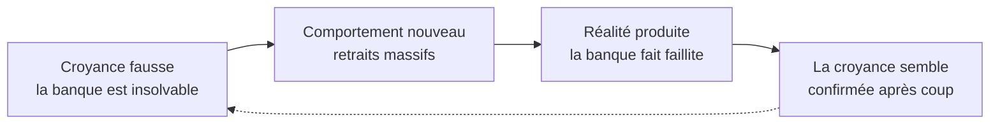
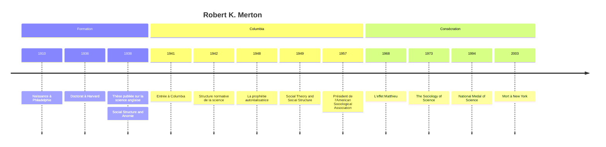

# Robert K. Merton (1910-2003)

Sociologue américain, figure centrale de la sociologie de l'après-guerre, Robert K. Merton a peut-être légué plus d'expressions au langage courant qu'aucun autre sociologue : « prophétie autoréalisatrice », « effet Matthieu », « modèle de rôle », « groupe de référence », « conséquences inattendues ». Héritier du fonctionnalisme, il l'a assoupli au point d'en faire un outil d'enquête plutôt qu'un système ; fondateur de la sociologie des sciences, il a posé les questions que toute la discipline discute encore.

## Biographie et contexte

Merton naît en 1910 à Philadelphie sous le nom de Meyer Robert Schkolnick, dans une famille d'immigrés juifs d'Europe de l'Est installée dans un quartier pauvre de la ville. Adolescent, il pratique la prestidigitation sous un nom de scène qu'il finit par adopter légalement. La bibliothèque municipale voisine lui sert, selon ses propres souvenirs, de première université.

Boursier à Temple University, il y découvre la sociologie, puis rejoint Harvard au début des années 1930. Il y travaille avec Pitirim Sorokin et le jeune Talcott Parsons, et suit l'historien des sciences George Sarton. Sa thèse, soutenue en 1936 et publiée en 1938 sous le titre *Science, Technology and Society in Seventeenth-Century England*, pose déjà son premier grand objet : les conditions sociales de l'essor de la science (voir [[La Révolution Scientifique]]).

Après un bref passage à Tulane, il entre en 1941 à l'université Columbia, qu'il ne quittera plus. Il y codirige avec le méthodologue Paul Lazarsfeld le Bureau of Applied Social Research, qui fait de Columbia l'un des centres mondiaux de la recherche empirique. Président de l'American Sociological Association en 1957, il reçoit en 1994 la National Medal of Science, première fois qu'un sociologue en est distingué. Il meurt à New York en 2003. Son fils, l'économiste Robert C. Merton, a reçu le prix Nobel d'économie en 1997.

## Œuvres majeures

| Titre | Date | Apport principal |
|---|---|---|
| « The Unanticipated Consequences of Purposive Social Action » | 1936 | Les effets non voulus de l'action intentionnelle |
| *Science, Technology and Society in Seventeenth-Century England* | 1938 | Puritanisme et essor de la science anglaise |
| « Social Structure and Anomie » | 1938 | Reformulation de l'anomie et typologie des adaptations |
| « Bureaucratic Structure and Personality » | 1940 | Les dysfonctions de la bureaucratie |
| « The Normative Structure of Science » | 1942 | L'ethos de la science en quatre normes |
| *Mass Persuasion* | 1946 | Étude d'une campagne radiophonique de vente d'obligations de guerre |
| « The Self-Fulfilling Prophecy » | 1948 | La prophétie autoréalisatrice |
| *Social Theory and Social Structure* | 1949 (rééd. 1957 et 1968) | Recueil majeur, traduit en français sous le titre *Éléments de théorie et de méthode sociologique* |
| *The Focused Interview* (avec Fiske et Kendall) | 1956 | L'entretien centré, ancêtre du *focus group* |
| *On the Shoulders of Giants* | 1965 | Enquête érudite et facétieuse sur l'origine d'un aphorisme |
| « The Matthew Effect in Science » | 1968 | L'accumulation des avantages dans la reconnaissance scientifique |
| *The Sociology of Science* | 1973 | Recueil de ses travaux sur la science |

## Concepts clés

### Les théories de moyenne portée

Contre les grandes architectures théoriques de son maître Parsons, qui prétendaient rendre compte du système social tout entier, Merton plaide pour des **théories de moyenne portée** (*middle-range theories*) : des propositions assez générales pour dépasser la description d'un cas, assez limitées pour être confrontées aux données — une théorie des groupes de référence, de la mobilité, des conflits de rôles. C'est une position d'artisan : la sociologie, jeune science, n'a pas encore son Newton et doit accumuler des résultats partiels solides plutôt que de construire des cathédrales.

### Fonctions manifestes et latentes

Merton reprend le fonctionnalisme hérité d'[[Émile Durkheim]] et de l'anthropologie, mais en retire trois postulats qu'il juge intenables : que tout élément soit fonctionnel pour la société entière, que tout élément ait une fonction, et que chaque fonction ne puisse être remplie que par un seul élément. Il introduit à la place une série de distinctions :

| Notion | Définition | Exemple |
|---|---|---|
| **Fonction manifeste** | Conséquence objective voulue et reconnue par les acteurs | La cérémonie de la pluie des Hopi vise à faire pleuvoir |
| **Fonction latente** | Conséquence non voulue et non reconnue | La cérémonie renforce l'identité et la cohésion du groupe |
| **Dysfonction** | Conséquence qui diminue l'adaptation d'un système | La rigidité réglementaire d'une administration |
| **Équivalent fonctionnel** | Autre élément capable de remplir la même fonction | D'autres institutions peuvent assurer la cohésion |

Son exemple le plus célèbre est la « machine politique » des grandes villes américaines : moralement condamnée, elle survit parce qu'elle remplit des fonctions latentes — aide aux immigrants, accès des entreprises aux décideurs, voies d'ascension pour ceux que les voies légitimes excluent.

> [!important] Idée clé
> La fonction latente est le cœur de la méthode mertonienne : elle invite le sociologue à chercher ce qu'une pratique fait réellement, au-delà de ce qu'elle prétend faire. C'est ce qui rend le fonctionnalisme de Merton critique plutôt que conservateur : montrer qu'une institution jugée irrationnelle remplit des besoins que les institutions officielles négligent, c'est aussi montrer que la supprimer sans offrir d'équivalent fonctionnel est voué à l'échec.

### Anomie et modes d'adaptation

Dans « Social Structure and Anomie », Merton déplace l'[[Anomie]] durkheimienne. Il la situe dans l'écart entre les **buts culturels** valorisés par une société — la réussite matérielle, dans l'Amérique du « rêve américain » — et l'accès inégal aux **moyens légitimes** pour les atteindre. Cet écart produit une pression vers la [[Sociologie de la Déviance|déviance]], qui prend cinq formes :

| Mode d'adaptation | Buts culturels | Moyens institutionnels |
|---|---|---|
| Conformisme | acceptés | acceptés |
| Innovation | acceptés | rejetés |
| Ritualisme | rejetés | acceptés |
| Évasion (*retreatism*) | rejetés | rejetés |
| Rébellion | rejetés et remplacés | rejetés et remplacés |

L'intérêt de la typologie est d'expliquer la déviance par la structure sociale plutôt que par les pathologies individuelles. Elle servira de point d'appui, et de repoussoir, à la sociologie interactionniste de [[Howard Becker]].

### La bureaucratie et ses dysfonctions

Prolongeant [[Max Weber]], Merton montre que les qualités mêmes de la [[Bureaucratie]] — discipline, respect de la règle, prévisibilité — engendrent ses défauts. Le fonctionnaire formé à suivre scrupuleusement les procédures finit par traiter la règle comme une fin en soi : c'est le **déplacement des buts**. Il reprend l'expression de Veblen, « incapacité entraînée », pour désigner ces aptitudes qui deviennent des handicaps quand la situation change.

### La prophétie autoréalisatrice

Merton part du théorème formulé par William I. Thomas et Dorothy Swaine Thomas en 1928 : « If men define situations as real, they are real in their consequences. » Il en tire la **prophétie autoréalisatrice**, qu'il définit comme une définition fausse de la situation suscitant un comportement nouveau qui rend vraie la conception d'abord fausse. Son exemple est celui d'une banque solvable qui fait faillite parce qu'une rumeur d'insolvabilité pousse tous les déposants à retirer leurs fonds en même temps.

Merton applique immédiatement le mécanisme aux préjugés raciaux : exclure les travailleurs noirs des syndicats au motif qu'ils seraient des briseurs de grève, c'est les contraindre à accepter les emplois de briseurs de grève.

> [!warning] Piège
> La prophétie autoréalisatrice n'est pas n'importe quelle prédiction qui se réalise. Chez Merton, la croyance de départ est fausse, et c'est l'action qu'elle déclenche qui la rend vraie. Une prévision exacte qui se vérifie n'a rien d'autoréalisateur. L'inverse existe aussi : la prophétie autodestructrice, qui empêche l'événement annoncé de survenir parce qu'on l'a annoncé.

### La sociologie des sciences

Merton fait de la science un objet sociologique. Dans sa thèse, il montre les affinités entre l'éthique puritaine et l'essor de la science expérimentale anglaise, dans la lignée de l'étude de Weber sur le protestantisme. En 1942, dans un contexte où la science est menacée par les régimes totalitaires, il décrit l'**ethos de la science** par quatre normes : l'universalisme (les énoncés sont jugés indépendamment de la personne qui les propose), le « communisme » (les résultats appartiennent à la communauté), le désintéressement et le scepticisme organisé.

L'**effet Matthieu**, emprunté à l'Évangile (« car on donnera à celui qui a »), décrit ensuite l'accumulation de la reconnaissance : à contribution égale, le chercheur déjà célèbre recueille plus de crédit que l'inconnu. Merton reconnut plus tard que l'analyse devait beaucoup aux enquêtes de Harriet Zuckerman, qui devint son épouse.

## Méthode

Merton est un théoricien qui travaille au plus près de l'enquête. Au Bureau of Applied Social Research, il contribue à la mise au point de l'entretien centré (*focused interview*), utilisé pour étudier les effets de la radio et de la propagande de guerre, et dont dérive le *focus group* des études de marché (voir [[Sociologie des Médias et de la Communication]] et [[Méthodes de Recherche]]). Il pratique aussi une érudition historique rare, attentive aux sources, et une écriture où la clarté des concepts prime. Son goût pour la **sérendipité** — la découverte inattendue qui oblige à reformuler une théorie — dit bien sa conception de la recherche : une théorie doit se laisser surprendre par les données.

## Influence

- **Vocabulaire commun** : modèle de rôle, groupe de référence, ensemble de rôles (*role-set*), prophétie autoréalisatrice sont passés dans la psychologie, l'économie, la gestion et le langage courant.
- **Sociologie des sciences** : ses normes et l'effet Matthieu ont structuré la discipline jusqu'aux années 1970, avant d'être contestés par la sociologie des connaissances scientifiques.
- **Criminologie** : la théorie de la tension (*strain theory*) issue de « Social Structure and Anomie » est l'une des bases de la criminologie américaine.
- **Élèves** : Columbia forme une génération de sociologues majeurs, parmi lesquels Peter Blau, Alvin Gouldner ou Lewis Coser.

## Critiques

- **Le fonctionnalisme en procès** : dans les années 1960, le courant fonctionnaliste est accusé de conservatisme et d'aveuglement aux conflits (voir [[Grands Courants Théoriques]]). Merton, par ses dysfonctions et son attention aux tensions, en est la version la moins exposée, mais il reste associé au paradigme en déclin.
- **Les normes de la science idéalisées** : la sociologie des sciences constructiviste des années 1970 reproche aux normes mertoniennes de décrire ce que les savants disent de leur activité plutôt que ce qu'ils font ; les controverses réelles relèvent de stratégies, d'alliances et d'intérêts que l'ethos décrit mal.
- **La typologie de l'anomie** : elle suppose un consensus sur les buts de réussite matérielle et explique mal les déviances qui ne visent aucun gain, comme la violence expressive ou la consommation de drogues pour elle-même ; les interactionnistes lui reprochent surtout d'ignorer qui définit la déviance.

## Chronologie

## Ressources

- Robert K. Merton, *Éléments de théorie et de méthode sociologique*, trad. Henri Mendras, Plon, 1965.
- Robert K. Merton, *Social Theory and Social Structure*, Free Press, éd. augmentée, 1968.
- Robert K. Merton, *The Sociology of Science: Theoretical and Empirical Investigations*, University of Chicago Press, 1973.
- Piotr Sztompka, *Robert K. Merton: An Intellectual Profile*, Macmillan, 1986.
