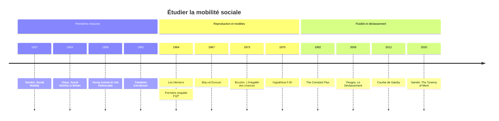

# Mobilité Sociale

La mobilité sociale désigne le changement de position d'un individu dans la structure sociale. On distingue la **mobilité intergénérationnelle**, qui compare la position d'une personne à celle de ses parents, et la **mobilité intragénérationnelle**, qui suit une même personne au cours de sa carrière. La question est au cœur du projet démocratique : une société qui proclame l'égalité des droits promet implicitement que la naissance ne fixe pas le destin. Mesurer la mobilité revient donc à tester cette promesse.

Le terme est popularisé par Pitirim Sorokin dans *Social Mobility* (1927), qui distingue déjà mobilité horizontale (changer de groupe à niveau égal) et verticale (monter ou descendre). La mobilité suppose une stratification préalable, dont les catégories et les outils de mesure sont présentés dans [[Stratification et Classes Sociales]].

## Les tables de mobilité

L'instrument de base est la **table de mobilité**, un tableau croisé qui répartit une population selon deux variables : la position sociale d'origine (en général la catégorie socioprofessionnelle du père, plus récemment aussi celle de la mère) et la position atteinte, observée à un âge où la carrière est stabilisée (souvent 35-59 ans). En France, elles sont construites à partir de l'enquête Formation et qualification professionnelle (FQP) de l'INSEE, menée depuis 1964.

Une même table se lit de deux façons :

| Lecture | Question posée | Calcul | Exemple de phrase |
|---|---|---|---|
| **Table de destinée** | Que deviennent les enfants d'un milieu donné ? | pourcentages en ligne, par origine | « Parmi les fils d'ouvriers, x % sont devenus cadres. » |
| **Table de recrutement** | D'où viennent les membres d'un groupe ? | pourcentages en colonne, par position atteinte | « Parmi les cadres, x % sont fils d'ouvriers. » |

La **diagonale** du tableau regroupe les individus immobiles, restés dans la catégorie de leur parent. Deux phénomènes classiques en ressortent : l'**autorecrutement** élevé de certains groupes (les agriculteurs exploitants sont très majoritairement enfants d'agriculteurs) et la forte **hérédité sociale** aux deux extrémités de la hiérarchie.

> [!warning] Piège
> Les deux lectures donnent des images opposées et on les confond souvent. Le recrutement des cadres peut s'ouvrir aux enfants d'ouvriers simplement parce que le nombre de cadres a explosé, sans que les chances relatives d'un enfant d'ouvrier aient changé. Inversement, les agriculteurs ont un autorecrutement très fort, mais la plupart des enfants d'agriculteurs ont quitté l'agriculture, faute de place. Avant d'interpréter un pourcentage, il faut toujours se demander s'il est calculé en ligne ou en colonne.

## Mobilité absolue et mobilité relative

### La mobilité observée

La **mobilité absolue** (ou observée) est la part des individus qui occupent une position différente de celle de leurs parents. En France, elle est élevée : autour des deux tiers des hommes de 35 à 59 ans n'appartiennent pas à la même catégorie que leur père, et la proportion est encore plus forte chez les femmes comparées à leur mère. Les mouvements ascendants l'emportent sur les mouvements descendants sur la longue période, même si l'écart s'est réduit pour les générations récentes.

Une grande part de cette mobilité est **structurelle** : elle découle de la transformation de la structure des emplois entre deux générations. Au XXe siècle, la chute du nombre d'agriculteurs et, plus tard, d'ouvriers, et la croissance des cadres, des professions intermédiaires et des employés, ont mécaniquement obligé une partie des enfants à changer de catégorie. La sociologie a longtemps décomposé la mobilité observée en mobilité structurelle et mobilité nette (le reste, attribué à la « circulation »), mais cette décomposition est aujourd'hui jugée fragile, car elle suppose que l'on sache quelle part du mouvement est « forcée ».

### La fluidité sociale

D'où le recours à la **mobilité relative**, ou **fluidité sociale**, qui neutralise les changements de structure. Elle compare les chances relatives d'accès à une position selon l'origine, au moyen de **rapports de chances relatives** (*odds ratios*). On compare par exemple, pour un fils de cadre, ses chances d'être cadre plutôt qu'ouvrier, et les mêmes chances pour un fils d'ouvrier. Si le rapport valait 1, l'origine n'aurait aucune influence : la société serait parfaitement fluide. En pratique, les rapports observés entre les extrêmes de la hiérarchie restent très supérieurs à 1 dans toutes les tables françaises, et ne diminuent que lentement.

> [!important] Idée clé
> Une société peut être à la fois très mobile et très peu fluide. C'est même le schéma dominant du XXe siècle : la mobilité absolue a beaucoup augmenté parce que la structure sociale s'est transformée (on a « aspiré » les enfants d'agriculteurs et d'ouvriers vers le salariat qualifié), alors que l'inégalité des chances relatives n'a reculé que lentement. Tout le monde a pu monter d'un étage sans que les écarts entre étages changent beaucoup. Distinguer mobilité et fluidité, c'est distinguer l'effet de la croissance de celui de la justice sociale.

### Constance ou lente ouverture ?

En 1975, les sociologues américains Featherman, Jones et Hauser avancent l'hypothèse dite FJH : la fluidité serait à peu près identique dans toutes les sociétés industrielles, seules les différences de structure expliquant les écarts de mobilité observée. Robert Erikson et John Goldthorpe, dans *The Constant Flux* (1992), confirment largement une forte stabilité de la fluidité dans le temps et une grande ressemblance entre pays. Des travaux ultérieurs, notamment ceux rassemblés par Richard Breen (*Social Mobility in Europe*, 2004) et, pour la France, ceux de Louis-André Vallet, ont nuancé ce constat : la fluidité progresse, lentement, dans plusieurs pays, et l'expansion scolaire y contribue.

## Le paradoxe d'Anderson

Si l'école joue un rôle central dans l'accès aux positions, on attend qu'un enfant plus diplômé que son père occupe une position supérieure. Or le sociologue américain C. Arnold Anderson montre en 1961 qu'une part importante des fils plus diplômés que leur père n'atteignent pas une position plus élevée, et que certains descendent même.

L'explication tient à l'**inflation des diplômes** : lorsque l'accès aux études se généralise plus vite que les emplois qualifiés, la valeur d'un titre sur le marché du travail diminue. Le baccalauréat de 1990 n'ouvre pas les mêmes portes que celui de 1960. Raymond Boudon, dans *L'Inégalité des chances* (1973), en propose une explication par les effets d'agrégation : chaque famille a intérêt à pousser ses enfants vers des études plus longues, mais la somme de ces choix individuellement rationnels dévalue collectivement les titres. Marie Duru-Bellat en a tiré un diagnostic critique dans *L'Inflation scolaire* (2006), et Camille Peugny a documenté dans *Le Déclassement* (2009) la montée des trajectoires descendantes pour les générations nées à partir des années 1960.

Le paradoxe ne signifie pas que le diplôme ne sert à rien : à chaque époque, les plus diplômés restent les mieux placés. Il signifie que le diplôme est un bien **positionnel**, dont la valeur dépend de sa rareté relative. Les liens entre origine, parcours scolaire et destinée sont développés dans [[Sociologie de l'Éducation]].

## Reproduction et transmission

Pourquoi l'origine continue-t-elle de peser ? Les réponses sociologiques se sont longtemps opposées.

| Approche | Auteurs | Mécanisme central |
|---|---|---|
| **Reproduction** | [[Pierre Bourdieu]] et Jean-Claude Passeron, *Les Héritiers* (1964), *La Reproduction* (1970) | l'école consacre comme « dons » des dispositions héritées : l'[[Habitus]] et le capital culturel des classes favorisées |
| **Individualisme méthodologique** | Raymond Boudon, *L'Inégalité des chances* (1973) | à résultats égaux, les familles font des choix d'orientation différents selon les coûts et bénéfices perçus depuis leur position |
| **Réussite statutaire** | Peter Blau et Otis Dudley Duncan, *The American Occupational Structure* (1967) | modèle statistique où le diplôme est le principal médiateur entre origine et position |

S'y ajoutent la transmission directe du patrimoine et des entreprises familiales, les réseaux, le lieu de résidence et les ressources de la famille élargie étudiées par la [[Sociologie de la Famille]]. Les enquêtes récentes soulignent aussi le rôle du genre : les femmes connaissent une mobilité différente de celle des hommes, en partie en raison de la ségrégation des métiers analysée par la [[Sociologie du Genre]].

## Comparaisons internationales

Les économistes mesurent plutôt la mobilité par les revenus, via l'**élasticité intergénérationnelle** : de combien le revenu d'un enfant s'écarte de la moyenne quand celui de ses parents s'en écarte. Miles Corak a montré que les pays les plus inégalitaires tendent aussi à être les moins mobiles, relation baptisée en 2012 « courbe de Gatsby le Magnifique » par l'économiste Alan Krueger. Les pays nordiques combinent faibles inégalités et forte mobilité, les États-Unis et le Royaume-Uni l'inverse, la France se situant dans une position intermédiaire.

Aux États-Unis, l'équipe de Raj Chetty a estimé en 2017 que la part des enfants gagnant plus que leurs parents au même âge était passée d'environ 90 % pour les générations nées en 1940 à environ 50 % pour celles nées dans les années 1980, sous l'effet conjugué d'une croissance plus faible et d'une répartition plus inégale.

## La méritocratie en débat

Le mot « méritocratie » est inventé par le sociologue britannique Michael Young dans *The Rise of the Meritocracy* (1958), une fable satirique : dans une Angleterre future, la sélection par le quotient intellectuel et l'effort crée une élite convaincue de mériter sa place et une classe inférieure privée même de l'excuse de l'injustice. Le terme a ensuite été adopté comme idéal, à rebours de l'intention de son auteur.

Le débat contemporain oppose plusieurs positions. Pour les défenseurs de l'égalité des chances, la méritocratie reste l'horizon légitime d'une société démocratique, à condition de corriger ses biais. [[Rawls]] juge insuffisante une égalité des chances purement formelle et exige une égalité équitable des chances, qui compense les désavantages sociaux. François Dubet, dans *Les Places et les chances* (2010), rappelle qu'on peut aussi réduire les écarts entre positions plutôt que multiplier les concours pour y accéder. Michael Sandel, dans *The Tyranny of Merit* (2020), soutient que la croyance méritocratique rend les gagnants arrogants et fait porter aux perdants le poids moral de leur échec.

> [!important] Idée clé
> La méritocratie contient une tension interne : plus une société croit que chacun est à sa place par mérite, moins les inégalités qui en résultent paraissent contestables. [[Alexis de Tocqueville]] observait déjà que l'égalité des conditions aiguise la sensibilité aux écarts qui subsistent ; la promesse méritocratique produit à la fois de l'espoir et du ressentiment.

## L'expérience vécue de la mobilité

La mobilité n'est pas qu'un mouvement statistique : elle se vit, souvent comme un déplacement entre deux mondes. Richard Hoggart, dans *La Culture du pauvre* (1957), décrit déjà le « boursier » tiraillé entre son milieu d'origine et le monde lettré. Didier Eribon (*Retour à Reims*, 2009) ou la philosophe Chantal Jaquet (*Les Transclasses*, 2014) ont analysé ces trajectoires de transfuges, faites de loyautés contradictoires et de gêne sociale, dont l'œuvre d'Annie Ernaux offre une version littéraire. À l'inverse, l'enquête de Benoît Coquard, [[Ceux qui restent]], montre des jeunes qui choisissent de ne pas partir, pour qui l'ancrage local vaut davantage qu'une ascension incertaine en ville.

## Chronologie

## Ressources

- Raymond Boudon, *L'Inégalité des chances*, Armand Colin, 1973.
- Pierre Bourdieu et Jean-Claude Passeron, *Les Héritiers*, Minuit, 1964.
- Robert Erikson et John H. Goldthorpe, *The Constant Flux*, Oxford, 1992.
- Camille Peugny, *Le Déclassement*, Grasset, 2009.
- Michael Young, *The Rise of the Meritocracy*, 1958.
