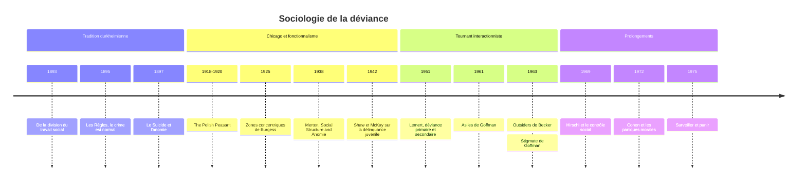

# Sociologie de la Déviance

Est déviant un comportement qui transgresse une norme reconnue par un groupe, et qui expose son auteur à une sanction, formelle (amende, prison) ou informelle (moquerie, exclusion). La définition est volontairement large : elle englobe le crime, mais aussi la consommation de drogue, certaines sexualités hier réprimées, l'excentricité vestimentaire, la maladie mentale, voire le refus de travailler. La **délinquance** n'est qu'un sous-ensemble de la déviance, celle qui viole la loi pénale.

La sociologie a profondément renouvelé la question. Là où le sens commun et la criminologie du XIXe siècle cherchaient ce qui distingue le déviant du « normal » (son hérédité, son crâne, sa psychologie), les sociologues ont déplacé le regard vers la société elle-même : ses normes, ses tensions, ses institutions de contrôle et ses manières de désigner.

## Durkheim : la normalité du crime

[[Émile Durkheim]] ouvre la voie avec une thèse provocante, exposée dans *Les Règles de la méthode sociologique* (1895) : le crime est un phénomène **normal**. Non qu'il soit souhaitable, mais parce qu'on le rencontre dans toutes les sociétés et qu'une société sans crime est impossible. Même dans une communauté de saints, écrit-il en substance, des fautes vénielles prendraient la place des crimes et seraient sanctionnées avec la même intensité.

Le crime est d'abord défini de manière sociologique. Dans *De la division du travail social* (1893), Durkheim le caractérise comme l'acte qui froisse les états forts et définis de la conscience collective. Ce n'est pas parce qu'un acte est criminel qu'il choque, c'est parce qu'il choque qu'il est criminel. La peine a alors une fonction : en réaffirmant la norme, elle ressoude le groupe autour de ses valeurs. La déviance est un [[Fait Social]] qui participe à la [[Solidarité]] qu'elle semble menacer.

Durkheim ajoute que le crime peut préparer la morale de demain. L'exemple qu'il donne est celui de [[Socrate]], criminel selon le droit athénien, dont l'indépendance de pensée annonçait une morale nouvelle. Une société trop uniforme pour tolérer le moindre écart serait aussi incapable de changer.

Enfin, *Le Suicide* (1897) introduit la notion d'[[Anomie]] : un défaut de régulation sociale, lorsque les normes ne parviennent plus à borner les désirs, par exemple lors de crises économiques ou de brusques enrichissements. Ce concept sera repris et transformé par [[Robert K. Merton|Merton]].

> [!important] Idée clé
> Dire que le crime est « normal » n'est pas un jugement moral mais un constat de méthode. Durkheim distingue le normal du pathologique par la fréquence et la généralité du phénomène à un stade donné d'une société. Ce qui serait pathologique, c'est un taux de criminalité anormalement élevé ou anormalement bas. La thèse a une conséquence durable : la déviance cesse d'être une propriété d'individus anormaux pour devenir une propriété du système social.

## Merton : la tension entre buts et moyens

Robert K. Merton publie en 1938 un article devenu classique, « Social Structure and Anomie ». Il y redéfinit l'anomie comme un décalage entre les **buts culturels** valorisés par une société et les **moyens légitimes** qu'elle offre pour les atteindre. L'Amérique de son temps exalte la réussite matérielle pour tous, mais distribue très inégalement l'accès à l'éducation et aux emplois qui y conduisent. Cette tension pousse une partie de la population à des adaptations déviantes.

| Mode d'adaptation | Buts culturels | Moyens légitimes | Exemple type |
|---|---|---|---|
| **Conformisme** | acceptés | acceptés | le salarié qui fait carrière |
| **Innovation** | acceptés | rejetés | l'escroc, le trafiquant |
| **Ritualisme** | abandonnés | acceptés | le bureaucrate attaché à la règle pour elle-même |
| **Évasion** (retrait) | rejetés | rejetés | le vagabond, le toxicomane |
| **Rébellion** | remplacés | remplacés | le militant révolutionnaire |

La typologie a l'avantage d'expliquer pourquoi la délinquance acquisitive est plus fréquente dans les milieux populaires sans invoquer une moindre moralité : ce sont les mêmes valeurs, partagées par tous, qui produisent la déviance là où les moyens manquent. Elle a été prolongée par Albert Cohen, *Delinquent Boys* (1955), sur les sous-cultures délinquantes, et par Richard Cloward et Lloyd Ohlin (1960), qui montrent que l'accès aux moyens *illégitimes* est lui aussi inégalement réparti.

## L'école de Chicago : la ville et la désorganisation

Au même moment, le département de sociologie de l'université de Chicago fait de la ville son laboratoire. Chicago connaît une croissance explosive et accueille des vagues d'immigrants d'Europe, puis de Noirs du Sud. William Thomas et Florian Znaniecki, avec *The Polish Peasant in Europe and America* (1918-1920), étudient la désorganisation des familles paysannes transplantées. Robert Park et Ernest Burgess proposent une **écologie urbaine** : Burgess modélise la ville en zones concentriques, la « zone de transition » entourant le centre concentrant pauvreté, immigration récente et délinquance.

Clifford Shaw et Henry McKay montrent ensuite que les taux de délinquance juvénile restent élevés dans ces quartiers même lorsque les groupes qui y vivent se succèdent. La délinquance s'attache donc aux lieux et à leur **désorganisation sociale**, non aux origines ethniques de leurs habitants. Edwin Sutherland formule, à partir de la fin des années 1930, la théorie de l'**association différentielle** : le comportement délinquant s'apprend, comme n'importe quel comportement, au contact de ceux qui le pratiquent. C'est aussi lui qui forge la notion de délinquance en col blanc.

Méthodologiquement, l'école de Chicago impose l'observation directe, les histoires de vie, les monographies (sur les bandes, les vagabonds, les *taxi-dance halls*). Cette tradition est détaillée dans [[Sociologie Urbaine]] et dans [[Interactionnisme Symbolique]], courant qui en est largement issu.

## Becker et la théorie de l'étiquetage

Le tournant majeur survient avec *Outsiders* (1963) d'[[Howard Becker]]. La question n'est plus « pourquoi certains transgressent-ils les normes ? » mais « qui fait les normes, et comment certains sont-ils désignés comme déviants ? ». Becker l'énonce ainsi : « The deviant is one to whom that label has successfully been applied; deviant behavior is behavior that people so label. » La déviance n'est pas une qualité de l'acte mais le produit d'une interaction entre celui qui agit et ceux qui réagissent.

Plusieurs notions en découlent :

- **Les entrepreneurs de morale** : des individus ou des groupes qui se mobilisent pour créer une norme (ainsi, aux États-Unis, la croisade contre la marijuana dans les années 1930) puis pour la faire appliquer.
- **La carrière déviante** : Becker décrit, à partir d'enquêtes sur les fumeurs de marijuana et les musiciens de danse, un apprentissage en étapes, où l'on apprend la technique, la perception des effets et leur interprétation comme agréables.
- **Le moment de la désignation publique** : être pris et étiqueté transforme l'identité sociale, ferme l'accès aux groupes conventionnels et pousse vers les groupes déviants organisés.

Becker croise deux variables, le fait d'avoir transgressé ou non et le fait d'être perçu comme déviant ou non, pour obtenir quatre situations : le conforme, le pleinement déviant, le déviant secret et le **faussement accusé**. Ce dernier cas suffit à montrer que la réaction sociale peut fabriquer un déviant sans transgression.

Becker s'inscrit dans une lignée : Frank Tannenbaum parlait dès 1938 de « dramatisation du mal », et Edwin Lemert distinguait en 1951 la **déviance primaire**, écart initial sans conséquence identitaire, de la **déviance secondaire**, celle qui s'organise en réponse à l'étiquetage.

> [!warning] Piège
> La théorie de l'étiquetage ne dit pas que les déviants sont innocents, ni que les actes n'existent pas avant qu'on les nomme. Elle dit que *la qualification de déviant* dépend d'un processus social, sélectif, qui touche inégalement les groupes : à comportement égal, le jeune de quartier populaire a plus de chances d'être contrôlé, poursuivi et condamné que l'étudiant aisé. Sa limite, souvent relevée, est de peu expliquer la déviance primaire elle-même, et de sous-estimer les actes gravement nuisibles qui ne dépendent guère d'une définition locale.

## Goffman : le stigmate et l'identité abîmée

[[Erving Goffman]] publie la même année que Becker *Stigmate* (1963). Il s'intéresse aux interactions ordinaires entre les « normaux » et ceux qui portent un attribut qui les disqualifie. Le stigmate n'est pas l'attribut lui-même mais le décalage entre l'identité sociale **virtuelle** (ce qu'on attend d'une personne) et son identité sociale **réelle**.

Goffman distingue trois types de stigmates : les difformités physiques, les « tares de caractère » (passé psychiatrique, prison, addiction, homosexualité dans le contexte de l'époque) et les stigmates tribaux (appartenance ethnique, nationale ou religieuse). Surtout, il oppose deux situations :

| Situation | Problème pratique | Stratégies |
|---|---|---|
| **Discrédité** : le stigmate est visible ou connu | gérer la **tension** de l'interaction | humour, surcompensation, évitement des situations mixtes |
| **Discréditable** : le stigmate est caché | gérer l'**information** | dissimulation (*passing*), confidences sélectives, couverture |

Le stigmatisé trouve des appuis chez « les siens », qui partagent le stigmate, et chez les « initiés », qui en connaissent la réalité (proches, soignants). Deux ans plus tôt, *Asiles* (1961) analysait l'hôpital psychiatrique comme une **institution totale** où l'identité du reclus est méthodiquement défaite, ce qui rapproche Goffman des analyses de la médicalisation présentées dans [[Sociologie de la Santé]].

> [!tip] Méthode
> Becker et Goffman se complètent : Becker explique comment on *devient* déviant par un processus de désignation ; Goffman décrit ce que c'est que *vivre* avec une identité discréditée, dans le détail des interactions. Pour analyser un cas concret (sortie de prison, maladie chronique, handicap), articuler les deux permet de passer de la genèse de l'étiquette à sa gestion quotidienne.

## Prolongements

L'approche constructiviste a nourri de nombreuses recherches. Stanley Cohen, dans *Folk Devils and Moral Panics* (1972), montre comment médias, police et entrepreneurs de morale amplifient une menace (les affrontements entre *mods* et *rockers* dans l'Angleterre des années 1960) jusqu'à la **panique morale**. [[Foucault]], dans *Surveiller et punir* (1975), déplace l'analyse vers les dispositifs disciplinaires et la production de la « délinquance » comme catégorie gérable par la prison.

À l'inverse, Travis Hirschi (*Causes of Delinquency*, 1969) renverse la question durkheimienne : ce qu'il faut expliquer n'est pas pourquoi certains transgressent, mais pourquoi la plupart s'en abstiennent. Sa théorie du **contrôle social** met l'accent sur les liens (attachement, engagement, implication, croyance) qui retiennent l'individu.

Ces débats éclairent des questions contemporaines : la dépénalisation de certaines drogues, la psychiatrisation des comportements, les contrôles d'identité ou la manière dont le [[Droit Pénal]] définit et hiérarchise les infractions. Ils rappellent que la frontière entre normal et déviant est historique : elle se déplace, et ce déplacement est lui-même un objet sociologique.

## Chronologie

## Ressources

- Émile Durkheim, *Les Règles de la méthode sociologique*, 1895.
- Howard S. Becker, *Outsiders. Études de sociologie de la déviance*, 1963 (trad. fr. Métailié, 1985).
- Erving Goffman, *Stigmate. Les usages sociaux des handicaps*, 1963 (trad. fr. Minuit, 1975).
- Albert Ogien, *Sociologie de la déviance*, Armand Colin, 1995.
- Stanley Cohen, *Folk Devils and Moral Panics*, 1972.
