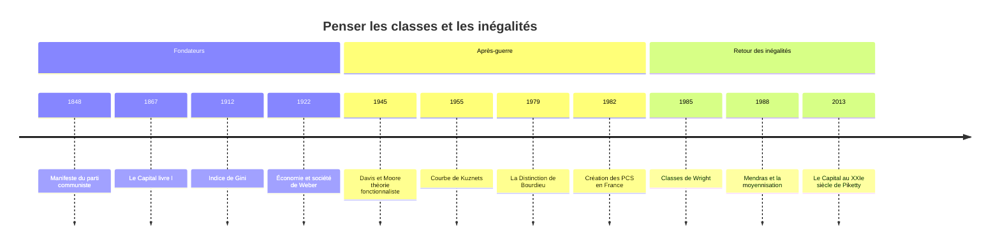

# Stratification et Classes Sociales

Toutes les sociétés connues distribuent inégalement les ressources rares : richesse, pouvoir, prestige, savoir. La sociologie de la stratification étudie la manière dont ces inégalités se structurent, se cumulent et se transmettent. Le mot « stratification » est emprunté à la géologie : la société y est vue comme un empilement de couches. Le mot « classe » porte une autre idée, plus conflictuelle : les groupes ne sont pas seulement superposés, ils sont liés par des rapports, souvent d'exploitation ou de domination.

Cette tension entre une vision **graduelle** (des strates plus ou moins hautes sur une échelle continue) et une vision **relationnelle** (des groupes définis les uns par rapport aux autres) traverse tout le champ, de [[Karl Marx]] aux enquêtes statistiques contemporaines.

## Marx : la classe comme rapport de production

Pour Marx, une classe se définit d'abord par sa position dans les rapports de production. Dans le capitalisme industriel que décrit *Le Capital* (livre I, 1867), la bourgeoisie possède les moyens de production, le prolétariat ne possède que sa force de travail, qu'il vend contre un salaire. La plus-value, écart entre la valeur produite par le travail et le salaire versé, est appropriée par le capitaliste : le rapport de classe est un rapport d'exploitation.

Le *Manifeste du parti communiste* (1848), écrit avec [[Friedrich Engels]], en tire une philosophie de l'histoire : l'histoire de toute société jusqu'à nos jours est l'histoire de luttes de classes. La dynamique du capitalisme devait polariser la société en deux camps et conduire à la révolution prolétarienne.

Marx distingue en outre l'existence objective d'une classe de sa conscience d'elle-même. Dans *Misère de la philosophie* (1847), il oppose une classe « vis-à-vis du capital » à une classe « pour elle-même », formule que la tradition a retenue sous la forme classe *en soi* / classe *pour soi*. Dans *Le 18 Brumaire de Louis Bonaparte* (1852), il compare les paysans parcellaires français à un sac de pommes de terre : des unités semblables juxtaposées, incapables de s'organiser en force politique. Une position commune ne suffit pas à faire un acteur collectif. Les prolongements de cette analyse sont traités dans la note [[Marxisme]].

## Weber : trois dimensions de l'ordre social

[[Max Weber]], dans *Économie et société* (posthume, 1922), refuse de ramener toute hiérarchie à l'économie. Il distingue trois ordres de répartition du pouvoir :

| Dimension | Ordre | Fondement | Groupe type |
|---|---|---|---|
| **Classe** | économique | chances de vie sur le marché (biens, qualifications) | propriétaires, rentiers, salariés qualifiés |
| **Groupe de statut** (*Stand*) | social | honneur, prestige, style de vie | noblesse, professions libérales, castes |
| **Parti** | politique | conquête du pouvoir dans un groupement | partis, factions, associations |

La classe wébérienne n'est plus un rapport d'exploitation mais une **situation de marché** : ce qu'un individu peut obtenir en échange de ses biens ou de ses compétences. Le groupe de statut, lui, repose sur une estime sociale qui s'exprime par un mode de vie, des mariages entre pairs, des manières de table. Les trois dimensions peuvent diverger : un nouveau riche a une position de classe élevée mais un honneur social contesté, un aristocrate ruiné conserve un prestige que son revenu ne justifie plus.

> [!important] Idée clé
> L'opposition Marx-Weber n'est pas celle du conflit contre l'harmonie. Weber voit lui aussi des luttes partout. La différence porte sur le nombre d'axes : Marx pense que la propriété commande, en dernière instance, le statut et le pouvoir ; Weber tient ces trois hiérarchies pour partiellement autonomes. D'où l'intérêt, chez les héritiers de Weber, pour les **incohérences de statut**, ces situations où l'on est haut sur un axe et bas sur un autre.

## Bourdieu : l'espace social et les capitaux

[[Pierre Bourdieu]] propose dans *La Distinction* (1979) une synthèse originale. La société est un **espace social** à plusieurs dimensions, où chacun occupe une position définie par le **volume** global de ses capitaux et par leur **structure**, c'est-à-dire le poids relatif du capital économique et du capital culturel. À volume égal, un professeur et un chef d'entreprise s'opposent : le premier est riche en diplômes et en culture légitime, le second en patrimoine. S'y ajoutent le capital social (le réseau mobilisable) et le capital symbolique (la reconnaissance que procurent les autres capitaux).

Les positions engendrent des dispositions : l'[[Habitus]], système de goûts et de manières intériorisés, fait correspondre à chaque région de l'espace un style de vie. Le goût, qui semble la chose la plus personnelle, devient un marqueur de classe ; la culture légitime fonctionne comme un instrument de [[Domination]] d'autant plus efficace qu'il est méconnu, ce que Bourdieu appelle [[Violence Symbolique]]. Le rôle de l'école dans cette transmission est détaillé dans [[Sociologie de l'Éducation]].

Bourdieu distingue aussi les classes « sur le papier », regroupements construits par le sociologue, des classes mobilisées, qui n'existent qu'au terme d'un travail politique de représentation. Il retrouve ainsi, par un autre chemin, la distinction marxienne entre classe objective et classe consciente.

## Wright : les positions contradictoires

Le sociologue américain Erik Olin Wright (1947-2019) a cherché à rendre le marxisme compatible avec la réalité des sociétés salariales, où la plupart des actifs ne sont ni capitalistes ni ouvriers d'usine. Dans ses travaux de la fin des années 1970, il introduit les **positions contradictoires de classe** : les cadres et les managers sont salariés, donc du côté du travail, mais ils exercent une autorité au nom du capital. Dans *Classes* (1985), il reformule le modèle autour de plusieurs actifs dont la détention permet d'exploiter autrui : les moyens de production, l'organisation (le contrôle hiérarchique) et les qualifications rares.

Wright a mené des enquêtes comparatives internationales pour tester empiriquement ces catégories, montrant que le vocabulaire des classes pouvait être opérationnalisé autant que celui des strates. Ses derniers travaux, notamment *Envisioning Real Utopias* (2010), se tournent vers les alternatives institutionnelles au capitalisme.

## L'approche fonctionnaliste et les nomenclatures

À l'opposé de la tradition conflictuelle, Kingsley Davis et Wilbert Moore soutiennent en 1945 que la stratification est fonctionnelle : toute société doit attirer les individus les plus compétents vers les positions les plus importantes, et les récompenses inégales servent à cela. La critique est venue vite, notamment de Melvin Tumin (1953) : qui décide de l'importance d'une fonction, et comment expliquer que l'héritage, et non la compétence, commande l'accès à tant de positions ?

Les statisticiens, eux, ont besoin de catégories opératoires. En France, l'INSEE utilise les **professions et catégories socioprofessionnelles** (PCS), créées en 1982 à partir des CSP de 1954 et rénovées en 2020. Elles croisent statut (indépendant ou salarié), qualification et secteur. Au Royaume-Uni et dans la comparaison internationale, le schéma de classes dit EGP, du nom d'Erikson, Goldthorpe et Portocarero, s'est imposé ; il repose sur la relation d'emploi (contrat de travail ou relation de service) plutôt que sur le seul revenu.

> [!warning] Piège
> Les PCS ne sont pas des classes sociales au sens de Marx ou de Bourdieu, ni une échelle de revenus. Un agriculteur exploitant et un artisan peuvent gagner moins qu'un ouvrier qualifié ; un professeur des écoles gagne moins qu'un commerçant prospère. La nomenclature classe des *situations professionnelles* supposées homogènes en conditions de vie et en pratiques. C'est pour cela qu'elle discrimine si bien les comportements culturels et scolaires, mais c'est aussi pourquoi il ne faut pas la lire comme un classement du haut vers le bas.

## Mesurer les inégalités

### Les instruments

| Indicateur | Ce qu'il mesure | Lecture |
|---|---|---|
| **Déciles** | seuils qui découpent la population en dix parts égales | D1 = revenu sous lequel se trouvent les 10 % les plus modestes |
| **Rapport interdécile D9/D1** | écart entre le haut et le bas de la distribution | insensible à ce qui se passe au-delà des extrêmes du D9 et du D1 |
| **Part du décile ou du centile supérieur** | concentration au sommet | privilégiée par les travaux sur les très hauts revenus |
| **Courbe de Lorenz** | part cumulée des revenus détenue par les x % les plus modestes | plus la courbe s'éloigne de la diagonale, plus l'inégalité est forte |
| **Indice de Gini** | aire entre la diagonale et la courbe de Lorenz, normalisée | 0 = égalité parfaite, 1 = une seule personne détient tout |

L'indice porte le nom du statisticien italien Corrado Gini, qui le propose en 1912. Il résume une distribution entière en un nombre, ce qui est sa force et sa faiblesse : deux distributions très différentes peuvent avoir le même Gini.

### Quelques ordres de grandeur

Pour le **revenu disponible** (après impôts et prestations), l'indice de Gini se situe entre 0,25 et 0,28 environ dans les pays nordiques, vers 0,29-0,30 en France, près de 0,40 aux États-Unis et au-dessus de 0,60 en Afrique du Sud. En France, le rapport D9/D1 du niveau de vie tourne autour de 3,5 : les 10 % les plus aisés commencent à un niveau de vie environ trois fois et demie supérieur à celui sous lequel vivent les 10 % les plus modestes. La redistribution réduit fortement ces écarts par rapport aux revenus primaires.

Le **patrimoine** est beaucoup plus concentré que le revenu. En France, les 10 % les mieux dotés détiennent de l'ordre de la moitié du patrimoine total, et l'indice de Gini du patrimoine dépasse couramment 0,6. La différence tient à la nature des deux grandeurs : le revenu est un flux, en partie tiré du travail et plafonné par lui ; le patrimoine est un stock qui s'accumule, rapporte et se transmet par héritage.

> [!important] Idée clé
> Confondre revenu et patrimoine conduit à sous-estimer la reproduction sociale. Deux ménages au même salaire n'ont pas la même position si l'un est propriétaire et héritier, l'autre locataire sans apport. Pour comprendre la transmission des positions entre générations, sujet de la note [[Mobilité Sociale]], le patrimoine compte souvent davantage que le revenu courant.

### Piketty et le temps long

En 1955, l'économiste Simon Kuznets avait suggéré que les inégalités croissent dans les premières phases de l'industrialisation puis décroissent avec le développement : la célèbre courbe en cloche. *Le Capital au XXIe siècle* de Thomas Piketty (2013), fondé sur les sources fiscales de nombreux pays sur deux siècles, dessine plutôt une courbe en U pour les pays riches : concentration très forte à la Belle Époque, effondrement entre 1914 et 1945 sous l'effet des guerres, de l'inflation et de la fiscalité progressive, puis remontée depuis les années 1980, particulièrement marquée aux États-Unis.

Au cœur de l'argument, l'inégalité r > g : lorsque le rendement du capital dépasse durablement le taux de croissance de l'économie, les patrimoines hérités croissent plus vite que les revenus du travail et la société tend vers un « capitalisme patrimonial ». La compression des inégalités du XXe siècle apparaît alors comme une parenthèse historique plus que comme une loi du développement. Le livre a suscité un vaste débat, portant notamment sur la mesure du capital, le rôle du logement dans la hausse du rapport patrimoine/revenu et le caractère réellement durable de r > g. Les prolongements économiques sont abordés dans [[Sociologie Économique]].

## Débats contemporains

**La fin des classes ?** Dans les années 1980, Henri Mendras décrit dans *La Seconde Révolution française* (1988) une société en « toupie », dominée par une vaste constellation centrale où les clivages de classe s'estompent. Louis Chauvel, dans *Les Classes moyennes à la dérive* (2006), conteste cette moyennisation en montrant le déclassement des générations nées après les années 1950 et le retour d'écarts de patrimoine.

**Intersectionnalité.** La position de classe se combine avec le genre, l'origine migratoire et le territoire ; les notes [[Sociologie du Genre]] et [[Sociologie des Migrations]] montrent comment ces axes se renforcent ou se contrarient.

**Classes populaires et territoires.** L'enquête de Benoît Coquard sur les jeunes des campagnes du Grand Est, [[Ceux qui restent]], illustre comment la réputation locale et les réseaux d'interconnaissance deviennent une ressource décisive quand le capital scolaire manque.

**Justice.** Enfin, la question n'est pas seulement descriptive. [[Rawls]] fait des inégalités une affaire de principe : elles ne sont justes que si elles profitent aux plus défavorisés. Longtemps avant lui, [[Alexis de Tocqueville]] voyait dans la marche vers l'égalité des conditions le fait majeur des sociétés modernes, ce qui rend chaque inégalité persistante plus visible et plus contestée.

## Chronologie

## Ressources

- Karl Marx et Friedrich Engels, *Manifeste du parti communiste*, 1848.
- Pierre Bourdieu, *La Distinction. Critique sociale du jugement*, Minuit, 1979.
- Erik Olin Wright, *Classes*, Verso, 1985.
- Thomas Piketty, *Le Capital au XXIe siècle*, Seuil, 2013.
- Louis Chauvel, *Les Classes moyennes à la dérive*, Seuil, 2006.
